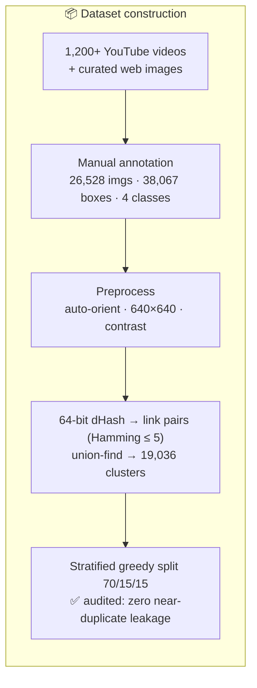
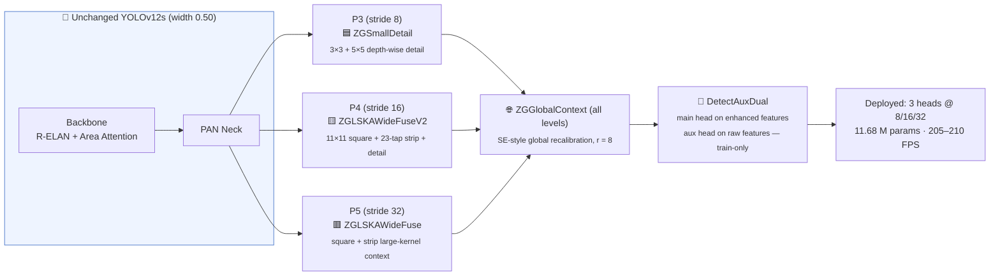
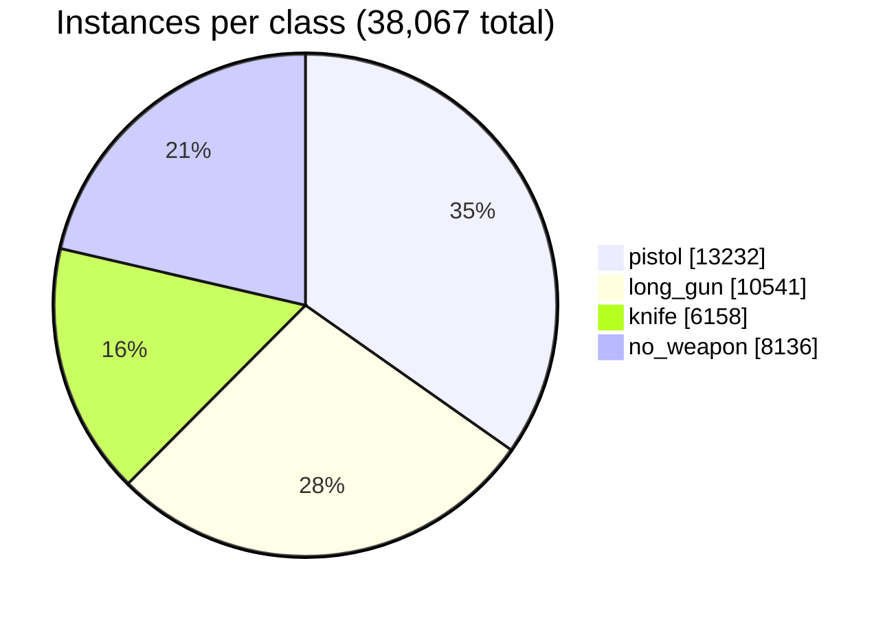
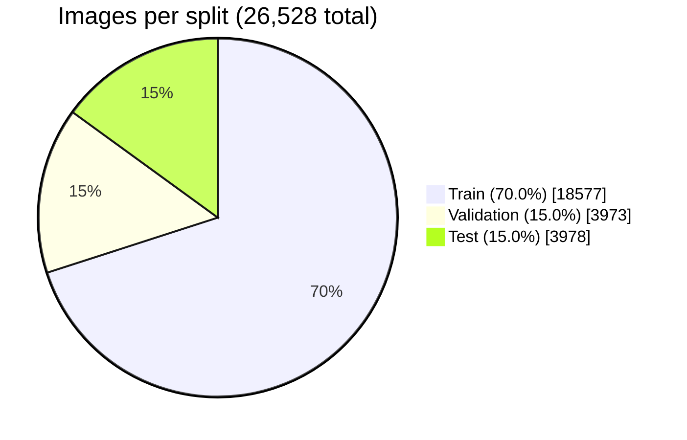
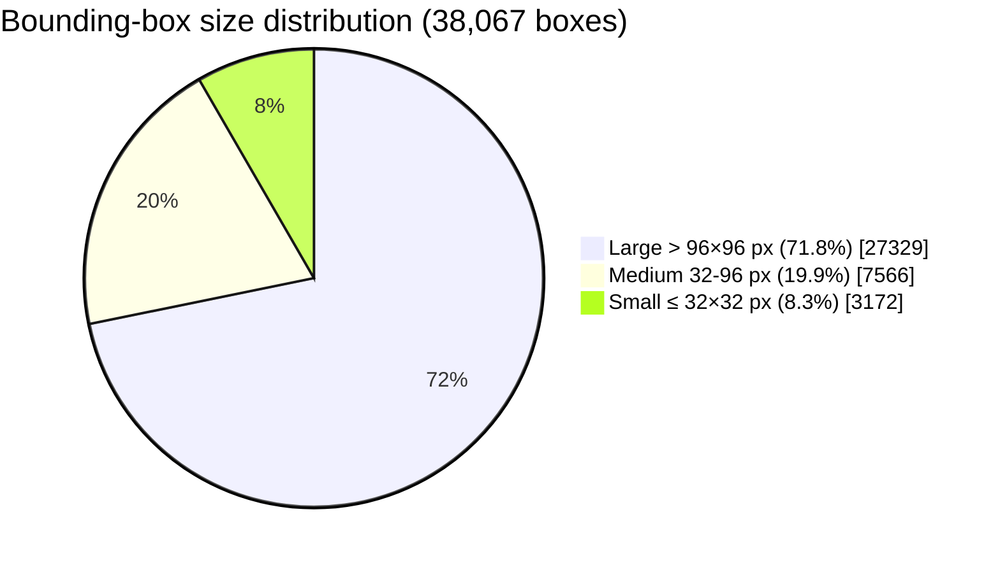

<h1 align="center">🔫 Real-Time Weapon Detection with Enhanced YOLOv12s & a Custom Dataset</h1>

<p align="center"><sub>Official repository for the paper <b>"Real-Time Weapon Detection Using Enhanced YOLOv12 Models and a Custom Dataset"</b><br>Constantin Catargiu & Iulian B. Ciocoiu — Faculty of Electronics, Telecommunications and Information Technology,<br>Gheorghe Asachi Technical University of Iasi, Romania</sub></p>

<p align="center">
  
  
  
</p>

<p align="center">
  <a href="https://universe.roboflow.com/gundetectiondataset/weapondataset-oi2g3/dataset/11">
    
  </a>
  <a href="https://universe.roboflow.com/gundetectiondataset/nogun/dataset/5">
    
  </a>
</p>

<p align="center">
  
  
  
  
  
  
  
  
</p>

---

## ⚡ TL;DR

> **What:** A customized **YOLOv12s** for detecting **small, occluded, low-contrast weapons** in surveillance video, trained on a new **26,528-image / 38,067-instance** public dataset with a **leakage-free** cluster-based split.
>
> **How:** **(i)** a small-object-aware **loss** — dynamic curriculum weighting, adaptive loss clipping, and a retuned Task-Aligned assigner — and **(ii)** five **zero-gated, append-only modules** in the detection head. The backbone, PAN neck, and P3/P4/P5 layout stay untouched, so every addition starts as an **exact identity** of the pretrained baseline; the worst realistic outcome is baseline performance.
>
> **Result:** **mAP@50 0.812 → 0.852 (+4.9% relative)**, mAP@50-95 **+7.2%**, Recall **+7.1%**, small-object mAP@50 **+10.6%**, `no_weapon` confounder class **+11.6%** — consistent across **3 independent seeds** (gains ≈ 10× the seed-to-seed noise), at **205–210 FPS** (vs ~220 FPS baseline) on an RTX 4090. Outperforms **YOLO26s** trained under identical conditions **at every object size**, and transfers **zero-shot** to 3 external public datasets (**mAP@50 0.776–0.805**).

> 📐 **Reading the percentages in this README.** Two different quantities appear throughout, and they are now labelled distinctly:
> - **relative %** — the ratio of the change to the baseline value, e.g. 0.812 → 0.852 is **+4.9% relative**. Used in the headline tables and in the paper's Tables 5 and 6.
> - **percentage points (pp)** — the arithmetic difference, e.g. 0.812 → 0.852 is **+4.0 pp**. Used in the seed-reproducibility discussion, where the comparison is against a standard deviation.
>
> The same underlying gain can therefore appear as "+4.9%" in one section and "+4.0 pp" in another. Where a number could be read either way, the unit is now written out.

<div align="center">

### 🔢 By the Numbers

<table>
<tr>
<td align="center" width="16%">

**26,528**
<br><sub>images</sub>

</td>
<td align="center" width="16%">

**38,067**
<br><sub>labeled instances</sub>

</td>
<td align="center" width="16%">

**19,036**
<br><sub>dedup clusters</sub>

</td>
<td align="center" width="16%">

**+4.9%**
<br><sub>mAP@50 vs baseline (rel.)</sub>

</td>
<td align="center" width="16%">

**+10.6%**
<br><sub>small-object mAP@50 (rel.)</sub>

</td>
<td align="center" width="16%">

**205–210**
<br><sub>FPS @ RTX 4090</sub>

</td>
</tr>
<tr>
<td align="center">

**40+**
<br><sub>architectures tested</sub>

</td>
<td align="center">

**3× / 3×**
<br><sub>seeds × 2×2 ablation</sub>

</td>
<td align="center">

**5**
<br><sub>zero-gated modules</sub>

</td>
<td align="center">

**+2.58 M**
<br><sub>params (+28%)</sub>

</td>
<td align="center">

**3**
<br><sub>external datasets, 0-shot</sub>

</td>
<td align="center">

**4**
<br><sub>classes</sub>

</td>
</tr>
</table>

</div>

---

## 📚 Table of Contents

| | | |
|---|---|---|
| [🌍 Motivation](#-motivation) | [🕰️ Background: 20 Years of Weapon Detection](#%EF%B8%8F-background-how-weapon-detection-got-here) | [🏆 Research Highlights](#-research-highlights) |
| [📖 Overview & Contributions](#-overview--contributions) | [🔬 Method Pipeline](#-method-pipeline-at-a-glance) | [⚡ Dataset](#-dataset-summary) |
| [🧬 Leakage-Free Split](#-leakage-free-data-split-important) | [📊 Dataset Statistics](#-dataset-split--class-distribution-paper--table-1) | [📉 Part A: Custom Loss](#-proposed-model--part-a-small-object-aware-loss--assignment) |
| [🧮 Loss Formulation](#-loss-formulation-schematic-transcription-of-paper-eqs-18) | [🏗️ Part B: Head Modules](#%EF%B8%8F-proposed-model--part-b-zero-gated-head-enhancements) | [🧾 Config at a Glance](#-final-configuration-at-a-glance) |
| [📏 Evaluation Protocol](#-evaluation-protocol) | [📊 Per-Class Results](#-results--per-class-performance-paper--tables-4--5-test-set) | [🔬 Size Ablation](#-ablation-study--performance-by-object-size-paper--table-6-test-set) |
| [🧬 Architecture Search](#-architecture-search-summary-40-variants--full-details-in-the-supplementary-material) | [🎲 Seed Reproducibility](#-seed-reproducibility-study-paper--table-8-3-independent-seeds-per-configuration) | [🔶 vs YOLO26](#-controlled-comparison-vs-yolo26-paper--table-7-averages-over-3-runs) |
| [🌍 External Validation](#-external-dataset-validation--state-of-the-art-context-paper--table-9) | [🩺 Error Analysis](#-error-analysis--what-the-baseline-gets-wrong-paper--figures-810) | [🔍 Visual Comparisons](#-detection-comparison--original-vs-custom-yolov12s) |
| [🚀 Getting Started](#-getting-started) | [🧭 How To Reproduce](#-how-to-reproduce--step-by-step-walkthrough) | [❓ FAQ](#-faq) |
| [✅ Reproducibility Checklist](#-reproducibility-checklist) | [⚠️ Limitations](#%EF%B8%8F-limitations--future-work) | [🛡️ Responsible Use](#%EF%B8%8F-responsible-use--dual-use-considerations) |
| [⚖️ License](#%EF%B8%8F-license) | [📚 Resources](#-resources) | [📖 Citation](#-citation) |

---

## 🌍 Motivation

Gun violence remains one of the most alarming public-safety concerns worldwide. Civilians collectively own approximately **857 million firearms** — nearly **393 million in the United States alone**, exceeding the country's population — and roughly **46,000 firearm-related deaths** were reported in the US during 2023, including **656 mass shootings**. Attacks increasingly occur in spaces once considered sanctuaries: schools, churches, concert halls.

Many surveillance setups still rely on **human operators** watching dozens of camera feeds — an approach that is inherently flawed: fatigue, blind spots, and delayed reaction times make manual threat identification stressful and error-prone, especially in fast-paced or crowded environments. Intelligent systems that identify weapons **in real time** are directly applicable to **smart-city monitoring, school safety, and public-transport surveillance**, where both accuracy and speed are indispensable — and where the hardest cases are precisely **small, distant, occluded, or low-contrast** weapons and **weapon-shaped everyday objects** that trigger false alarms.

> 🛡️ Deployment of a detector like this one carries obligations that accuracy numbers do not capture. See [Responsible Use & Dual-Use Considerations](#%EF%B8%8F-responsible-use--dual-use-considerations).

---

## 🕰️ Background: How Weapon Detection Got Here

<details>
<summary><b>📜 Two decades of prior work in one table (paper — Section II)</b> — click to expand</summary>

<br>

| Era | Representative approaches | Achievement | Limitation |
|-----|---------------------------|-------------|------------|
| 🧮 **Handcrafted features** | k-means color segmentation + Harris/FREAK matching (Tiwari & Verma); Bag-of-Visual-Words + SIFT + SVM (Ben Halima & Hosam) | 84.26% accuracy on 89 images; robust to scale/rotation/partial occlusion | Tiny datasets; degraded under variable lighting; too slow for real time |
| 🌡️ **Alternative sensing** | Passive millimeter-wave + cascaded AdaBoost (Xiao et al.); thermal YOLOv3 on a wearable smartphone rig (Muñoz et al., 64.52% mAP@50); IR+RGB DWT fusion (Gosain et al., 90.62% acc.) | Detects **concealed**, even non-metallic weapons; low-power wearable operation | Specialized hardware; clothing thickness & stream-alignment issues |
| 🧠 **CNN era** | SSD vs Faster R-CNN comparison (Jain et al.); VGG-16 + Faster R-CNN real-time handgun alarm with the AATpI responsiveness metric (Olmos et al., F1 = 91.43%); binocular disparity fusion (−49% false positives); MLFPNet multi-level pyramid for non-canonical firearms (Lim et al.) | Large accuracy jump; first real-time alarm pipelines | Accuracy-vs-speed trade-offs; compute cost limits deployment |
| 🧍 **Contextual cues** | YOLOv5 + HRNet pose fusion via MLP (Maligireddy et al., 90.7% acc.); human-object-interaction posture cues (Xu & Verma, 74%); component-wise firearm CNNs — barrel/stock/magazine/receiver (Egiazarov et al., 76–88%) | Reasoning about posture + appearance together; occlusion robustness | Pose-estimation errors under occlusion; heavy overhead |
| 🚨 **False-alarm reduction** | ODeBiC two-level binary classifiers for confusable classes, e.g. pistols vs phones (Pérez-Hernández et al.: +19.57% precision, −56.5% FP); DaCoLT darkening+CLAHE for reflective knives (Castillo et al., F1 = 93.97%); **"Not-Pistol" negative class** on 8,300 CCTV images (Bhatti et al., YOLOv4, mAP@50 = 91.73%); armed-person inference via spatial heuristics (Amado-Garfias et al.) | Directly attacks the dominant deployment failure mode — false positives on weapon-like objects | Complexity/speed trade-offs; crowded-scene degradation |
| 🪶 **Lightweight / edge** | YOLOv10n @ 20 FPS on Raspberry Pi 4 (Žigulić et al., mAP@50 = 0.91); 7-class custom CNN (Kaya et al., 98.4% acc.); MSA-YOLOv5 with 1.79 M params (Park et al., mAP@50 = 98.3%); YOLOv9 on 500 images (Sumi & Dey, mAP@50 = 99.2%) | Edge-deployable real-time detection | Small / single-class datasets → overfitting & generalization concerns |

**Lessons this paper builds on:** handcrafted features fail on scene variability · thermal/IR needs special hardware · standard CNN detectors trade speed for accuracy · contextual methods are computationally heavy · lightweight YOLO variants still struggle with **small, occluded firearms** — and negative-class supervision (Bhatti et al.'s *Not-Pistol*) demonstrably reduces both false positives *and* false negatives. Our design targets exactly these gaps.

**Why YOLOv12 as the base?** YOLOv12 introduces a hybrid CNN+Transformer design: **Area Attention** (reduced self-attention complexity via spatial-region partitioning), **R-ELAN** (residual shortcuts for better gradient flow), and **FlashAttention** (lower memory-access overhead) — a well-balanced accuracy/efficiency architecture that surpasses separate CNN or transformer detectors, making it the natural starting point for real-time weapon detection.

</details>

---

<div align="center">

## 🏆 Research Highlights

</div>

The proposed model customizes **YOLOv12s** with **(i)** a **small-object-aware loss** (A1–A4) and **(ii)** five **lightweight, append-only, zero-gated enhancement modules** in the detection head (B1–B5). All headline gains are averaged over **3 independent seeds** and exceed seed-to-seed variation by an **order of magnitude**, while preserving **real-time operation**.

<table>
  <tr>
    <td align="center" width="50%">
      
      <br><sub>🏗️ Modified YOLOv12s architecture — block diagram (paper Fig. 3, top).</sub>
    </td>
    <td align="center" width="50%">
      
      <br><sub>🧩 Structure of the new head modules — problem → solution → effect for each block (paper Fig. 3 a–e, bottom).</sub>
    </td>
  </tr>
  <tr>
    <td align="center" width="50%">
      
      <br><sub>📊 Ablation (paper Fig. 4): baseline (blue); + arch B1–B5 (orange); + loss A1–A4 (red); combined (green) — loss components L<sub>IoU</sub>, L<sub>DFL</sub>, L<sub>cls</sub> and validation metrics.</sub>
    </td>
    <td align="center" width="50%">
      
      <br><sub>📈 Learning dynamics on train & validation sets (paper Fig. 5): original YOLOv12s (blue); + A1–A4 custom loss (orange).</sub>
    </td>
  </tr>
  <tr>
    <td align="center" width="50%">
      
      <br><sub>🎯 Confusion matrices for the original model: a) small; b) medium; c) large; d) all objects — "background" counts FP/FN.</sub>
    </td>
    <td align="center" width="50%">
      
      <br><sub>🎯 Confusion matrices for the new model: a) small; b) medium; c) large; d) all objects — "background" counts FP/FN.</sub>
    </td>
  </tr>
  <tr>
    <td align="center" colspan="2">
      
      <br><sub>🧩 Leakage-free splitting procedure. Step 1: each frame is reduced to a 64-bit perceptual hash; frames within Hamming distance 5 are linked, and connected components form clusters of mutually near-identical frames. Step 2: each cluster is assigned to a single split.</sub>
    </td>
  </tr>
</table>

<div align="center">

<table>
  <tr>
    <th align="center" colspan="4">📈 Test-Set Performance (mean over 3 seeds — <a href="#-seed-reproducibility-study-paper--table-8-3-independent-seeds-per-configuration">seed study</a>). Percentages are <b>relative</b> to the baseline.</th>
  </tr>
  <tr>
    <th align="center">Metric</th>
    <th align="center">🔷 YOLOv12s<br><sub>Baseline → + Custom Loss (A1–A4)</sub></th>
    <th align="center">🏆 YOLOv12s<br><sub>Baseline → + Loss + Arch (Proposed)</sub></th>
    <th align="center">🔶 YOLO26s<br><sub>(same data, split & schedule)</sub></th>
  </tr>
  <tr>
    <td align="left"><b>mAP@50</b></td>
    <td align="center">0.812 → <b>0.839</b> <sub>(+3.3%)</sub></td>
    <td align="center">0.812 → <b>0.852</b> <sub>(+4.9%)</sub></td>
    <td align="center">0.807</td>
  </tr>
  <tr>
    <td align="left"><b>mAP@50-95</b></td>
    <td align="center">0.516 → <b>0.539</b> <sub>(+4.5%)</sub></td>
    <td align="center">0.516 → <b>0.553</b> <sub>(+7.2%)</sub></td>
    <td align="center">0.521</td>
  </tr>
  <tr>
    <td align="left"><b>Precision</b></td>
    <td align="center">0.833 → <b>0.852</b> <sub>(+2.3%)</sub></td>
    <td align="center">0.833 → <b>0.865</b> <sub>(+3.8%)</sub></td>
    <td align="center">0.845</td>
  </tr>
  <tr>
    <td align="left"><b>Recall</b></td>
    <td align="center">0.747 → <b>0.782</b> <sub>(+4.7%)</sub></td>
    <td align="center">0.747 → <b>0.800</b> <sub>(+7.1%)</sub></td>
    <td align="center">0.753</td>
  </tr>
  <tr>
    <td align="left"><b>F1-score</b></td>
    <td align="center">0.788 → <b>0.816</b> <sub>(+3.6%)</sub></td>
    <td align="center">0.788 → <b>0.831</b> <sub>(+5.5%)</sub></td>
    <td align="center">0.796</td>
  </tr>
  <tr>
    <td colspan="4" align="center"><b>🔍 Size-Specific mAP@50</b></td>
  </tr>
  <tr>
    <td align="left">🔍 <b>Small</b></td>
    <td align="center">0.640 → <b>0.681</b> <sub>(+6.4%)</sub></td>
    <td align="center">0.640 → <b>0.708</b> <sub>(+10.6%)</sub></td>
    <td align="center">0.615</td>
  </tr>
  <tr>
    <td align="left">📦 <b>Medium</b></td>
    <td align="center">0.781 → <b>0.818</b> <sub>(+4.7%)</sub></td>
    <td align="center">0.781 → <b>0.826</b> <sub>(+5.8%)</sub></td>
    <td align="center">0.780</td>
  </tr>
  <tr>
    <td align="left">🟫 <b>Large</b></td>
    <td align="center">0.848 → <b>0.866</b> <sub>(+2.1%)</sub></td>
    <td align="center">0.848 → <b>0.872</b> <sub>(+2.8%)</sub></td>
    <td align="center">0.843</td>
  </tr>
  <tr>
    <td colspan="4" align="center"><b>🔍 Size-Specific mAP@50-95</b></td>
  </tr>
  <tr>
    <td align="left">🔍 <b>Small</b></td>
    <td align="center">0.324 → <b>0.348</b> <sub>(+7.4%)</sub></td>
    <td align="center">0.324 → <b>0.354</b> <sub>(+9.3%)</sub></td>
    <td align="center">0.317</td>
  </tr>
  <tr>
    <td align="left">📦 <b>Medium</b></td>
    <td align="center">0.445 → <b>0.472</b> <sub>(+6.1%)</sub></td>
    <td align="center">0.445 → <b>0.480</b> <sub>(+7.9%)</sub></td>
    <td align="center">0.466</td>
  </tr>
  <tr>
    <td align="left">🟫 <b>Large</b></td>
    <td align="center">0.574 → <b>0.591</b> <sub>(+3.0%)</sub></td>
    <td align="center">0.574 → <b>0.595</b> <sub>(+3.7%)</sub></td>
    <td align="center">0.588</td>
  </tr>
</table>

<table>
  <tr>
    <th align="center">⚙️ Deployed Params</th>
    <th align="center">⚡ Throughput (RTX 4090)</th>
    <th align="center">🎯 Biggest Gains</th>
  </tr>
  <tr>
    <td align="center">9.10 M → <b>11.68 M</b> <sub>(+2.58 M; 0.82 M aux is training-only)</sub></td>
    <td align="center">~220 FPS → <b>205–210 FPS</b> <sub>(≈5% overhead; wide real-time margin)</sub></td>
    <td align="center"><b>Small objects</b> +10.6% mAP@50, +12.8% Recall<br><b>no_weapon</b> +11.6% mAP@50, +16.4% Recall</td>
  </tr>
</table>

<sub>🔍 The largest relative gains land exactly where the design aims — small objects and the confounder class — and the proposed YOLOv12s outperforms <b>YOLO26s</b> at every object size. Recall rose sharply while Precision remained high: sensitivity was gained without sacrificing stability.</sub>

</div>

---

## 📖 Overview & Contributions

This repository accompanies our research paper on **real-time small-object weapon detection**. The main contributions:

1. 📦 **A large, realistic, public dataset** — **26,528 images / 38,067 manually annotated instances** across 4 classes (`knife`, `pistol`, `long_gun`, `no_weapon`), extracted from **1,200+ YouTube videos** (CCTV, action films, firearm tutorials, shooting-range & tactical-training footage) plus curated web images, spanning motion blur, varied lighting, occlusion, and dense crowds — one of the largest open-access weapon-related resources, hosted as two companion Roboflow projects forming a single dataset.
2. 🧬 **A leakage-free evaluation protocol** — perceptual-hash clustering of near-duplicate video frames with whole-cluster split assignment and a cross-split audit, so reported metrics measure **generalization**, not memorization.
3. 📉 **A small-object-aware loss** (A1–A4) — dynamic curriculum weighting, an auxiliary center loss (evaluated honestly, then disabled), adaptive loss clipping, and a small-object-tuned Task-Aligned assigner.
4. 🏗️ **Five zero-gated, append-only head modules** (B1–B5) — every module starts as an exact identity of the pretrained baseline and opens only where it reduces the loss; the P3/P4/P5 layout, backbone, and neck are untouched (a P2/five-scale extension was tested and **rejected**).
5. 🔬 **An extensive, honest evaluation** — 40+ architectural variants, loss grid searches, per-size and per-class ablations, a **3-seed reproducibility study**, a **controlled comparison against YOLO26** under identical conditions, **zero-shot external validation** on three public benchmarks, and qualitative error analysis of the most safety-critical failure modes.
6. 📎 **Extensive supplementary material** — hyperparameter-tuning results, all tested architecture variants, the exact image-level split assignments, and many examples of instances missed or misdetected by the baseline but handled by the proposed model.

### 💡 Applications

| Domain | Use Cases |
|--------|-----------|
| 📹 **Surveillance** | CCTV monitoring, real-time threat detection, smart-city integration |
| 🛡️ **Public Safety** | Transportation hubs, stadiums, schools, public gatherings |
| 🚪 **Access Control** | Entry point screening, secure facilities, building protection |
| 🚔 **Law Enforcement** | Real-time threat assessment, evidence analysis, situational awareness |
| 🤖 **Research & AI** | Benchmark dataset, small-object detection research, negative-class design |

> ⚠️ These are research application areas, not deployment endorsements. A detector at 0.800 Recall misses roughly one in five annotated instances; see [Responsible Use](#%EF%B8%8F-responsible-use--dual-use-considerations) before putting this in a live safety pipeline.

---

## 🔬 Method Pipeline at a Glance





<sub>🔧 Every colored module is a <b>zero-gated residual</b> (learnable gate γ initialized to 0): at epoch 0 the network reproduces the pretrained baseline <i>exactly</i>; gates open only where the branch reduces training loss — so the worst realistic outcome is baseline performance. Pretrained detection parameters transfer cleanly after a <b>one-time remap of the detection-head index</b>.</sub>

---

## ⚡ Dataset Summary

<table>
  <tr>
    <th align="left" width="220">📋 Property</th>
    <th align="left">📊 Details</th>
  </tr>
  <tr>
    <td>🖼️ <b>Total Images</b></td>
    <td><code>26,528</code></td>
  </tr>
  <tr>
    <td>🔢 <b>Total Instances</b></td>
    <td><code>38,067</code> — all annotations created manually by the first author and verified by the second author, on the Roboflow platform</td>
  </tr>
  <tr>
    <td>🏷️ <b>Classes</b></td>
    <td>
      
      
      
      
    </td>
  </tr>
  <tr>
    <td>🎬 <b>Sources</b></td>
    <td>Frames extracted from <b>1,200+ YouTube videos</b> — surveillance (CCTV) footage, action films containing weapon scenarios, firearm tutorials, and shooting-range & tactical-training recordings — supplemented with images collected manually through web image search. This sourcing strategy <b>deliberately mixes viewpoints, resolutions, lighting conditions, and weapon-handling contexts</b>.</td>
  </tr>
  <tr>
    <td>🌓 <b>Conditions covered</b></td>
    <td>Different scales (close vs distant views) · day / night / artificial lighting · occlusions · motion blur · crowded backgrounds</td>
  </tr>
  <tr>
    <td>🧰 <b>Format & labeling rules</b></td>
    <td><code>YOLO</code> — <code>class x_center y_center width height</code> (normalized), axis-aligned boxes. A <b>single label covers all variants of each weapon type</b> (every pistol model → <code>pistol</code>); weapons only <b>partially visible</b> due to occlusion or border truncation are annotated with the <b>same class</b> as fully visible instances.</td>
  </tr>
  <tr>
    <td>🧬 <b>Split</b></td>
    <td>70 / 15 / 15 (train/val/test), <b>leakage-free</b> cluster-based split (<a href="#-leakage-free-data-split-important">details</a>). Train → optimization · Validation → hyperparameter tuning & early stopping · Test → final evaluation only.</td>
  </tr>
  <tr>
    <td>📜 <b>Usage</b></td>
    <td>All frames collected from publicly accessible sources — released <b>for research purposes only</b> (see <a href="#%EF%B8%8F-license">License</a>)</td>
  </tr>
  <tr>
    <td>🔖 <b>Versions used in the paper</b></td>
    <td>Both Roboflow projects carry <b>several published versions</b>. The paper uses <b>WeaponDataset v11</b> and <b>NoGun v5</b> — earlier versions differ in content and will not reproduce the reported numbers.</td>
  </tr>
  <tr>
    <td>🖼️ <b>Sample images</b></td>
    <td>Annotated examples for all four classes — including the <code>no_weapon</code> confounders — are in <a href="./DatasetExamples"><code>DatasetExamples/</code></a>. Browse the full dataset interactively via the Roboflow links below.</td>
  </tr>
  <tr>
    <td>🏷️ <b>Label corrections</b></td>
    <td>A number of annotations were corrected <b>after</b> those Roboflow versions were published, and the fixes have not yet been pushed back upstream. The corrected label files ship in <a href="./DatasetLabels"><code>DatasetLabels/</code></a> in this repository and <b>should replace the labels in the Roboflow export</b>.</td>
  </tr>
  <tr>
    <td>☁️ <b>Hosting</b></td>
    <td>
      Two companion Roboflow projects forming a single dataset:<br>
      <a href="https://universe.roboflow.com/gundetectiondataset/weapondataset-oi2g3/dataset/11"></a>
      <a href="https://universe.roboflow.com/gundetectiondataset/nogun/dataset/5"></a>
    </td>
  </tr>
</table>

<details>
<summary><b>🏷️ Class descriptions — and why <code>no_weapon</code> exists</b></summary>

<br>

- 🗡️ **`knife`** — bladed weapons including knives and similar sharp objects
- 🔫 **`pistol`** — handguns and short firearms
- 🎯 **`long_gun`** — rifles, shotguns, and other long-barreled firearms
- 🚫 **`no_weapon`** — a curated set of visually confusable items: phones, remote controls, selfie sticks, and similarly shaped hand-held tools

> 🖼️ See [`DatasetExamples/`](./DatasetExamples) for annotated samples of each class. The `no_weapon` examples are the most informative — they show why the class is needed: a phone held in the same pose as a pistol is a genuinely hard case for an appearance-only detector.

**Why an explicit negative class?** It **supervises the decision boundary directly** instead of leaving confounders as unlabeled background — following the *Not-Pistol* precedent of Bhatti et al. (IEEE Access 2021), where it reduced **both false positives and false negatives**. This design directly targets the dominant failure mode of weapon detectors deployed in the wild: **high false-positive rates on weapon-shaped common objects**.

✅ Reduces false positives in production &nbsp;·&nbsp; ✅ Improves precision in crowded scenes &nbsp;·&nbsp; ✅ Forces the model to learn the weapon-vs-confounder boundary

</details>

<details>
<summary><b>🛠️ Preprocessing pipeline (uniform across all three splits)</b></summary>

<br>

| Step | Description | Purpose |
|:----:|-------------|---------|
| 🔄 **Auto-Orient** | Rotates the pixel matrix based on orientation metadata (pixel data is sometimes stored in an uncorrected orientation) | Prevents learning misleading pose variations (sideways weapons, rotated people); ensures feature extraction on properly oriented objects |
| 📐 **Resize** | Uniform resizing to `640×640` px | YOLO training requirement; 640 px confirmed against 800/960 px alternatives (no improvement) |
| 🌗 **Auto-Adjust Contrast** | Adaptive histogram equalization redistributing pixel intensities across the full dynamic range | Emphasizes object boundaries in low-light/high-glare scenes — critical for small objects whose features (e.g., the outline of a handgun) get lost in shadows or low-contrast regions |

Applied identically to train/val/test, so training and evaluation share the same input distribution.

</details>

---

## 🧬 Leakage-Free Data Split (important!)

Most images originate from video footage, so **successive frames are nearly identical** — a naive per-frame split places many similar images in train *and* test, yielding **over-optimistic accuracy**. Our protocol (paper Fig. 2) prevents this:

| Step | What happens | Why |
|:----:|--------------|-----|
| 1️⃣ **Hash** | Every frame → **64-bit perceptual hash** (difference hash, dHash) | Cheap, robust near-duplicate fingerprint |
| 2️⃣ **Link** | Image pairs within **Hamming distance ≤ 5** are linked | Standard practice for dHash near-duplicate detection: small distances in this range capture near-identical frames while avoiding merging visually distinct images |
| 3️⃣ **Cluster** | Connected components via **union-find** → **19,036 clusters** over 26,528 images | Groups mutually near-identical frames |
| 4️⃣ **Assign** | Every **whole cluster** goes to a single split — stratified greedy procedure targeting **70/15/15** for the total image count *and* every class simultaneously | No cluster is ever divided across subsets → no near-duplicate frame can cross a split boundary |
| 5️⃣ **Audit** | Final cross-split verification | **Confirmed:** no image pair within the near-duplicate threshold crosses a split boundary ✅ |

➡️ The evaluation is free of near-duplicate leakage at the chosen threshold; reported metrics reflect **generalization**, not memorized near-duplicates.

---

## 📊 Dataset Split & Class Distribution <sub>(Paper — Table 1)</sub>

| Split | Images | Instances | 🗡️ knife | 🎯 long_gun | 🔫 pistol | 🚫 no_weapon |
|-------|-------:|----------:|---------:|------------:|----------:|-------------:|
| Train | 18,577 (70.0%) | 26,103 | 4,294 (16.5%) | 7,337 (28.1%) | 9,187 (35.2%) | 5,285 (20.2%) |
| Validation | 3,973 (15.0%) | 5,853 | 923 (15.8%) | 1,561 (26.7%) | 1,985 (33.9%) | 1,384 (23.6%) |
| Test | 3,978 (15.0%) | 6,111 | 941 (15.4%) | 1,643 (26.9%) | 2,060 (33.7%) | 1,467 (24.0%) |
| **Total** | **26,528** | **38,067** | **6,158 (16.2%)** | **10,541 (27.7%)** | **13,232 (34.8%)** | **8,136 (21.4%)** |

<table>
<tr>
<td width="50%">



</td>
<td width="50%">



</td>
</tr>
</table>

### 📐 Bounding-Box Size Distribution <sub>(Paper — Table 2; COCO convention, computed on the 640×640 resized images from normalized w×h areas: small ≤ 32², medium ≤ 96², large > 96² px)</sub>

| Split | Total boxes | 🔍 Small | 📦 Medium | 🟫 Large |
|-------|------------:|---------:|----------:|---------:|
| Train | 26,103 | 2,198 (8.4%) | 5,312 (20.4%) | 18,593 (71.2%) |
| Validation | 5,853 | 475 (8.1%) | 1,087 (18.6%) | 4,291 (73.3%) |
| Test | 6,111 | 499 (8.2%) | 1,167 (19.1%) | 4,445 (72.7%) |
| **Total** | **38,067** | **3,172 (8.3%)** | **7,566 (19.9%)** | **27,329 (71.8%)** |

The dataset is dominated by large objects (~72%), with ~20% medium and only ~8% small instances — **consistent across all three splits**, so no split is systematically easier.



### 📐 Size Distribution per Class <sub>(Paper — Table 3)</sub>

| Class | Total boxes | 🔍 Small | 📦 Medium | 🟫 Large |
|-------|------------:|---------:|----------:|---------:|
| 🗡️ knife | 6,158 | 225 (3.7%) | 1,065 (17.3%) | 4,868 (79.1%) |
| 🎯 long_gun | 10,541 | 482 (4.6%) | 1,542 (14.6%) | 8,517 (80.8%) |
| 🔫 pistol | 13,232 | **2,023 (15.3%)** | 3,414 (25.8%) | 7,795 (58.9%) |
| 🚫 no_weapon | 8,136 | 442 (5.4%) | 1,545 (19.0%) | 6,149 (75.6%) |
| **Total** | **38,067** | **3,172 (8.3%)** | **7,566 (19.9%)** | **27,329 (71.8%)** |

> 📌 **Why this matters:** small instances are strongly class-dependent — `pistol` alone accounts for **63.8% of all small boxes** (15.3% of pistol instances are small, reflecting that handguns frequently appear small and distant in surveillance footage), while the remaining classes are predominantly large (76–81%). This concentration of small, hard instances within the pistol class, together with the heterogeneous `no_weapon` class, is **exactly what the loss and architecture design target** — and exactly where the largest gains land.

---

## 📉 Proposed Model — Part A: Small-Object-Aware Loss & Assignment

The standard YOLOv12 loss is effective for general-purpose detection but suffers on **small, cluttered, or occluded** targets such as firearms in surveillance footage. Four modifications (A1–A4) address exactly these limitations; all hyperparameters were tuned by **grid search on the validation set** (~15% of the dataset, class-balanced).

<details>
<summary><b>📉 A1 — Dynamic Curriculum Weighting ✅ enabled</b></summary>

<br>

**Problem:** after assignment, all positives are weighted roughly equally, so **large boxes dominate** — their IoU gradients are stronger and small objects get ignored in early optimization.

**Solution:** each positive assignment *j* receives a combined weight mixing a **normalized inverse-area term** *âⱼ* (favoring small objects) with the **target score** *sⱼ*, blended by a curriculum coefficient *α(t)* transitioning from **early area-dominant** (small objects start with greater influence) to **later balanced** learning over the *T* training epochs. The weight is applied to **both the IoU and DFL** loss terms.

| Parameter | Search range | Optimal |
|-----------|:------------:|:-------:|
| α₁ (early mixing) | [0.1, 1.0] | **0.7** |
| α₂ (late mixing) | [0.1, 1.0] | **0.4** |
| Small-object threshold | — | area ≤ **32×32 px** |

> 📎 *T* (the total epoch budget) is **not** merely a stopping condition here: it is the denominator of the α(t) curriculum, so a reimplementation must pass the configured budget into the loss rather than the number of epochs a run happens to take.

</details>

<details>
<summary><b>🎯 A2 — Auxiliary Center Loss for Small Objects ❌ disabled in the final model</b></summary>

<br>

**Idea:** IoU-based regression losses are small for tiny boxes because small shifts make IoU **collapse even when centers are close**. A lightweight **L1 penalty on box centers**, applied only to small targets (area < 32×32 px, via a binary mask) with a **decaying weight schedule** (α₃, α₄), is meant to stabilize early training and fix "miss by a few pixels" errors on small handguns/knives.

**Honest result:** the tuned weight (searched in [0, 0.1]) brought **no measurable validation improvement** — and the ablation shows it slightly *hurts* small/medium objects (Table 6, column +A2: small mAP@50 0.640 → 0.631). It is **switched off** (λ_center = 0) in the final model and documented for completeness.

</details>

<details>
<summary><b>✂️ A3 — Adaptive Loss Clipping ✅ enabled</b></summary>

<br>

**Problem:** training occasionally produces **unstable loss spikes** (mislabeled data, hard positives) that destabilize optimization — especially in cluttered security footage.

**Solution:** per-batch clipping of the IoU and DFL losses with **epoch-dependent ceilings** M_IoU(t) and M_DFL(t) — preventing gradient explosions in early training and yielding **smoother loss curves and more stable convergence**.

| Parameter | Role | Search range | Optimal |
|-----------|------|:------------:|:-------:|
| α₅ | IoU ceiling (start) | [10, 70], step 1 | **50** |
| α₆ | IoU ceiling (end) | [10, 70], step 1 | **30** |
| α₇ | DFL ceiling (start) | [10, 70], step 1 | **25** |
| α₈ | DFL ceiling (end) | [10, 70], step 1 | **15** |

> 📎 The ceilings **anneal over the epoch budget**, so this component shares the *T* horizon with A1.

</details>

<details>
<summary><b>🧲 A4 — Assignment Tuned Towards Small Objects (TAL) ✅ enabled</b></summary>

<br>

**Problem:** the default Task-Aligned Assigner uses a small candidate pool (*k* = 10) — for small objects, **no anchor may overlap the target**, producing false negatives.

| Parameter | YOLOv12 default | Ours | Search range |
|-----------|:---------------:|:----:|:------------:|
| Candidate pool `top-k` | 10 | **13** | [2, 25] |
| Score exponent | 0.5 | **0.7** | — |
| IoU exponent | 6.0 | **4.0** | — |

The larger pool yields more anchor candidates per box, improving recall especially in small-gun scenarios; the retuned exponents better balance **classification confidence vs localization quality** during assignment (lowering the IoU exponent from 6.0 to 4.0 reduces the assigner's bias against small, imperfectly-localized candidates).

</details>

### 🧮 Loss Formulation <sub>(schematic transcription of paper Eqs. (1)–(8))</sub>

> ⚠️ The formulas below are **readable transcriptions** of the paper's equations; consult the paper for the exact typeset definitions.

**Per-positive curriculum weight** (Eqs. 1–3): for each positive assignment $j$ at epoch $t$,

$$w_j(t) \;=\; \alpha(t)\,\hat{a}_j \;+\; \bigl(1-\alpha(t)\bigr)\,s_j$$

where $s_j$ is the target score and $\hat{a}_j$ is the **inverse ground-truth area** $1/a_j$ (in input-pixel coordinates), normalized over the set $P$ of positives in the batch. The mixing coefficient follows a curriculum interpolating from $\alpha_1 = 0.7$ (early, area-dominant) to $\alpha_2 = 0.4$ (late, balanced) over the $T$ training epochs. $w_j(t)$ multiplies both the **IoU regression loss** (Eq. 4, over ground-truth boxes $b_j$ vs predictions $\hat{b}_j$, with batch normalization term) and the **Distribution Focal Loss** (Eq. 5 — cross-entropy over discrete bins per box edge: the continuous coordinate $y$ is split between adjacent integer bins $l=\lfloor y\rfloor$ and $r=l{+}1$ with linear-interpolation weights $w_l = y-l$, $w_r = r-y$, averaged over edges).

**Auxiliary center loss** (Eq. 6, disabled in the final model):

$$L_{center} \;=\; \sum_{j}\mathbb{1}_{small}(j)\;\bigl\lVert c_j - \hat{c}_j \bigr\rVert_1$$

with $c_j,\hat{c}_j$ the ground-truth/predicted box centers, $\mathbb{1}_{small}$ selecting targets with area < 32×32 px, scaled by a decaying weight $\lambda_{center}(t)$ (parameters $\alpha_3,\alpha_4$) — **set to 0 in the final configuration**.

**Adaptive clipping** (Eq. 7): per-batch, with epoch-dependent ceilings,

$$\tilde{L}_{IoU} = \min\!\bigl(L_{IoU},\,M_{IoU}(t)\bigr), \qquad \tilde{L}_{DFL} = \min\!\bigl(L_{DFL},\,M_{DFL}(t)\bigr)$$

where $M_{IoU}$ anneals $\alpha_5{=}50 \to \alpha_6{=}30$ and $M_{DFL}$ anneals $\alpha_7{=}25 \to \alpha_8{=}15$.

**Overall detection objective** (Eq. 8):

$$L \;=\; \lambda_{box}\,\tilde{L}_{IoU} \;+\; \lambda_{DFL}\,\tilde{L}_{DFL} \;+\; \lambda_{cls}\,L_{cls} \;+\; \lambda_{center}(t)\,L_{center}$$

with $\lambda_{box}, \lambda_{DFL}, \lambda_{cls}$ **unchanged from the original YOLOv12** and $\lambda_{center}(t) \equiv 0$ in the final configuration.

> 🏆 **Final loss: A1 + A3 + A4** (A2 evaluated, then disabled). The combined effect of curriculum weighting, adaptive clipping, and the expanded assignment pool improves small-object detection and yields more stable training.

---

## 🏗️ Proposed Model — Part B: Zero-Gated Head Enhancements

**Context:** the baseline YOLOv12 detects at feature strides **8 (P3), 16 (P4), 32 (P5)** — suboptimal for small firearms that often occupy **fewer than 20–30 pixels** in real surveillance imagery.

> ⚠️ **Design decision worth knowing:** the "obvious" fix — a **stride-4 P2 head** — was implemented, tested, and **rejected**: the extra head sharply increased computational load and memory footprint (160×160 feature maps) while producing **no consistent improvement** over the 3-scale design. The final model keeps the stock **YOLOv12s backbone + PAN neck (width 0.50)** and the **P3/P4/P5 layout**, and enhances **only the detection head**.

| # | Module | Level | One-line summary | Status |
|:-:|--------|:-----:|------------------|:------:|
| B1 | **Zero-gating principle** | all | Every module = residual branch × learnable gate γ (init 0) → exact identity at start, opens only if it reduces loss. Pretrained head weights transfer after a one-time index remap | design rule |
| B2 | 🟦 **ZGSmallDetail** | P3 | Parallel 3×3 + 5×5 depth-wise convs → sum → GroupNorm → gated residual; reinforces fine detail that large kernels wash out | ✅ |
| B2 | 🟨 **ZGLSKAWideFuseV2** | P4 | Expand-then-fuse: square 11×11 large-kernel attention ⊕ hybrid branch (23-tap strip attention + small-kernel detail path) | ✅ |
| B2 | 🟥 **ZGLSKAWideFuse** | P5 | Square + strip large-kernel fusion — broad scene context for the coarsest scale | ✅ |
| B3 | 🌐 **ZGGlobalContext** | P3–P5 | SE-style global recalibration: GAP → 1×1 bottleneck (r=8) + SiLU → 1×1 expand → zero-gated additive broadcast | ✅ |
| B4 | 🎓 **DetectAuxDual** | head | Main head on enhanced features + auxiliary head on **raw** neck features (keeps backbone detail); **aux dropped at inference** | ✅ (train-only) |
| B5 | 🧪 **Hyperparameter selection** | — | Not a module: the sweep protocol that fixed kernel sizes, reduction factor, and input resolution | protocol |

> 📎 Note on labelling: **B5 is a protocol, not a block.** The "five modules" counted in the paper are ZGSmallDetail, ZGLSKAWideFuseV2, ZGLSKAWideFuse, ZGGlobalContext, and DetectAuxDual. Ablation columns labelled "+Architecture (B1–B5)" mean *all five modules together with the hyperparameters fixed by the B5 sweeps*.

### 🔬 Module Deep-Dive: Problem → Solution → Effect <sub>(Paper — Fig. 3 a–e)</sub>

<details>
<summary><b>🟦 a) ZGSmallDetail (P3, stride 8) — the small-object workhorse</b></summary>

<br>

| | |
|---|---|
| **Problem** | In the baseline, small objects are *found but poorly scored*, and wide-receptive-field branches **erode the fine P3 detail they depend on**. Empirically, *every* large-receptive-field variant tested at P3 **degraded** small-object accuracy. |
| **Solution** | Two parallel **depth-wise convolutions** with small **3×3 and 5×5 kernels**, outputs **summed → GroupNorm → projected back** as a zero-gated residual. Only small-kernel operators — no large-kernel smoothing. |
| **Effect** | Reinforces the fine, high-frequency local detail that small firearms depend on → improved small-object detection (+12.8% small-object Recall in combination). |

</details>

<details>
<summary><b>🟨 b) ZGLSKAWideFuseV2 (P4, stride 16) — context AND detail in one block</b></summary>

<br>

| | |
|---|---|
| **Problem** | A pure large-kernel fusion **smooths away small-object features** at the level that feeds mid-scale detection. |
| **Solution** | An **expand-then-fuse** block: 1×1 filters expand the input into two branches — **branch 1** keeps square large-kernel attention (**11×11**) for context; **branch 2** is a **hybrid** placing a small-detail path (depth-wise 3×3 + 5×5 with GroupNorm and SiLU) next to a **23-tap large strip kernel** for elongated objects. The branches are **concatenated and projected**, so one block serves both context and detail. |
| **Effect** | Preserves medium/large-object context while keeping small-object detail **at the fusion source**. Channel-*split* fusion was tested and rejected — it starved both branches of capacity; the full-width expand-then-fuse won. |

</details>

<details>
<summary><b>🟥 c) ZGLSKAWideFuse (P5, stride 32) — broad scene context where it belongs</b></summary>

<br>

| | |
|---|---|
| **Problem** | The deepest level is where **context dominates**, but the baseline head does not explicitly model broad spatial layout. |
| **Solution** | Fuses the **square** and **strip** large-kernel attention paths to supply broad scene context to the largest-stride features. |
| **Effect** | Better global localization at the coarsest scale; this block dominates the +2.58 M parameter budget. |

</details>

<details>
<summary><b>🌐 d) ZGGlobalContext (all levels) — for the context-defined confounder class</b></summary>

<br>

| | |
|---|---|
| **Problem** | A purely local receptive field **cannot separate the context-defined `no_weapon` class from genuine weapons** — a phone in a hand vs a pistol in a hand is often a *context* question. |
| **Solution** | Squeeze-and-excitation-style global recalibration: **global average pooling → 1×1 bottleneck (reduction 8) + SiLU → 1×1 expansion → gated additive broadcast** of the global channel-context vector to every spatial location. Zero-initialized gates follow **ReZero / GCNet** practice. |
| **Effect** | At **near-zero cost**, each location is recalibrated with an image-wide signal, improving appearance-vs-context discrimination without disturbing upstream per-location detail → **+11.6% mAP@50 and +16.4% Recall** on `no_weapon`. |

</details>

<details>
<summary><b>🎓 e) DetectAuxDual (head) — auxiliary supervision that's free at inference</b></summary>

<br>

| | |
|---|---|
| **Problem** | Training the head **only** through the enhanced features lets the backbone **drift toward coarse, context-dominated features** and lose fine detail. |
| **Solution** | A dual-path head: the **main head** is supervised on the three context-enhanced maps (outputs of B2–B3); a parallel **auxiliary head** is supervised on the **raw, pre-enhancement** P3/P4/P5 neck features. The auxiliary gradient provides a short, direct path that **rewards the backbone for preserving high-resolution detail**. The main path specializes in context; the auxiliary path targets detail. |
| **Effect** | The aux head (0.82 M params) is active **only during training** and **dropped at inference** → deployed model runs the three main heads at strides 8/16/32 with **zero added latency**. |

</details>

<details>
<summary><b>🧪 B5 — How the module hyperparameters were fixed (not hand-picked)</b></summary>

<br>

All module hyperparameters went through the **same ablation protocol as the architecture search**:

- **Square kernel size:** dose–response sweep over k ∈ {7, 11, 15} → **k = 11** empirical optimum, with **near-flat behavior around it** — the choice is not fragile
- **23-tap strip kernel:** motivated by the **elongated geometry of knives and long guns**; validated as a standalone branch, retained with the full-width expand-then-fuse structure after channel-split fusion was shown to starve both branches
- **P3 restriction:** limited to 3×3 / 5×5 depth-wise kernels because **every large-receptive-field variant degraded small-object accuracy**
- **Established practice:** zero-initialized gates (ReZero, GCNet), reduction factor 8 in the SE bottleneck
- **Input resolution:** 640 px confirmed against **800 px and 960 px** alternatives — no improvement

</details>

### 🧩 Why This Architecture, in Four Properties

1. 🛡️ **Safe superset of the baseline** — zero-gating preserves the strong pretrained initialization; every addition can only help or stay silent
2. 🎚️ **Per-scale specialization** — fine detail where small objects live (P3), broad context where they do not (P4/P5)
3. 🌐 **Global scene context at every level** — what the heterogeneous, context-defined `no_weapon` class needs
4. 🎓 **Backbone detail preserved for free** — the dual-head training signal costs nothing at inference

### ⚖️ Parameter & Speed Budget

| | Baseline YOLOv12s | Proposed (deployed) |
|---|:---:|:---:|
| **Parameters (inference)** | 9.10 M | **11.68 M** (+2.58 M, +28% — dominated by the P5 fusion block) |
| **Training-only aux branch** | — | 0.82 M (removed at deployment) |
| **Throughput (RTX 4090)** | ~220 FPS | **205–210 FPS** (≈5% overhead) |

All additions use **depth-wise and 1×1 operations only**, limiting the parameter and latency overhead. The measured cost is a **modest ~5% throughput reduction**, leaving a wide real-time margin — the parameter count rises by 28% while FPS falls by roughly 5%, because the added operations are cheap relative to their parameter footprint.

---

## 🧾 Final Configuration at a Glance

| Component | Enabled | Final values |
|-----------|:-------:|--------------|
| 📉 A1 — Curriculum weighting | ✅ | α₁ = 0.7, α₂ = 0.4, small ≤ 32×32 px |
| 🎯 A2 — Center loss | ❌ | λ_center = 0 (no validation gain; slightly hurts small objects) |
| ✂️ A3 — Adaptive clipping | ✅ | α₅ = 50, α₆ = 30 (IoU); α₇ = 25, α₈ = 15 (DFL) |
| 🧲 A4 — TAL assignment | ✅ | top-k = 13, score exp = 0.7, IoU exp = 4.0 |
| ⚖️ Loss weights λ_box, λ_DFL, λ_cls | unchanged | original YOLOv12 values |
| 🟦 B2 — ZGSmallDetail (P3) | ✅ | 3×3 + 5×5 depth-wise, GroupNorm, zero-gated |
| 🟨 B2 — ZGLSKAWideFuseV2 (P4) | ✅ | 11×11 square + 23-tap strip + detail path, expand-then-fuse |
| 🟥 B2 — ZGLSKAWideFuse (P5) | ✅ | square + strip large-kernel fusion |
| 🌐 B3 — ZGGlobalContext | ✅ | all levels, reduction r = 8, SiLU |
| 🎓 B4 — DetectAuxDual | ✅ train-only | aux on raw features, dropped at inference |
| 🏛️ Backbone / neck / scales | unchanged | stock YOLOv12s, width 0.50, P3/P4/P5 (P2 rejected) |
| 🖼️ Input resolution | 640 px | confirmed vs 800/960 px (no improvement) |

---

## 📏 Evaluation Protocol

For results to be interpreted correctly, the paper fixes the following measurement conventions:

| Aspect | Convention |
|--------|-----------|
| **Metrics** | Precision, Recall, F1-score, mAP@50, mAP@50-95 — overall, per class, and per size bucket |
| **Size buckets** | COCO convention on the 640×640 resized images: small ≤ 32², medium ≤ 96², large > 96² px (from normalized w×h box areas) |
| **Operating point** | Per-class P/R/F1 in **Table 4** are reported at the **F1-optimal operating point** |
| **Confusion matrices (Figs. 6–7)** | Computed at a **fixed confidence threshold conf = 0.25, IoU ≥ 0.5**; the "background" row/column counts false positives and false negatives — per-class values therefore differ slightly from Table 4 |
| **Headline comparisons** | **Mean ± std over 3 independent seeds** (Section V-C protocol) with deterministic execution |
| **Fairness** | Baseline, proposed model, and YOLO26 all trained with **identical data, split, schedule, and hyperparameters** |
| **Throughput** | FPS benchmarked on an NVIDIA RTX 4090 (24 GB), CUDA 12.1 |

---

## 📊 Results — Per-Class Performance <sub>(Paper — Tables 4 & 5, test set)</sub>

| Class | mAP@50<br><sub>Custom / Baseline</sub> | mAP@50-95<br><sub>Custom / Baseline</sub> | Precision<br><sub>Custom / Baseline</sub> | Recall<br><sub>Custom / Baseline</sub> | F1<br><sub>Custom / Baseline</sub> |
|-------|:---:|:---:|:---:|:---:|:---:|
| 🗡️ knife | **0.900** / 0.867 | **0.646** / 0.609 | **0.876** / 0.848 | **0.841** / 0.807 | **0.859** / 0.828 |
| 🔫 pistol | **0.916** / 0.882 | **0.609** / 0.569 | **0.897** / 0.862 | **0.879** / 0.840 | **0.888** / 0.851 |
| 🎯 long_gun | **0.903** / 0.881 | **0.575** / 0.554 | **0.880** / 0.859 | **0.883** / 0.848 | **0.882** / 0.853 |
| 🚫 no_weapon | **0.689** / 0.617 | **0.385** / 0.332 | **0.807** / 0.761 | **0.582** / 0.500 | **0.678** / 0.609 |
| **All** | **0.852** / 0.812 | **0.553** / 0.516 | **0.865** / 0.833 | **0.800** / 0.747 | **0.831** / 0.788 |

### 📈 Relative Improvements & Attribution <sub>(Paper — Table 5; all values are relative %)</sub>

```
🚫 no_weapon   +11.6% mAP@50  ████████████████████████████████████████
🔫 pistol       +3.9% mAP@50  █████████████
🗡️ knife        +3.8% mAP@50  █████████████
🎯 long_gun     +2.5% mAP@50  ████████
```

<sub>The confounder class — the paper's stated hardest case — receives ~3× the mAP@50 gain of any weapon class.</sub>

| Class | mAP@50 | Precision | Recall | F1 | What drives the gain |
|-------|:------:|:---------:|:------:|:--:|----------------------|
| 🗡️ knife | +3.8% | +3.3% | +4.2% | +3.7% | *ZGSmallDetail* (B2) + curriculum weighting (A1) preserve thin metallic edge features |
| 🔫 pistol | +3.9% | +4.0% | +4.6% | +4.3% | TAL tuning (A4) improves detection for the largest small-object class |
| 🎯 long_gun | +2.5% | +2.4% | +4.1% | +3.4% | Already strong at baseline; strip-kernel attention (B2) tightens elongated bounding-box fits |
| 🚫 no_weapon | **+11.6%** | +6.0% | **+16.4%** | **+11.3%** | *ZGGlobalContext* (B3) + *DetectAuxDual* (B4) separate confounders from real weapons more reliably |
| **All** | **+4.9%** | **+3.8%** | **+7.1%** | **+5.5%** | Complementary gains from the custom loss (A1, A3, A4) and head modules (B1–B4), each effective in isolation |

> 📌 The confusion matrices (paper Figs. 6–7) show consistent per-class improvements across all object dimensions — most prominently for small objects — while confirming `no_weapon` remains the hardest class to discriminate, given the diversity of real-life items that can be mistaken for weapons.

---

## 🔬 Ablation Study — Performance by Object Size <sub>(Paper — Table 6, test set)</sub>

### 📊 At a Glance — mAP@50 Gain, New Model vs Baseline

```
🔍 Small   (0.640 → 0.708)  ████████████████████████████████████████  +10.63% rel.  (+6.8 pp)
📦 Medium  (0.781 → 0.826)  ███████████████████████                    +5.76% rel.  (+4.5 pp)
🟫 Large   (0.848 → 0.872)  ███████████                                 +2.83% rel.  (+2.4 pp)
```

<sub>Gains scale inversely with object size — exactly the intended behavior of a small-object-targeted design. Full per-metric breakdown below.</sub>

> 📐 In the tables below, the paper reports a relative % only for the final **New model** column. The relative percentages shown for the intermediate columns (+A1 … +Architecture) are **computed in this README** from the paper's own values for readability; they are not printed in the manuscript.

<details>
<summary><b>🔍 Small Objects (area ≤ 32×32 px)</b> — click to expand</summary>

| Metric       | Baseline | +A1             | +A2             | +A3             | +A4             | Custom Loss<br>(A1–A4) | +Architecture<br>(B1–B5) | 🏆 New Model         |
|:-------------|---------:|:----------------|:-----------------|:-----------------|:-----------------|:------------------------------|:-----------------|:----------------------|
| **mAP@50**    | 0.640    | 0.669 (+4.53%)  | 0.631 (−1.41%)   | 0.665 (+3.91%)   | 0.674 (+5.31%)   | 0.681 (+6.41%)                | 0.664 (+3.75%)   | **0.708 (+10.63%)**   |
| **mAP@50–95** | 0.324    | 0.336 (+3.70%)  | 0.319 (−1.54%)   | 0.341 (+5.25%)   | 0.339 (+4.63%)   | 0.348 (+7.41%)                | 0.334 (+3.09%)   | **0.354 (+9.26%)**    |
| **Precision** | 0.758    | 0.770 (+1.58%)  | 0.762 (+0.53%)   | 0.766 (+1.06%)   | 0.778 (+2.64%)   | 0.783 (+3.30%)                | 0.769 (+1.45%)   | **0.790 (+4.22%)**    |
| **Recall**    | 0.585    | 0.622 (+6.32%)  | 0.572 (−2.22%)   | 0.628 (+7.35%)   | 0.625 (+6.84%)   | 0.648 (+10.77%)               | 0.611 (+4.44%)   | **0.660 (+12.82%)**   |
| **F1-score**  | 0.662    | 0.692 (+4.53%)  | 0.653 (−1.36%)   | 0.694 (+4.83%)   | 0.697 (+5.29%)   | 0.708 (+6.95%)                | 0.682 (+3.02%)   | **0.719 (+8.61%)**    |

</details>

<details>
<summary><b>📦 Medium Objects (32×32 &lt; area ≤ 96×96 px)</b> — click to expand</summary>

| Metric       | Baseline | +A1             | +A2             | +A3             | +A4             | Custom Loss<br>(A1–A4) | +Architecture<br>(B1–B5) | 🏆 New Model         |
|:-------------|---------:|:----------------|:-----------------|:-----------------|:-----------------|:------------------------------|:-----------------|:----------------------|
| **mAP@50**    | 0.781    | 0.811 (+3.84%)  | 0.773 (−1.02%)   | 0.807 (+3.33%)   | 0.814 (+4.23%)   | 0.818 (+4.74%)                | 0.797 (+2.05%)   | **0.826 (+5.76%)**    |
| **mAP@50–95** | 0.445    | 0.464 (+4.27%)  | 0.439 (−1.35%)   | 0.467 (+4.94%)   | 0.465 (+4.49%)   | 0.472 (+6.07%)                | 0.457 (+2.70%)   | **0.480 (+7.87%)**    |
| **Precision** | 0.816    | 0.838 (+2.70%)  | 0.820 (+0.49%)   | 0.833 (+2.08%)   | 0.845 (+3.55%)   | 0.851 (+4.29%)                | 0.832 (+1.96%)   | **0.860 (+5.39%)**    |
| **Recall**    | 0.723    | 0.751 (+3.87%)  | 0.714 (−1.24%)   | 0.754 (+4.29%)   | 0.752 (+4.01%)   | 0.763 (+5.53%)                | 0.741 (+2.49%)   | **0.775 (+7.19%)**    |
| **F1-score**  | 0.767    | 0.792 (+3.26%)  | 0.758 (−1.17%)   | 0.791 (+3.13%)   | 0.796 (+3.78%)   | 0.805 (+4.95%)                | 0.784 (+2.22%)   | **0.815 (+6.26%)**    |

</details>

<details>
<summary><b>🟫 Large Objects (area &gt; 96×96 px)</b> — click to expand</summary>

| Metric       | Baseline | +A1             | +A2             | +A3             | +A4             | Custom Loss<br>(A1–A4) | +Architecture<br>(B1–B5) | 🏆 New Model         |
|:-------------|---------:|:----------------|:-----------------|:-----------------|:-----------------|:------------------------------|:-----------------|:----------------------|
| **mAP@50**    | 0.848    | 0.858 (+1.18%)  | 0.853 (+0.59%)   | 0.854 (+0.71%)   | 0.862 (+1.65%)   | 0.866 (+2.12%)                | 0.856 (+0.94%)   | **0.872 (+2.83%)**    |
| **mAP@50–95** | 0.574    | 0.583 (+1.57%)  | 0.578 (+0.70%)   | 0.585 (+1.92%)   | 0.582 (+1.39%)   | 0.591 (+2.96%)                | 0.582 (+1.39%)   | **0.595 (+3.66%)**    |
| **Precision** | 0.844    | 0.867 (+2.73%)  | 0.851 (+0.83%)   | 0.862 (+2.13%)   | 0.873 (+3.44%)   | 0.880 (+4.27%)                | 0.861 (+2.01%)   | **0.893 (+5.81%)**    |
| **Recall**    | 0.808    | 0.822 (+1.73%)  | 0.815 (+0.87%)   | 0.825 (+2.10%)   | 0.823 (+1.86%)   | 0.831 (+2.85%)                | 0.818 (+1.24%)   | **0.838 (+3.71%)**    |
| **F1-score**  | 0.825    | 0.843 (+2.18%)  | 0.832 (+0.85%)   | 0.842 (+2.06%)   | 0.846 (+2.55%)   | 0.854 (+3.52%)                | 0.839 (+1.70%)   | **0.864 (+4.73%)**    |

</details>

> 📌 **How to read this:** every proposed component (A1, A3, A4, B1–B5) helps in isolation; **A2 slightly hurts small/medium objects** — which is exactly why it is disabled in the final model. The full combination is strongest on every metric at every object size, and gains **scale inversely with object size** (small +10.6% > medium +5.8% > large +2.8% mAP@50, relative) — the intended behavior of a small-object-targeted design.

---

## 🧬 Architecture Search Summary <sub>(40+ variants — full details in the Supplementary Material)</sub>

<details>
<summary><b>What was explored — and what won</b></summary>

<br>

Over **40 distinct model variants** were tested before converging on B1–B5:

| Direction | Explored |
|-----------|----------|
| 🔍 **Attention** | Insertion point & kernel size of large-kernel attention; self-attention variants |
| 🔀 **Fusion** | Wide-receptive-field fusion; global & channel context; spatial pyramid pooling |
| 🧲 **Sampling** | Deformable and dynamic-sampling operators |
| 📏 **Capacity** | Capacity redistribution; P3 depth/path changes; head tower capacity |
| 🏔️ **Topology** | Neck topology changes; **P2/five-scale extension** (stride-4 head) |
| 🖼️ **Resolution** | 640 px vs 800 px vs 960 px input |
| 🎯 **Heads** | Auxiliary supervision, decoupled heads, alternative classifiers |

**Outcome:**

- 🏆 The best configuration **leaves the YOLOv12s backbone and PAN neck unchanged** — including the 0.50 width multiplier inherited from the standard "s" model scale — and enhances **only the detection head** with the five append-only modules, whose hyperparameters were fixed by the B5 sweeps
- ❌ The **P2/five-scale extension performed below the 3-scale design** while sharply increasing compute and memory
- ❌ Every large-receptive-field variant at P3 **degraded** small-object accuracy → P3 restricted to 3×3/5×5 depth-wise kernels
- ✅ Square-kernel dose–response sweep k ∈ {7, 11, 15} → **k = 11**, near-flat behavior around the optimum (robust choice)
- ✅ 640 px input confirmed against 800/960 px (no improvement)
- 📎 Characteristics of all tested variants are documented in the **Supplementary Material** and in this repository

</details>

---

## 🎲 Seed Reproducibility Study <sub>(Paper — Table 8; 3 independent seeds per configuration)</sub>

Neural-network training is stochastic — weight initialization, batch ordering, and non-deterministic GPU kernels all depend on the random seed, so two runs differing only in seed can yield different scores. Reporting a single run risks mistaking a **lucky seed** for a real improvement — a particular concern when configurations differ by only a few points. The four configurations form a **2×2 ablation** (loss × architecture), each trained **3×** with all other factors fixed (same dataset & split, 640 px, batch 64, deterministic execution).

> 📐 **This section uses percentage points (pp)**, not relative %, because the comparison of interest is gap-vs-standard-deviation and both must be in the same units.

| Configuration | n | mAP@50 | mAP@50-95 | Precision | Recall | mAP@50 (Small) | mAP@50 (Med.) | mAP@50 (Large) |
|---------------|:-:|:------:|:---------:|:---------:|:------:|:--------------:|:-------------:|:--------------:|
| Baseline | 3 | 0.812 (±0.0006) | 0.516 (±0.0011) | 0.833 (±0.0034) | 0.747 (±0.0019) | 0.640 (±0.0102) | 0.781 (±0.0025) | 0.848 (±0.0009) |
| + Custom Loss | 3 | 0.839 (±0.0007) | 0.539 (±0.0015) | 0.852 (±0.0025) | 0.782 (±0.0017) | 0.681 (±0.0155) | 0.818 (±0.0018) | 0.866 (±0.0001) |
| + Custom Arch | 3 | 0.845 (±0.0008) | **0.557** (±0.0014) | 0.853 (±0.0094) | 0.780 (±0.0044) | 0.664 (±0.0065) | 0.797 (±0.0022) | 0.856 (±0.0008) |
| **+ Loss + Arch (Proposed)** | **3** | **0.852 (±0.0002)** | 0.553 (±0.0021) | **0.865 (±0.0031)** | **0.800 (±0.0007)** | **0.708 (±0.0129)** | **0.826 (±0.0021)** | **0.872 (±0.0019)** |

<sub>⚠️ Note on bolding: in the <b>mAP@50-95</b> column the highest value is <b>0.557</b> (architecture-only), not the proposed model's 0.553. This README bolds the true maximum. The trade-off is deliberate and discussed below.</sub>

```
mAP@50 — mean of 3 seeds (gap between bars ≫ seed-to-seed noise, std ≤ ±0.0008)

Baseline               0.812  ████████████████████████████████████████
+ Custom Loss           0.839  ██████████████████████████████████████████
+ Custom Arch            0.845  ███████████████████████████████████████████
Proposed (Loss+Arch)      0.852  █████████████████████████████████████████████
```

<sub>Configuration gaps (+2.7 to +4.0 pp) are ~10× larger than any seed's standard deviation — the improvements cannot be explained by seed variance.</sub>

**Key observations:**

- 🎯 **Signal ≫ noise:** mAP@50 varies by at most **±0.0008** across seeds (±0.0002 for the proposed model), while configuration gaps are **+2.7 pp** (loss alone), **+3.3 pp** (architecture alone), and **+4.0 pp** (full model, 0.812 → 0.852) — an **order of magnitude larger** than the noise floor. The gains cannot be ascribed to seed selection.
- ⚖️ **A deliberate, documented trade-off:** at strict mAP@50-95 the architecture-only variant is slightly highest (0.557 vs 0.553 — small but consistent). The custom loss trades a marginal amount of strict-IoU localization for **substantially higher Recall (0.800 vs 0.780), Precision (0.865 vs 0.853), and small-object mAP@50 (0.708 vs 0.664)** — the operationally critical metrics for surveillance. The two contributions are otherwise complementary: each helps in isolation, and the combination is strongest on every remaining metric.
- 🔍 Only the small-object metric shows sizeable variance (std up to ~0.015 — expected from the smaller number of small instances), yet the proposed model's **6.8-pp small-object gain still clears the spread**.
- 📐 **Protocol takeaway:** mean ± std over multiple seeds is the reporting basis for **all** headline comparisons in the paper.

---

## 🔶 Controlled Comparison vs YOLO26 <sub>(Paper — Table 7; averages over 3 runs)</sub>

For a fair, reproducible comparison, **YOLO26 ("s" scale, official Ultralytics implementation)** — the most recent member of the YOLO family — was trained under **exactly the same conditions**: same dataset, same leakage-free split, 640 px input, identical schedule and hyperparameters.

| Metric | Object size | YOLOv12s | YOLOv12s + Custom Loss | 🏆 YOLOv12s + Loss + Arch | YOLO26 |
|--------|:-----------:|:--------:|:----------------------:|:---------------------------:|:------:|
| mAP@50 | Small | 0.640 | 0.681 | **0.708** | 0.615 |
| | Medium | 0.781 | 0.818 | **0.826** | 0.780 |
| | Large | 0.848 | 0.866 | **0.872** | 0.843 |
| | All | 0.812 | 0.839 | **0.852** | 0.807 |
| mAP@50-95 | Small | 0.324 | 0.348 | **0.354** | 0.317 |
| | Medium | 0.445 | 0.472 | **0.480** | 0.466 |
| | Large | 0.574 | 0.591 | **0.595** | 0.588 |
| | All | 0.516 | 0.539 | **0.553** | 0.521 |
| Precision | All | 0.833 | 0.852 | **0.865** | 0.845 |
| Recall | All | 0.747 | 0.782 | **0.800** | 0.753 |
| F1-score | All | 0.788 | 0.816 | **0.831** | 0.796 |

> 🔍 The modified YOLOv12s **outperforms YOLO26 regardless of object dimensionality** — the small-object gap (0.708 vs 0.615 mAP@50, **+15% relative**) is the largest. Notably, stock YOLO26 is *below* stock YOLOv12s on small objects (0.615 vs 0.640), underscoring that small-object detection needs targeted design, not just a newer backbone.

---

## 🌍 External Dataset Validation & State-of-the-Art Context <sub>(Paper — Table 9)</sub>

The proposed model, trained **only on our custom dataset**, was evaluated **zero-shot (no retraining)** on three public weapon datasets:

| Model / Dataset | Precision | Recall | mAP@50 | Dataset | Paper ref. |
|-----------------|:---------:|:------:|:------:|---------|:----------:|
| **New YOLOv12s (ours) — own test set** | **0.865** | **0.800** | **0.852** | 26,528 images (knife, pistol, long_gun, no_weapon) | — |
| **↳ [Zenodo dataset](https://zenodo.org/records/16422779)** | 0.833 | 0.778 | 0.792 | 8,478 images (machete, knife, baseball bat, rifle, gun) | [37] Omiotek, *Electronics* 14(17):3540, 2025 |
| **↳ [YouTube-GDD](https://github.com/ucas-gyx/youtube-gdd)** | 0.854 | 0.781 | 0.805 | 5,000 images (gun) | [38] Gu, Liao & Qin, arXiv:2203.04129 |
| **↳ [Sohas / OD-WeaponDetection](https://github.com/ari-dasci/OD-WeaponDetection)** | 0.828 | 0.760 | 0.776 | 5,859 images (pistol, smartphone, knife, coin purse, ticket, card) | [39] OD-WeaponDetection |

<sub>📎 The manuscript cites references [37]–[39] as publications; the links above point to the corresponding data repositories.</sub>

<details>
<summary><b>📚 Context: prior weapon-detection studies (⚠️ each row uses a different dataset — indicative, not directly comparable)</b></summary>

<br>

| Method | Precision | Recall | mAP@50 | Dataset |
|--------|:---------:|:------:|:------:|---------|
| YOLOv7 | 0.852 | 0.617 | 0.33 | 400 images (guns and knives) |
| YOLOv5l | 0.715 | 0.614 | 0.641 | 2,986 images (pistols) |
| YOLOv8m | 0.85 | 0.80 | 0.82 | 1,000 images (weapon, no_weapon) |
| VGG-SSD | 0.87 | 0.866 | 0.87 | 872 images (normal, knife, gun) |
| Faster R-CNN | — | — | 0.81 | 3,831 images (gun) |
| YOLOv10n | 0.938 | 0.863 | 0.91 | 9,464 images (pistol/handgun) |

**Reading this fairly:** each row reports results on a **different dataset** (different classes, sizes, difficulty), so values are indicative of each study's setting rather than directly comparable — the controlled comparison under identical data, split, and training conditions is the one against the YOLOv12s baseline and YOLO26 above. Within that context: earlier YOLOv5/v7 results were constrained by smaller datasets and limited class diversity; VGG-SSD (0.87) and Faster R-CNN (0.81) were evaluated on **under 4,000 images**; the high 0.91 of YOLOv10n came from a **single-weapon-type dataset roughly one-third the size of ours**. Our model reaches **mAP@50 = 0.852 on the largest and most diverse dataset in the table** — which additionally includes a dedicated `no_weapon` confounder class that makes the task **deliberately harder** — and retains **0.776–0.805 zero-shot** on external data, indicating the learned representations generalize well beyond the training distribution.

</details>

---

## 🩺 Error Analysis — What the Baseline Gets Wrong <sub>(Paper — Figures 8–10)</sub>

The paper dedicates three figures to qualitative failure analysis on the test set, comparing baseline vs proposed model:

| Figure | Error mode | Baseline behavior | Proposed model |
|:------:|-----------|-------------------|----------------|
| Fig. 8 | **False positives** (per class: knife, pistol, long_gun, no_weapon) | Objects with weapon-like visual patterns — metallic tools, elongated shapes — trigger incorrect detections; some `no_weapon` scenes fire due to background clutter or **human poses resembling weapon handling** | Substantially fewer, thanks to global-context recalibration (B3) and the supervised negative class |
| Fig. 9 | **False negatives** (per class) | Frequently misses **partially occluded or small-scale weapons**, especially under low resolution and motion blur | Recovers many of these — +12.8% small-object Recall, +7.1% overall |
| Fig. 10 | **Weapons misclassified as `no_weapon`** — the most **safety-critical** error mode | Genuine weapons absorbed into the confounder class | Reduced relative to the baseline |

**Summary:** the baseline struggles with challenging edge cases involving **low resolution, motion blur, and complex backgrounds**; the enhanced model mitigates these through improved feature extraction and attention mechanisms, producing **more complete and stable detections**, particularly for small or partially occluded targets — while the sharp Recall rise came **without sacrificing Precision** (0.865 vs 0.833).

> ⚠️ **Residual risk is not zero.** Fig. 10 documents that genuine weapons are still occasionally absorbed into `no_weapon`. This error mode is reduced, not eliminated. Any deployment must assume it occurs.

---

## 🔍 Detection Comparison — Original vs Custom YOLOv12s

Side-by-side predictions from the **baseline YOLOv12s** vs the **proposed model**: higher confidence scores, fewer weapon↔`no_weapon` confusions, and fewer missed detections — especially for small and partially occluded weapons.

<details>
<summary><b>🖼️ Click to view all detection examples</b></summary>

<br>

<table>
  <tr>
    <td align="center" colspan="2"><b>📌 Key Improvements</b></td>
  </tr>
  <tr>
    <td align="center">✅ Higher precision — fewer false positives</td>
    <td align="center">✅ Correct class assignment — reduced weapon↔no_weapon confusion</td>
  </tr>
  <tr>
    <td align="center">✅ Fewer missed detections on small objects</td>
    <td align="center">✅ Higher confidence scores across all classes</td>
  </tr>
</table>

<br>

<table>
  <tr><td align="center"></td></tr>
  <tr><td align="center"></td></tr>
  <tr><td align="center"></td></tr>
  <tr><td align="center"></td></tr>
  <tr><td align="center"></td></tr>
  <tr><td align="center"></td></tr>
  <tr><td align="center"></td></tr>
  <tr><td align="center"></td></tr>
  <tr><td align="center"></td></tr>
  <tr><td align="center"></td></tr>
  <tr><td align="center"></td></tr>
  <tr><td align="center"></td></tr>
  <tr><td align="center"></td></tr>
  <tr><td align="center"></td></tr>
  <tr><td align="center"></td></tr>
  <tr><td align="center"></td></tr>
  <tr><td align="center"></td></tr>
  <tr><td align="center"></td></tr>
  <tr><td align="center"></td></tr>
  <tr><td align="center"></td></tr>
</table>

</details>

---

## 🚀 Getting Started

<details>
<summary><b>⬇️ 1. Get the code, data, and weights</b></summary>

<br>

```bash
# Clone the repository
git clone https://github.com/CostiCatargiu/Yolov12_WeaponDetection
cd Yolov12_WeaponDetection

# Install dependencies
pip install -r requirements.txt
```

- 📦 **Dataset** — download both companion projects from Roboflow (YOLO format): [WeaponDataset **v11**](https://universe.roboflow.com/gundetectiondataset/weapondataset-oi2g3/dataset/11) + [NoGun **v5**](https://universe.roboflow.com/gundetectiondataset/nogun/dataset/5). These are the versions used in the paper — both projects have other published versions that will not match.
- 🏷️ **Corrected labels** — after replacing the labels with the Roboflow export, overwrite them with the files in [`DatasetLabels/`](./DatasetLabels). These contain annotation fixes made after the Roboflow versions were published.
- 🖼️ **Want to see the data first?** — [`DatasetExamples/`](./DatasetExamples) holds annotated samples of all four classes.
- ⬇️ **Pre-trained weights** — [Original model](https://drive.google.com/drive/folders/1TECu5MI4lv36sJH50WSmS4iBd8SuhYgF?usp=sharing) · [Custom model](https://drive.google.com/drive/folders/12aaS7CwZfGqb7__BK1UX54j1gQS_DoPi?usp=sharing)

</details>

<details>
<summary><b>🏋️ 2. Reproduce training (shared settings for baseline / custom / YOLO26)</b></summary>

<br>

Both the baseline and the custom model (and YOLO26) were trained under **identical settings** for a fair comparison:

<pre>
# ═══════════════════════════════════════════════════════════════
# ⚙️ Shared training settings
# ═══════════════════════════════════════════════════════════════
optimizer: SGD            # selected by the automatic optimizer policy
lr0: 0.01
weight_decay: 0.0005
momentum: 0.9
batch: 64
imgsz: 640
seeds: 3 independent runs per configuration, deterministic execution
# epoch budget + early-stopping patience: see TrainingHyperparameters.yaml in this repo

# ═══════════════════════════════════════════════════════════════
# 🏆 Final custom-loss configuration (A1 + A3 + A4; A2 disabled)
# ═══════════════════════════════════════════════════════════════

# A1 — Dynamic curriculum weighting ✅        (search range [0.1, 1.0])
alpha_1: 0.7
alpha_2: 0.4
small_obj_px: 32          # small-object threshold (area ≤ 32×32)

# A2 — Auxiliary center loss ❌ DISABLED     (search range [0, 0.1];
lambda_center: 0.0        #  no measurable validation improvement)

# A3 — Adaptive loss clipping ✅             (search range [10, 70], step 1)
alpha_5: 50               # IoU clipping ceiling (start)
alpha_6: 30               # IoU clipping ceiling (end)
alpha_7: 25               # DFL clipping ceiling (start)
alpha_8: 15               # DFL clipping ceiling (end)

# A4 — Task-Aligned Assigner ✅              (top-k searched over [2, 25])
tal_topk: 13              # default: 10
tal_score_exp: 0.7        # default: 0.5
tal_iou_exp: 4.0          # default: 6.0

# Loss weights: lambda_box, lambda_DFL, lambda_cls — original YOLOv12 values
</pre>

> 📎 **Take the epoch budget from `TrainingHyperparameters.yaml`, not from a training curve.** A curve shows how long a run *lasted*; with early stopping active that is not necessarily the configured budget *T*, and *T* is the denominator of the A1 curriculum (Eq. 3) and the A3 annealing schedule (Eq. 7).

</details>

<details>
<summary><b>🖥️ 3. Hardware & software used in the paper</b></summary>

<br>

| Component | Specification |
|-----------|---------------|
| 💻 **Operating System** | Ubuntu 22.04.3 LTS |
| 🎮 **GPU** | NVIDIA RTX 4090 24GB (CUDA 12.1) — Tensor-Core mixed precision + parallel data loading |
| 🧠 **CPU** | Intel Core i9-13900KF (5.8 GHz) |
| 🗄️ **RAM** | DDR5 64GB (6000 MHz) |
| 🐍 **Python / 🔥 PyTorch** | 3.10.2 / 2.1.2 |
| 📦 **Ultralytics** | See `requirements.txt` — Steps 3–4 below patch files inside the installed package, so use the pinned version |

</details>

---

## 🧭 How To Reproduce — Step-by-Step Walkthrough

This is the end-to-end recipe to go from a clean machine to a trained model that matches the paper. It follows the exact workflow used in the study: **download the data → rebuild the leakage-free split → install our custom loss → install our custom modules → apply our hyperparameters → launch our training script**. Baseline, custom model, and YOLO26 all use the *same* data, split, schedule, and hyperparameters — only the loss/architecture toggles change.

> 📌 **Before you start:** clone this repo and install dependencies (see [Getting Started](#-getting-started)). All paths below assume you are in the repository root and that Ultralytics is installed in your environment. An **editable checkout is recommended** (`pip install -e .` on a local Ultralytics clone) so you can edit the package files in place and keep your edits version-controlled.
>
> ```bash
> git clone https://github.com/CostiCatargiu/Yolov12_WeaponDetection
> cd Yolov12_WeaponDetection
> pip install -r requirements.txt
> ```
>
> 📎 **Use the Ultralytics version pinned in `requirements.txt`.** Steps 3 and 4 patch `ultralytics/utils/loss.py`, `ultralytics/nn/modules/`, and `ultralytics/nn/tasks.py`. Upstream refactors these files periodically, so the instructions assume the pinned version.

<details open>
<summary><b>⬇️ Step 1 — Download the datasets from Roboflow</b></summary>

<br>

The dataset is hosted as **two companion Roboflow projects that together form a single dataset**. Download **both** in **YOLOv8 / YOLO (PyTorch TXT)** format and merge them:

| Project | Version used | Link | Contents |
|---------|:---:|------|----------|
| 📦 **WeaponDataset** | **v11** | https://universe.roboflow.com/gundetectiondataset/weapondataset-oi2g3/dataset/11 | `knife`, `pistol`, `long_gun` |
| 🚫 **NoGun Dataset** | **v5** | https://universe.roboflow.com/gundetectiondataset/nogun/dataset/5 | `no_weapon` confounder class |

> 🔖 **Pick the right versions.** Both projects have several versions published on Roboflow Universe. The results in the paper come from **WeaponDataset v11** and **NoGun v5**; downloading any other version will give you a different dataset.

Either **use the Roboflow download UI** (choose *YOLOv8* format → *download zip to computer*) or the Python SDK:

```bash
pip install roboflow
```

```python
from roboflow import Roboflow
rf = Roboflow(api_key="YOUR_API_KEY")   # from your Roboflow account settings

# WeaponDataset v11 (knife / pistol / long_gun)
rf.workspace("gundetectiondataset").project("weapondataset-oi2g3") \
  .version(11).download("yolov8", location="data/weapondataset")

# NoGun dataset v5 (no_weapon)
rf.workspace("gundetectiondataset").project("nogun") \
  .version(5).download("yolov8", location="data/nogun")
```

🏷️ **Then apply the corrected labels.** Some annotations were fixed locally after v11 / v5 were published, and those fixes are not yet reflected on Roboflow. Overwrite the exported label files with the ones in [`DatasetLabels/`](./DatasetLabels):

```bash
# after downloading and merging both Roboflow exports
cp -r DatasetLabels/* data/labels/     # adjust to match your layout
```

Use these labels for anything you intend to compare against the paper — the reported metrics were computed with them.

✅ **Important:** keep the **class-index ordering consistent** across both projects so the four classes map to a single `data.yaml`:

```yaml
# data/data.yaml
train: data/train/images
val:   data/val/images
test:  data/test/images
names:
  0: knife
  1: long_gun
  2: no_weapon
  3: pistol
```

Merge the images/labels from both downloads into one dataset root (`images/` + `labels/`) before splitting, remapping the `no_weapon` label index to `2` if Roboflow exported it as `0`.

</details>

<details open>
<summary><b>🧬 Step 2 — Recreate the leakage-free split (same 70/15/15 as the paper)</b></summary>

<br>

Do **not** use a random per-frame split — most frames come from video, so a random split leaks near-duplicates across train/test and inflates every metric. Reproduce the **exact protocol** from the [Leakage-Free Data Split](#-leakage-free-data-split-important) section:

| Step | Action | Setting |
|:----:|--------|---------|
| 1️⃣ | Hash every image with a **64-bit difference hash (dHash)** | 64-bit |
| 2️⃣ | Link image pairs within **Hamming distance ≤ 5** | threshold = 5 |
| 3️⃣ | Form clusters via **union-find** (connected components) | → 19,036 clusters |
| 4️⃣ | Assign **whole clusters** to splits with a **stratified greedy** target of **70/15/15** — for the total image count *and* every class | 70 / 15 / 15 |
| 5️⃣ | **Audit**: verify no near-duplicate pair crosses a split boundary | must be zero |

Minimal reference implementation (dHash + union-find + greedy assignment):

```python
import imagehash                    # pip install imagehash
from PIL import Image
from pathlib import Path

# 1) 64-bit dHash for every image
hashes = {p: imagehash.dhash(Image.open(p)) for p in Path("data/images").glob("*.jpg")}

# 2) link pairs with Hamming distance <= 5, 3) union-find into clusters
parent = {p: p for p in hashes}
def find(x):
    while parent[x] != x:
        parent[x] = parent[parent[x]]; x = parent[x]
    return x
def union(a, b): parent[find(a)] = find(b)

paths = list(hashes)
for i, a in enumerate(paths):
    for b in paths[i+1:]:
        if (hashes[a] - hashes[b]) <= 5:      # Hamming distance
            union(a, b)

clusters = {}
for p in paths:
    clusters.setdefault(find(p), []).append(p)

# 4) stratified greedy assignment of WHOLE clusters -> 70/15/15
#    (assign each cluster to the split furthest below its per-class quota)
# 5) audit: assert no cross-split pair has Hamming distance <= 5
```

> 📎 The **exact image-level split assignments used in the paper are published in the Supplementary Material / this repository** — use them directly if you want a bit-for-bit reproduction instead of regenerating the split.

Organize the result into the standard Ultralytics layout and point `data.yaml` at it:

```
data/
├── data.yaml
├── train/  (images/ + labels/)   # 70%
├── val/    (images/ + labels/)   # 15%
└── test/   (images/ + labels/)   # 15%
```

</details>

<details open>
<summary><b>📉 Step 3 — Install the custom loss into Ultralytics</b></summary>

<br>

Copy the contents of **[`CustomLoss.py`](./CustomLoss.py)** into the Ultralytics loss module so the trainer picks up the small-object-aware loss (A1 curriculum weighting + A3 adaptive clipping + A4 tuned TAL assignment; **A2 center loss stays disabled**).

1. Locate the Ultralytics loss file in your environment:

   ```bash
   python -c "import ultralytics, os; print(os.path.join(os.path.dirname(ultralytics.__file__), 'utils', 'loss.py'))"
   ```

   This prints the path to `ultralytics/utils/loss.py`.

2. **Copy our custom loss** from `CustomLoss.py` into that file — replace the detection-loss class / assignment logic with ours (curriculum weighting on IoU+DFL, adaptive clipping ceilings, and the retuned Task-Aligned Assigner). Keep a backup of the original first:

   ```bash
   cp "$(python -c "import ultralytics,os;print(os.path.join(os.path.dirname(ultralytics.__file__),'utils','loss.py'))")" loss.py.bak
   ```

3. The loss-side knobs (TAL `top-k`, score/IoU exponents, clipping ceilings, curriculum α's) are all read from the hyperparameter file in Step 5, so you don't hard-code them here.

> ⚠️ **Editable install recommended.** If Ultralytics is installed as a normal package, edits live inside `site-packages`. Prefer `pip install -e .` on a local Ultralytics checkout so your edits are version-controlled and survive reinstalls.
>
> 🕐 **The curriculum needs the epoch budget.** A1 and A3 both interpolate over *T*. Make sure the trainer passes the configured `epochs` value into the loss — not the number of epochs actually run.

</details>

<details open>
<summary><b>🏗️ Step 4 — Install the custom modules into Ultralytics (nn/modules)</b></summary>

<br>

Copy the five zero-gated head modules from **[`ultralytics_modules/`](./ultralytics_modules)** into Ultralytics' neural-network modules so they can be referenced by name from the model YAML:

- 🟦 `ZGSmallDetail` (P3) &nbsp;·&nbsp; 🟨 `ZGLSKAWideFuseV2` (P4) &nbsp;·&nbsp; 🟥 `ZGLSKAWideFuse` (P5) &nbsp;·&nbsp; 🌐 `ZGGlobalContext` (all levels) &nbsp;·&nbsp; 🎓 `DetectAuxDual` (train-only head)

1. Locate the Ultralytics modules directory:

   ```bash
   python -c "import ultralytics, os; print(os.path.join(os.path.dirname(ultralytics.__file__), 'nn', 'modules'))"
   ```

2. **Copy our module definitions** from `ultralytics_modules/` into `ultralytics/nn/modules/` (e.g. add the blocks to `block.py` / `head.py`, or drop in a new file).

3. **Register the modules** so the YAML parser can find them:
   - Export the new class names in `ultralytics/nn/modules/__init__.py`
   - Import and whitelist them in the model-parser (`ultralytics/nn/tasks.py`) so `parse_model` recognizes the new layer names used in the architecture YAML.

4. Use **[`Architectures_ablation.yaml`](./Architectures_ablation.yaml)** as the model definition — it wires the modules onto the unchanged YOLOv12s backbone + PAN neck at the P3/P4/P5 heads (backbone/neck/scales untouched; P2 head intentionally omitted). Point your training config at this YAML.

> 🔧 Every module is a **zero-gated residual** (gate γ initialized to 0): at epoch 0 the network is an exact identity of the pretrained baseline, so a mis-wire degrades gracefully to baseline rather than breaking training. Pretrained detection weights transfer after a **one-time remap of the detection-head index**. If a module name isn't recognized, you missed the registration in `__init__.py` / `tasks.py` in step 3.

</details>

<details open>
<summary><b>⚙️ Step 5 — Apply our training hyperparameters</b></summary>

<br>

Use **[`TrainingHyperparameters.yaml`](./TrainingHyperparameters.yaml)** — it contains the shared schedule and the final custom-loss configuration (A1 + A3 + A4 on; A2 off). These are the same values reported in [Final Configuration at a Glance](#-final-configuration-at-a-glance):

```yaml
# shared schedule (baseline / custom / YOLO26 all identical)
optimizer: SGD
lr0: 0.01
weight_decay: 0.0005
momentum: 0.9
batch: 64
imgsz: 640
# epochs (budget T) and patience are set in the copy shipped in this repo

# A1 — curriculum weighting ✅
alpha_1: 0.7
alpha_2: 0.4
small_obj_px: 32

# A2 — center loss ❌ disabled
lambda_center: 0.0

# A3 — adaptive loss clipping ✅
alpha_5: 50    # IoU ceiling start
alpha_6: 30    # IoU ceiling end
alpha_7: 25    # DFL ceiling start
alpha_8: 15    # DFL ceiling end

# A4 — Task-Aligned Assigner ✅
tal_topk: 13
tal_score_exp: 0.7
tal_iou_exp: 4.0

# lambda_box / lambda_DFL / lambda_cls: original YOLOv12 values
```

For the paper's headline numbers, run **3 independent seeds** per configuration with deterministic execution and report **mean ± std**.

</details>

<details open>
<summary><b>🚀 Step 6 — Launch training with our script</b></summary>

<br>

Run **[`TrainingScript.py`](./TrainingScript.py)**, pointing it at your merged dataset (`data.yaml`), the architecture YAML from Step 4, and the hyperparameters from Step 5:

```bash
python TrainingScript.py \
  --data   data/data.yaml \
  --model  Architectures_ablation.yaml \
  --hyp    TrainingHyperparameters.yaml \
  --imgsz  640 \
  --batch  64 \
  --seed   0            # repeat with 3 seeds for mean ± std
```

> 💡 Adjust the flag names to match `TrainingScript.py` if it exposes them differently — the essentials are: **our data + our architecture YAML + our hyperparameters**.

**To reproduce each row of the 2×2 ablation** (loss × architecture), toggle the two contributions:

| Configuration | Loss (Step 3) | Modules (Step 4) |
|---------------|:-------------:|:----------------:|
| Baseline | stock YOLOv12s loss | none |
| + Custom Loss | ✅ `CustomLoss.py` | none |
| + Custom Arch | stock loss | ✅ `ultralytics_modules/` |
| **Proposed** | ✅ `CustomLoss.py` | ✅ `ultralytics_modules/` |

</details>

<details>
<summary><b>✅ Sanity checks — did it work?</b></summary>

<br>

- **Correct labels in place** — the label files match `DatasetLabels/`, not the raw Roboflow export.
- **Split audit passes** — no image pair with Hamming distance ≤ 5 crosses a train/val/test boundary.
- **Modules load** — training starts without an "unknown module" error (if it fails, revisit the `__init__.py` / `tasks.py` registration in Step 4).
- **Zero-gating confirmed** — at epoch 0, validation metrics ≈ the pretrained baseline (gates start closed).
- **Curriculum wired correctly** — log α(t) for the first and last epoch; it should run 0.7 → 0.4 across the full configured budget, not across the number of epochs the run happened to take.
- **Ballpark results** — the proposed model should land near **mAP@50 ≈ 0.852**, **Recall ≈ 0.800**, **small-object mAP@50 ≈ 0.708** on the test set (mean over 3 seeds), at **~205–210 FPS** on an RTX 4090.
- **Prefer exact reproduction?** — download the published image-level split assignments and the provided weights (`OriginalModel.pt`, `CustomModel.pt`) instead of regenerating from scratch.

</details>

---

## ❓ FAQ

<details>
<summary><b>Why no P2 (stride-4) detection head? Isn't that the standard fix for small objects?</b></summary>
<br>
It was implemented and tested. The stride-4 head sharply increased compute and memory (160×160 feature maps) while producing <b>no consistent improvement</b> over the 3-scale design on this task — the P2/five-scale extension performed <i>below</i> the proposed three-scale model. Small-object gains came instead from protecting fine P3 detail (ZGSmallDetail), better assignment (A4), and curriculum weighting (A1).
</details>

<details>
<summary><b>Why is A2 (center loss) described in the paper if it's disabled?</b></summary>
<br>
Scientific completeness. The idea is well-motivated (IoU collapses for tiny boxes even when centers are close), it was tuned honestly over [0, 0.1], it brought no measurable validation improvement — and the ablation shows it slightly hurts small/medium objects. Documenting a negative result saves other researchers the experiment.
</details>

<details>
<summary><b>The architecture-only variant wins on mAP@50-95. Why isn't it the final model?</b></summary>
<br>
The difference is small (0.557 vs 0.553) and consistent, but the full model wins <b>everything else</b>: Recall 0.800 vs 0.780, Precision 0.865 vs 0.853, small-object mAP@50 0.708 vs 0.664. For surveillance, missing a weapon (Recall) and false alarms (Precision) are the operationally critical failure modes; a marginal amount of strict-IoU box tightness is the right thing to trade.
</details>

<details>
<summary><b>Why cluster-based splitting instead of a random split?</b></summary>
<br>
Because most images come from video, successive frames are nearly identical. A random per-frame split puts near-duplicates in both train and test, so the model is partly evaluated on images it effectively memorized — inflating every metric. Whole-cluster assignment (19,036 dHash clusters, audited) guarantees no near-duplicate pair crosses a split boundary.
</details>

<details>
<summary><b>Why an explicit <code>no_weapon</code> class instead of treating those objects as background?</b></summary>
<br>
Unlabeled background provides no gradient about <i>why</i> a phone is not a pistol. An explicit negative class supervises the decision boundary directly (following Bhatti et al.'s <i>Not-Pistol</i> class, which reduced both FP and FN). It is deliberately the hardest class in the dataset (mAP@50 = 0.689) — and the one where the proposed model gains most (+11.6% mAP@50, +16.4% Recall). Annotated examples are in <a href="./DatasetExamples"><code>DatasetExamples/</code></a>.
</details>

<details>
<summary><b>Which dataset versions correspond to the paper?</b></summary>
<br>
Both Roboflow projects have several published versions. The paper uses <b>WeaponDataset version 11</b> and <b>NoGun version 5</b> — other versions will not reproduce the reported numbers. In addition, some label corrections were made locally after those versions were published and have not yet been pushed back to Roboflow; the corrected label files ship in the <a href="./DatasetLabels"><code>DatasetLabels/</code></a> folder of this repository and should replace the labels in the Roboflow export.
</details>

<details>
<summary><b>Something isn't clear, or I can't reproduce a number. Who do I ask?</b></summary>
<br>
Open a GitHub issue, or email Constantin Catargiu at <a href="mailto:constantin.catargiu@yahoo.com">constantin.catargiu@yahoo.com</a>. Questions about training details, hyperparameters, the split assignments, or the labels are welcome.
</details>

<details>
<summary><b>Can I use the dataset commercially?</b></summary>
<br>
No — all frames were collected from publicly accessible sources and the dataset is released <b>for research purposes only</b>. See <a href="#%EF%B8%8F-license">License</a>.
</details>

---

## ✅ Reproducibility Checklist

- [x] Dataset publicly hosted (Roboflow, two companion projects) with exact image-level split assignments published
- [x] Leakage-free split protocol fully specified (dHash 64-bit, Hamming ≤ 5, union-find, stratified greedy 70/15/15, cross-split audit)
- [x] All loss and architecture hyperparameters, search ranges, and optima reported
- [x] Baseline, proposed model, and YOLO26 trained under **identical** data, split, schedule, and hyperparameters
- [x] Headline results reported as **mean ± std over 3 seeds** with deterministic execution
- [x] Evaluation conventions fixed (F1-optimal operating point for Table 4; conf = 0.25 / IoU ≥ 0.5 for confusion matrices)
- [x] Parameter counts and FPS measured and reported (deployed vs training-only)
- [x] Negative results documented (A2 center loss; P2 head; large kernels at P3; 800/960 px inputs; channel-split fusion)
- [x] Supplementary material: all 40+ architecture variants + hyperparameter-tuning details + extra qualitative examples
- [x] Exact dataset versions identified (WeaponDataset v11, NoGun v5), with post-publication label corrections shipped in `DatasetLabels/`
- [x] Training schedule, epoch budget, and early-stopping settings shipped in `TrainingHyperparameters.yaml`
- [x] Author contact provided for reproduction questions

---

## ⚠️ Limitations & Future Work

**Known limitations:**

- 🚫 `no_weapon` remains the hardest class (mAP@50 = 0.689) — the diversity of real-life items that can be mistaken for weapons is effectively unbounded
- 🎯 Overall Recall is **0.800**: roughly **one in five** annotated instances is still missed, and Fig. 10 shows genuine weapons are occasionally absorbed into the `no_weapon` class
- 🔍 Small-object metrics carry the largest seed variance (std up to ~0.015), an inherent consequence of the smaller number of small instances
- 🎬 A substantial share of the training data comes from **YouTube video, including action films and staged tutorial/range footage**. Cinematic and instructional weapon handling is not distributed like real incident footage, so performance on genuine CCTV may differ from the numbers reported here
- 🌒 Like all RGB-only detectors, performance is bounded by what is visible: fully concealed weapons are out of scope for this modality
- 🌍 Zero-shot external results (0.776–0.805 mAP@50) are strong but measured on three datasets only, all in the same broad domain

**Future directions (paper — Section VI):**

- 🌡️ **Multimodal perception** — thermal and depth sensing for low-light or occluded conditions
- 🎞️ **Temporally aware detection** — motion consistency across video frames
- 🪶 **Lightweight compression, cross-dataset generalization & domain adaptation** — robustness for edge-device deployment
- 🏥 Extension toward other application domains (e.g., medical imaging) — under investigation

---

## 🛡️ Responsible Use & Dual-Use Considerations

This model and dataset are released **for research purposes**. A weapon detector is a dual-use artifact: the same properties that make it useful for public safety make it useful for surveillance of people who have done nothing wrong. A few points we ask users to take seriously.

**What the metrics do and do not say.** The reported numbers are computed on this dataset's test split, at the F1-optimal operating point. They do **not** transfer automatically to a different camera, resolution, mounting height, population, or lighting regime. Anyone deploying should re-measure on data from the actual deployment site before trusting any figure here.

**This is a detector, not a decision system.** At Recall = 0.800 the model misses a meaningful fraction of instances, and the `no_weapon` class — the one guarding against false alarms on phones and hand tools — is the weakest at mAP@50 = 0.689. A detection is a cue for human review, not grounds for an automated response. Systems that trigger alerts, dispatch, or physical intervention without a person in the loop are outside the intended use of this work.

**Error costs are asymmetric and fall unevenly.** A false positive on someone holding a phone can produce an armed response against an innocent person. Detector performance can also vary across skin tone, clothing, body size, and camera placement — we did **not** audit for that, and the dataset was not constructed to support such an audit. Deployers should assume disparate performance until they have measured otherwise.

**Provenance and privacy.** Frames were collected from publicly accessible sources and include identifiable people who did not consent to inclusion in a training set. The dataset is provided for research only; do not use it to build biometric, re-identification, or tracking systems, and do not redistribute it for commercial purposes.

**Legal compliance is the deployer's responsibility.** Video surveillance is regulated (GDPR in the EU, and various state and national regimes elsewhere), and automated processing of biometric or behavioral data often carries additional obligations, including impact assessments. Nothing in this repository constitutes a compliance assessment.

If you use this work in a deployed system, we encourage you to document the operating threshold, the measured on-site performance, and the human-review procedure.

---

## ⚖️ License

| Component | Terms |
|-----------|-------|
| 📦 **Dataset** (both Roboflow projects) | **Research purposes only.** All frames were collected from publicly accessible sources. Commercial use is not permitted. |
| 💻 **Code** in this repository | Provided for research use alongside the paper. For any reuse beyond that, please get in touch (see contact below). |
| 🏋️ **Pre-trained weights** (`OriginalModel.pt`, `CustomModel.pt`) | Derived from the dataset above, so the research-only restriction carries over. |
| 🔷 **Upstream** | The baseline model and training framework are subject to Ultralytics' own license terms (AGPL-3.0 or a commercial license). If this repository redistributes or derives from Ultralytics code, those terms apply to the derived work — check before choosing a license for the code above. |

> 📌 Because Steps 3–4 patch the Ultralytics package directly, anything built on top of this work inherits Ultralytics' licensing terms alongside ours.

---

## 📚 Resources

| Resource | Link |
|----------|------|
| 📦 Weapon dataset — **v11**, used in the paper (Roboflow) | https://universe.roboflow.com/gundetectiondataset/weapondataset-oi2g3/dataset/11 |
| 🚫 No-weapon dataset — **v5**, used in the paper (Roboflow) | https://universe.roboflow.com/gundetectiondataset/nogun/dataset/5 |
| 🏷️ Corrected labels (this repo) | [`DatasetLabels/`](./DatasetLabels) |
| 🖼️ Annotated dataset samples (this repo) | [`DatasetExamples/`](./DatasetExamples) |
| 📧 Questions about data, code or reproduction | constantin.catargiu@yahoo.com |
| 🌍 External eval — Zenodo dataset [37] | https://zenodo.org/records/16422779 |
| 🌍 External eval — YouTube-GDD [38] | https://github.com/ucas-gyx/youtube-gdd |
| 🌍 External eval — Sohas / OD-WeaponDetection [39] | https://github.com/ari-dasci/OD-WeaponDetection |
| 🔶 YOLO26 (Ultralytics) | https://docs.ultralytics.com/models/yolo26/ |
| 📄 YOLOv12 paper | https://arxiv.org/abs/2502.12524 |
| 📄 YouTube-GDD paper | https://arxiv.org/abs/2203.04129 |

---

## 📖 Citation

If you use this dataset or code, please cite the paper:

```bibtex
@unpublished{catargiu2026weapon,
  title  = {Real-Time Weapon Detection Using Enhanced YOLOv12 Models and a Custom Dataset},
  author = {Catargiu, Constantin and Ciocoiu, Iulian B.},
  note   = {Manuscript under review},
  year   = {2026}
}
```

Once the paper appears, replace this entry with the published record (journal, volume, pages, DOI).

<p align="center"><sub>⚠️ Dataset released for <b>research purposes only</b>. All frames were collected from publicly accessible sources.<br>📧 Corresponding author: Iulian B. Ciocoiu (iciocoiu@etti.tuiasi.ro)<br>📧 Dataset, code & reproduction questions: Constantin Catargiu (constantin.catargiu@yahoo.com) · or open a GitHub issue.</sub></p>
