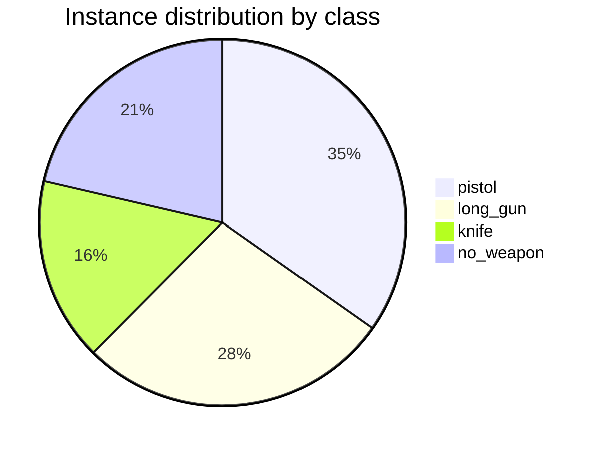
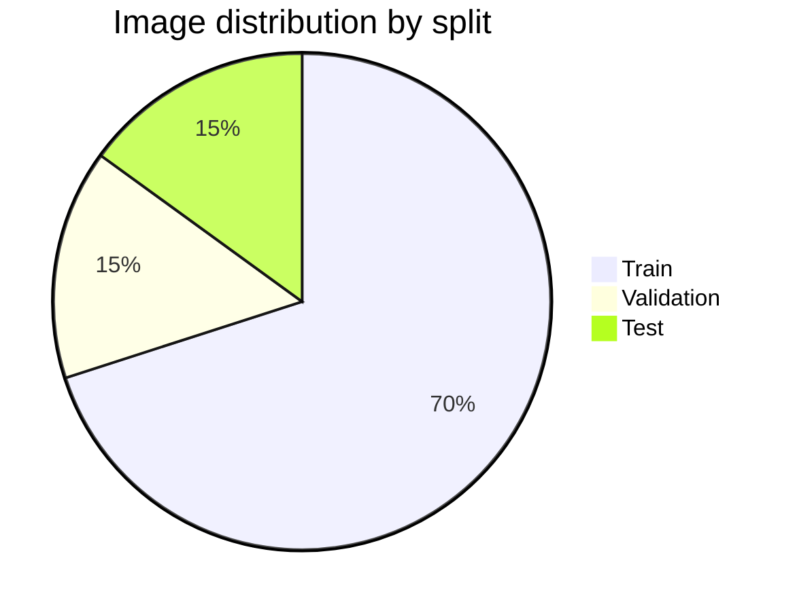
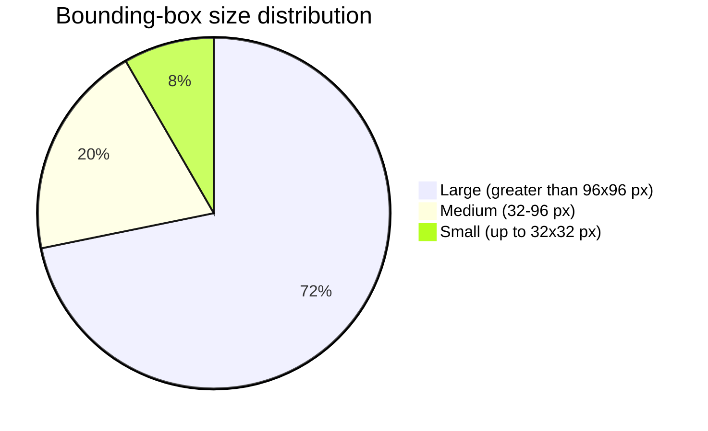
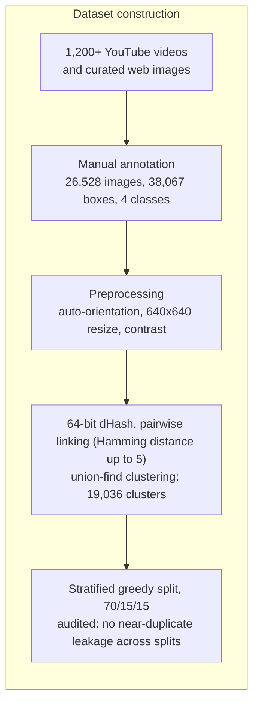
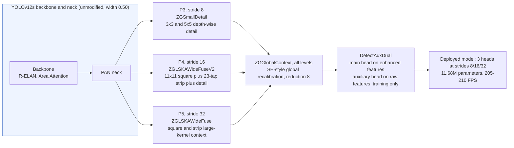

# Real-Time Weapon Detection Using Enhanced YOLOv12 Models and a Custom Dataset

Official repository for the paper *"Real-Time Weapon Detection Using Enhanced YOLOv12 Models and a Custom Dataset."*
Constantin Catargiu, Iulian B. Ciocoiu — Faculty of Electronics, Telecommunications and Information Technology, Gheorghe Asachi Technical University of Iasi, Romania.

<p align="center">
  
  
  
</p>

<p align="center">
  
  
  
</p>

---

## Abstract

This repository accompanies a study on real-time detection of small, occluded, and low-contrast weapons in surveillance imagery. We introduce a custom dataset of 26,528 images and 38,067 manually annotated instances across four classes (`knife`, `pistol`, `long_gun`, `no_weapon`), split using a perceptual-hash clustering procedure that eliminates near-duplicate leakage between training, validation, and test subsets. Building on YOLOv12s, we propose two complementary modifications: (i) a small-object-aware training loss combining dynamic curriculum weighting, adaptive loss clipping, and a retuned Task-Aligned Assigner; and (ii) five lightweight, zero-gated, append-only modules inserted into the detection head, each initialized as an exact identity of the pretrained baseline so that the backbone, neck, and P3/P4/P5 output structure remain unmodified. Averaged over three independent training seeds, the proposed model improves mAP@50 from 0.812 to 0.852 (+4.9%), with the largest relative gains on small objects (+10.6% mAP@50) and on the `no_weapon` confounder class (+11.6% mAP@50), while retaining real-time throughput (205–210 FPS on an RTX 4090, versus approximately 220 FPS for the baseline). Under a controlled comparison using identical data, split, and training schedule, the proposed model outperforms YOLO26s at every object scale. The model additionally generalizes to three external, publicly available weapon-detection datasets without retraining (zero-shot mAP@50 of 0.776–0.805).

---

## Contents

1. [Introduction](#1-introduction)
2. [Related Work](#2-related-work)
3. [Contributions](#3-contributions)
4. [Dataset](#4-dataset)
5. [Method](#5-method)
6. [Experimental Setup](#6-experimental-setup)
7. [Results](#7-results)
8. [Reproducibility](#8-reproducibility)
9. [Limitations and Future Work](#9-limitations-and-future-work)
10. [Frequently Asked Questions](#10-frequently-asked-questions)
11. [Reproducibility Checklist](#11-reproducibility-checklist)
12. [Resources](#12-resources)
13. [Citation](#13-citation)

---

## 1. Introduction

Firearm-related violence remains a significant public-safety concern. Civilian firearm ownership is estimated at approximately 857 million units worldwide, of which roughly 393 million are held in the United States — a figure that exceeds the country's population. In 2023 alone, the United States reported approximately 46,000 firearm-related deaths, including 656 mass-shooting incidents. Such events increasingly occur in settings historically regarded as low-risk, including schools, places of worship, and public venues.

Conventional video-surveillance deployments typically rely on human operators monitoring multiple simultaneous camera feeds. This approach is inherently limited by operator fatigue, restricted attention span, and delayed response time, particularly in crowded or visually complex scenes. Automated, real-time weapon-detection systems address these limitations directly and are applicable to smart-city monitoring, school-safety infrastructure, and public-transport surveillance. The primary technical difficulty in this setting is not the detection of large, unoccluded weapons — which existing detectors already handle adequately — but rather (i) small, distant, or partially occluded weapons, and (ii) everyday objects with weapon-like silhouettes that trigger false alarms. This work addresses both failure modes directly.

---

## 2. Related Work

<details>
<summary><b>Summary of prior approaches to weapon detection</b> (click to expand)</summary>

<br>

| Category | Representative work | Reported performance | Principal limitation |
|---|---|---|---|
| Handcrafted features | k-means color segmentation with Harris/FREAK matching (Tiwari and Verma); Bag-of-Visual-Words with SIFT and SVM (Ben Halima and Hosam) | 84.26% accuracy on an 89-image test set; robustness to scale, rotation, and partial occlusion | Small evaluation sets; degradation under variable illumination; insufficient throughput for real-time operation |
| Alternative sensing modalities | Passive millimeter-wave imaging with cascaded AdaBoost (Xiao et al.); thermal YOLOv3 on a wearable platform (Muñoz et al., 64.52% mAP@50); IR/RGB discrete wavelet transform fusion (Gosain et al., 90.62% accuracy) | Detection of concealed and non-metallic weapons; low-power operation | Requires specialized hardware; sensitive to clothing thickness and multi-stream registration |
| Convolutional neural networks | Comparative SSD/Faster R-CNN evaluation (Jain et al.); VGG-16 + Faster R-CNN handgun alarm system with the AATpI responsiveness metric (Olmos et al., F1 = 91.43%); binocular disparity fusion (−49% false positives); MLFPNet multi-level pyramid for non-canonical firearm poses (Lim et al.) | Substantial accuracy improvement over handcrafted approaches; first real-time alarm pipelines | Persistent accuracy–latency trade-off; computational cost restricts deployment scenarios |
| Contextual and pose-based cues | YOLOv5 with HRNet pose fusion via a multilayer perceptron (Maligireddy et al., 90.7% accuracy); human–object interaction posture cues (Xu and Verma, 74% accuracy); component-wise firearm classification — barrel, stock, magazine, receiver (Egiazarov et al., 76–88% accuracy) | Joint reasoning over posture and appearance; improved occlusion robustness | Sensitive to pose-estimation error under occlusion; additional computational overhead |
| False-alarm mitigation | ODeBiC two-level binary classifiers for confusable object pairs, e.g., pistols versus phones (Pérez-Hernández et al.: +19.57% precision, −56.5% false positives); DaCoLT darkening and CLAHE preprocessing for reflective knives (Castillo et al., F1 = 93.97%); explicit "Not-Pistol" negative class on 8,300 CCTV images (Bhatti et al., YOLOv4, mAP@50 = 91.73%); spatial-heuristic armed-person inference (Amado-Garfias et al.) | Directly addresses the dominant deployment failure mode: false positives on weapon-shaped objects | Increased system complexity and latency; degraded performance in crowded scenes |
| Lightweight and edge-deployable models | YOLOv10n at 20 FPS on a Raspberry Pi 4 (Žigulić et al., mAP@50 = 0.91); seven-class custom CNN (Kaya et al., 98.4% accuracy); MSA-YOLOv5 with 1.79M parameters (Park et al., mAP@50 = 0.983); YOLOv9 evaluated on 500 images (Sumi and Dey, mAP@50 = 0.992) | Real-time inference on constrained hardware | Small or single-class datasets, raising concerns about overfitting and generalization |

**Positioning relative to prior work.** Handcrafted-feature methods do not generalize across scene variability; thermal and IR sensing require dedicated hardware unavailable in most existing CCTV infrastructure; standard CNN detectors trade accuracy for latency or vice versa; contextual and pose-based methods introduce non-trivial computational overhead; and lightweight edge-oriented models remain evaluated on small or single-class datasets that limit generalization claims. Notably, the explicit negative-class supervision introduced by Bhatti et al. is, to our knowledge, the only prior approach demonstrated to reduce both false positives and false negatives simultaneously — a finding this work extends with a substantially larger and more diverse `no_weapon` class.

**Choice of base architecture.** YOLOv12 combines convolutional and attention-based components through Area Attention (reduced-complexity self-attention via spatial-region partitioning), R-ELAN (residual connections for improved gradient flow), and FlashAttention (reduced memory-access overhead). This combination offers a favorable accuracy–efficiency trade-off relative to purely convolutional or purely transformer-based detectors and motivates its use as the base architecture in this work.

</details>

---

## 3. Contributions

1. **A dataset for small-object weapon detection.** 26,528 images and 38,067 manually annotated instances across four classes, sourced from over 1,200 YouTube videos (CCTV footage, films depicting weapon-handling scenarios, firearm-instruction content, and shooting-range/tactical-training recordings) together with curated web imagery, spanning motion blur, variable illumination, occlusion, and crowded scenes.
2. **A leakage-free evaluation protocol.** Perceptual-hash clustering of near-duplicate video frames, with whole-cluster assignment to a single data split and a post-hoc cross-split audit, ensuring reported metrics reflect generalization rather than memorization of near-identical frames.
3. **A small-object-aware training loss.** Four modifications to the standard YOLOv12 objective: dynamic curriculum weighting, an auxiliary center loss (evaluated and ultimately not adopted), adaptive per-batch loss clipping, and a Task-Aligned Assigner retuned for small-object recall.
4. **Five zero-gated, append-only detection-head modules.** Each module is initialized as an identity mapping and is trained to activate only where it reduces the training loss; the backbone, neck, and P3/P4/P5 output structure of YOLOv12s remain unmodified (a stride-4, P2-based extension was evaluated and not adopted).
5. **An extensive experimental evaluation.** Over 40 architectural variants, exhaustive loss-hyperparameter grid searches, per-object-size and per-class ablations, a three-seed reproducibility study, a controlled comparison against YOLO26 under identical training conditions, zero-shot evaluation on three external public datasets, and qualitative error analysis targeting the most safety-critical failure mode.

### Application domains

| Domain | Representative use cases |
|---|---|
| Video surveillance | CCTV monitoring, real-time threat detection, smart-city integration |
| Public safety | Transportation hubs, stadiums, schools, public gatherings |
| Access control | Entry-point screening, secure-facility monitoring |
| Law enforcement | Real-time threat assessment, evidence analysis, situational awareness |
| Research | Benchmark dataset for small-object detection and negative-class design |

---

## 4. Dataset

### 4.1 Composition and sourcing

| Property | Value |
|---|---|
| Total images | 26,528 |
| Total annotated instances | 38,067 (annotated manually by the first author, verified by the second author) |
| Classes | `knife`, `pistol`, `long_gun`, `no_weapon` |
| Sources | Frames extracted from over 1,200 YouTube videos — surveillance footage, films depicting weapon-handling scenarios, firearm-instruction content, shooting-range and tactical-training recordings — supplemented with manually curated web imagery, deliberately spanning a range of viewpoints, resolutions, lighting conditions, and handling contexts |
| Conditions represented | Close and distant views; daytime, nighttime, and artificial lighting; occlusion; motion blur; crowded backgrounds |
| Annotation format | YOLO format (`class x_center y_center width height`, normalized), axis-aligned boxes. A single class label is used per weapon type regardless of model or variant; partially visible or boundary-truncated weapons are annotated with the same class as fully visible instances |
| Split | 70/15/15 (train/validation/test), assigned via the leakage-free protocol described in Section 4.3 |
| Intended use | Research purposes only; all imagery was sourced from publicly accessible content |

**Class definitions.** `knife` denotes bladed weapons and visually similar sharp objects; `pistol` denotes handguns and short firearms; `long_gun` denotes rifles, shotguns, and other long-barreled firearms; `no_weapon` is an explicit negative class comprising visually confusable items — phones, remote controls, selfie sticks, and similarly shaped hand-held objects.

The `no_weapon` class is included as an explicit negative rather than left as unlabeled background, following the precedent established by Bhatti et al. (IEEE Access, 2021), whose "Not-Pistol" class reduced both false positives and false negatives. Supervising this decision boundary directly targets the dominant failure mode of deployed weapon detectors: elevated false-positive rates on weapon-shaped everyday objects.

<details>
<summary><b>Preprocessing pipeline</b></summary>

<br>

| Step | Description | Purpose |
|---|---|---|
| Auto-orientation | Corrects pixel-matrix orientation using image metadata | Prevents the model from learning spurious pose variation caused by inconsistent source orientation |
| Resizing | Uniform resizing to 640×640 pixels | Standard YOLO input requirement; 640 px was confirmed against 800 px and 960 px alternatives, which produced no measurable improvement |
| Contrast adjustment | Adaptive histogram equalization across the full dynamic range | Improves boundary visibility under low-light or high-glare conditions, particularly relevant for small objects whose defining features are easily lost in low-contrast regions |

This pipeline is applied identically to all three splits, so training and evaluation share the same input distribution.

</details>

### 4.2 Leakage-free split protocol

Because most images originate from video, consecutive frames are often near-identical. A naive per-frame split can place near-duplicate frames in both the training and test sets, producing over-optimistic performance estimates. The following protocol prevents this:

| Step | Procedure | Rationale |
|---|---|---|
| 1. Hashing | Each frame is reduced to a 64-bit perceptual hash (difference hash) | Provides a compact, robust fingerprint for near-duplicate detection |
| 2. Linking | Frame pairs with Hamming distance ≤ 5 are linked | Standard threshold for perceptual near-duplicate detection; small enough to avoid merging visually distinct frames |
| 3. Clustering | Connected components are extracted via a union-find structure, yielding 19,036 clusters over 26,528 images | Groups mutually near-identical frames |
| 4. Split assignment | Each cluster is assigned in its entirety to a single split, via a stratified greedy procedure targeting a 70/15/15 ratio for both the overall image count and each class individually | Guarantees that no near-duplicate pair is divided across splits |
| 5. Audit | A post-hoc verification confirms that no image pair within the near-duplicate threshold crosses a split boundary | Provides an empirical guarantee, not merely a procedural assumption |

### 4.3 Dataset statistics

**Table 1. Split and class distribution.**

| Split | Images | Instances | knife | long_gun | pistol | no_weapon |
|---|---:|---:|---:|---:|---:|---:|
| Train | 18,577 (70.0%) | 26,103 | 4,294 (16.5%) | 7,337 (28.1%) | 9,187 (35.2%) | 5,285 (20.2%) |
| Validation | 3,973 (15.0%) | 5,853 | 923 (15.8%) | 1,561 (26.7%) | 1,985 (33.9%) | 1,384 (23.6%) |
| Test | 3,978 (15.0%) | 6,111 | 941 (15.4%) | 1,643 (26.9%) | 2,060 (33.7%) | 1,467 (24.0%) |
| **Total** | **26,528** | **38,067** | **6,158 (16.2%)** | **10,541 (27.7%)** | **13,232 (34.8%)** | **8,136 (21.4%)** |

*Figure 1. Instance distribution by class (38,067 total).*



*Figure 2. Image distribution by split (26,528 total).*



**Table 2. Bounding-box size distribution.** Following the COCO convention, computed on 640×640 resized images from normalized width/height box areas: small ≤ 32², medium ≤ 96², large > 96² px.

| Split | Total boxes | Small | Medium | Large |
|---|---:|---:|---:|---:|
| Train | 26,103 | 2,198 (8.4%) | 5,312 (20.4%) | 18,593 (71.2%) |
| Validation | 5,853 | 475 (8.1%) | 1,087 (18.6%) | 4,291 (73.3%) |
| Test | 6,111 | 499 (8.2%) | 1,167 (19.1%) | 4,445 (72.7%) |
| **Total** | **38,067** | **3,172 (8.3%)** | **7,566 (19.9%)** | **27,329 (71.8%)** |

The dataset is dominated by large objects (approximately 72%), with roughly 20% medium and 8% small instances. This distribution is consistent across all three splits, indicating no split is systematically easier than the others.

*Figure 3. Bounding-box size distribution (38,067 boxes).*



**Table 3. Size distribution by class.**

| Class | Total boxes | Small | Medium | Large |
|---|---:|---:|---:|---:|
| knife | 6,158 | 225 (3.7%) | 1,065 (17.3%) | 4,868 (79.1%) |
| long_gun | 10,541 | 482 (4.6%) | 1,542 (14.6%) | 8,517 (80.8%) |
| pistol | 13,232 | **2,023 (15.3%)** | 3,414 (25.8%) | 7,795 (58.9%) |
| no_weapon | 8,136 | 442 (5.4%) | 1,545 (19.0%) | 6,149 (75.6%) |
| **Total** | **38,067** | **3,172 (8.3%)** | **7,566 (19.9%)** | **27,329 (71.8%)** |

Small instances are strongly class-dependent: the `pistol` class alone accounts for 63.8% of all small boxes in the dataset, reflecting the tendency of handguns to appear small and distant in surveillance footage, whereas the remaining classes are predominantly large (76–81%). This concentration of small, difficult instances within a single class, together with the heterogeneous composition of `no_weapon`, motivates the design choices described in Section 5.

---

## 5. Method

### 5.1 Baseline architecture

The baseline detector is YOLOv12s, which outputs predictions at three feature-pyramid levels corresponding to strides 8 (P3), 16 (P4), and 32 (P5). This resolution is limiting for small firearms, which frequently occupy fewer than 20–30 pixels in surveillance imagery. A natural response — adding a fourth, higher-resolution detection head at stride 4 (P2) — was implemented and evaluated but ultimately not adopted, as it substantially increased computational cost and memory footprint (160×160 feature maps) without producing a consistent accuracy improvement over the three-scale design (Section 5.4, Section 7.3). The proposed model therefore retains the stock YOLOv12s backbone and PAN neck (width multiplier 0.50) and the original P3/P4/P5 output structure, concentrating all architectural modifications within the detection head.

### 5.2 Small-object-aware loss

Four modifications (denoted A1–A4) address specific limitations of the standard YOLOv12 training objective on small, cluttered, or occluded targets. All hyperparameters were tuned via grid search on the validation set.

<details>
<summary><b>A1 — Dynamic curriculum weighting (adopted)</b></summary>

<br>

Under the standard formulation, all positive assignments are weighted approximately equally, so that boxes with larger area dominate the loss due to stronger IoU gradients, leaving small objects under-represented during early training. Each positive assignment *j* receives a weight combining a normalized inverse-area term (favoring small objects) with the target score, blended by a curriculum coefficient α(t) that transitions from an early, area-dominant regime to a later, balanced regime over the course of training. This weight is applied to both the IoU and DFL loss terms.

| Parameter | Search range | Selected value |
|---|:---:|:---:|
| α₁ (early-training mixing coefficient) | [0.1, 1.0] | 0.7 |
| α₂ (late-training mixing coefficient) | [0.1, 1.0] | 0.4 |
| Small-object threshold | — | area ≤ 32×32 px |

</details>

<details>
<summary><b>A2 — Auxiliary center loss (evaluated, not adopted)</b></summary>

<br>

IoU-based regression losses provide weak gradient signal for small boxes, since minor positional error causes IoU to collapse even when box centers remain close. This modification adds an L1 penalty on box centers, restricted to small targets via a binary mask, with a decaying weight schedule, intended to correct near-miss localization errors on small handguns and knives.

The tuned weight, searched over [0, 0.1], produced no measurable improvement on the validation set, and the size-stratified ablation (Table 6) shows a small negative effect on small- and medium-object accuracy. This modification is therefore disabled (λ_center = 0) in the final configuration and is reported for completeness and to document a negative result.

</details>

<details>
<summary><b>A3 — Adaptive loss clipping (adopted)</b></summary>

<br>

Training occasionally produces unstable loss spikes, arising from label noise or unusually hard positives, which can destabilize optimization in cluttered surveillance footage. This modification applies per-batch clipping to the IoU and DFL losses using epoch-dependent ceilings, improving convergence stability.

| Parameter | Role | Search range | Selected value |
|---|---|:---:|:---:|
| α₅ | IoU ceiling, start of schedule | [10, 70], step 1 | 50 |
| α₆ | IoU ceiling, end of schedule | [10, 70], step 1 | 30 |
| α₇ | DFL ceiling, start of schedule | [10, 70], step 1 | 25 |
| α₈ | DFL ceiling, end of schedule | [10, 70], step 1 | 15 |

</details>

<details>
<summary><b>A4 — Task-Aligned Assigner retuning (adopted)</b></summary>

<br>

The default Task-Aligned Assigner considers a limited candidate pool (top-k = 10); for small objects, it is possible that no anchor sufficiently overlaps the ground-truth box, producing false negatives at the assignment stage.

| Parameter | YOLOv12 default | Selected value | Search range |
|---|:---:|:---:|:---:|
| Candidate pool (top-k) | 10 | 13 | [2, 25] |
| Score exponent | 0.5 | 0.7 | — |
| IoU exponent | 6.0 | 4.0 | — |

The expanded candidate pool improves recall in small-object scenarios, while the retuned exponents rebalance classification confidence against localization quality during assignment; lowering the IoU exponent reduces the assigner's bias against small candidates with imperfect but acceptable localization.

</details>

**Adopted configuration: A1 + A3 + A4** (A2 evaluated and disabled). Loss weights λ_box, λ_DFL, and λ_cls remain unchanged from the original YOLOv12 configuration.

### 5.3 Loss formulation

The following is a readable transcription of the paper's Equations (1)–(8); the typeset originals should be consulted for exact notation.

For each positive assignment *j* at training epoch *t*, the curriculum weight is:

$$w_j(t) \;=\; \alpha(t)\,\hat{a}_j \;+\; \bigl(1-\alpha(t)\bigr)\,s_j$$

where $s_j$ is the target score and $\hat{a}_j$ is the inverse ground-truth box area, normalized over the set of positive assignments in the batch. The coefficient $\alpha(t)$ interpolates from $\alpha_1 = 0.7$ (early training) to $\alpha_2 = 0.4$ (late training). $w_j(t)$ scales both the IoU regression loss and the Distribution Focal Loss (a cross-entropy loss over discrete coordinate bins per box edge).

The auxiliary center loss (disabled in the final configuration) is:

$$L_{center} \;=\; \sum_{j}\mathbb{1}_{small}(j)\;\bigl\lVert c_j - \hat{c}_j \bigr\rVert_1$$

where $c_j, \hat{c}_j$ are the ground-truth and predicted box centers and $\mathbb{1}_{small}$ selects targets with area below 32×32 px, scaled by a decaying weight $\lambda_{center}(t)$.

Adaptive clipping applies per-batch, epoch-dependent ceilings:

$$\tilde{L}_{IoU} = \min\!\bigl(L_{IoU},\,M_{IoU}(t)\bigr), \qquad \tilde{L}_{DFL} = \min\!\bigl(L_{DFL},\,M_{DFL}(t)\bigr)$$

where $M_{IoU}$ anneals from $\alpha_5=50$ to $\alpha_6=30$, and $M_{DFL}$ anneals from $\alpha_7=25$ to $\alpha_8=15$.

The overall training objective is:

$$L \;=\; \lambda_{box}\,\tilde{L}_{IoU} \;+\; \lambda_{DFL}\,\tilde{L}_{DFL} \;+\; \lambda_{cls}\,L_{cls} \;+\; \lambda_{center}(t)\,L_{center}$$

with $\lambda_{box}, \lambda_{DFL}, \lambda_{cls}$ unchanged from the original YOLOv12 configuration and $\lambda_{center}(t) \equiv 0$ in the adopted configuration.

### 5.4 Zero-gated head enhancements

Five modules (denoted B1–B5) modify only the detection head; the backbone, neck, and output resolution remain unchanged from stock YOLOv12s.

| Module | Feature level | Description | Status |
|---|:---:|---|:---:|
| B1 — Zero-gating principle | all | Each module is a residual branch scaled by a learnable gate γ, initialized to zero, so that the network reproduces the pretrained baseline exactly at the start of training; gates open only where the branch reduces the training loss | design principle |
| B2 — ZGSmallDetail | P3 | Two parallel depth-wise convolutions (3×3 and 5×5), summed, normalized, and projected as a gated residual | adopted |
| B2 — ZGLSKAWideFuseV2 | P4 | Expand-then-fuse block combining an 11×11 square large-kernel attention branch with a hybrid branch (23-tap strip attention plus a small-kernel detail path) | adopted |
| B2 — ZGLSKAWideFuse | P5 | Fusion of square and strip large-kernel attention paths, supplying broad scene context at the coarsest scale | adopted |
| B3 — ZGGlobalContext | P3–P5 | Squeeze-and-excitation-style global recalibration applied at all three levels | adopted |
| B4 — DetectAuxDual | head | Auxiliary detection head supervised on raw, pre-enhancement neck features, in parallel with the main head; discarded at inference | adopted (training only) |

<details>
<summary><b>Module rationale</b></summary>

<br>

**ZGSmallDetail (P3, stride 8).** Empirically, every large-receptive-field variant evaluated at P3 degraded small-object accuracy, as wide-receptive-field operations erode the fine detail on which small firearms depend. The module is therefore restricted to small-kernel, depth-wise operators (3×3 and 5×5) with no large-kernel smoothing.

**ZGLSKAWideFuseV2 (P4, stride 16).** A purely large-kernel fusion at this level was found to attenuate small-object features relevant to mid-scale detection. The module instead expands the input into two branches — one retaining square large-kernel attention for context, the other combining a small-detail path with a 23-tap strip kernel targeting the elongated geometry of knives and long guns — before concatenation and projection. A channel-split variant of this fusion (rather than full-width, expand-then-fuse) was evaluated and found to under-provision both branches; it was not adopted.

**ZGLSKAWideFuse (P5, stride 32).** At the coarsest scale, context dominates over fine detail. This module fuses square and strip large-kernel attention paths to model broad spatial layout; it accounts for the majority of the added parameter budget.

**ZGGlobalContext (all levels).** A purely local receptive field cannot separate the context-dependent `no_weapon` class from genuine weapons — for instance, distinguishing a phone from a pistol in a hand often requires scene-level context. This module applies global average pooling, a bottleneck projection (reduction factor 8) with SiLU activation, and an expansion, broadcast additively to every spatial location through a zero-initialized gate (following established practice from ReZero and GCNet). This yields the largest single-class improvement in the study: +11.6% mAP@50 and +16.4% recall on `no_weapon`.

**DetectAuxDual (head).** Supervising the detection head only through enhanced features risks encouraging the backbone toward coarse, context-dominated representations at the expense of fine detail. This module adds a parallel auxiliary head supervised directly on raw, pre-enhancement neck features, providing a short gradient path that rewards detail preservation. The auxiliary branch (0.82M parameters) is active during training only and is removed at inference, so the deployed model retains the original three-head structure at strides 8/16/32 with no added latency.

**Hyperparameter selection.** Module hyperparameters were fixed through the same ablation protocol used for the architecture search: the square-kernel size was swept over {7, 11, 15}, with k = 11 identified as the empirical optimum and near-flat sensitivity around this value; the 23-tap strip kernel was validated as a standalone branch before being retained in the full-width fusion design; and the 640 px input resolution was confirmed against 800 px and 960 px alternatives, which produced no improvement.

</details>

### 5.5 Parameter and throughput budget

| | Baseline YOLOv12s | Proposed (deployed) |
|---|:---:|:---:|
| Parameters (inference) | 9.10M | 11.68M (+2.58M, +28%; dominated by the P5 fusion block) |
| Auxiliary branch (training only) | — | 0.82M (removed at deployment) |
| Throughput (RTX 4090) | approximately 220 FPS | 205–210 FPS |

All added modules rely exclusively on depth-wise and 1×1 convolutions, limiting the parameter and latency overhead; the measured throughput reduction is modest and the deployed model retains a substantial real-time margin.

### 5.6 Method pipeline

*Figure 4. Dataset construction and split assignment.*



*Figure 5. Zero-gated head modules within the unmodified YOLOv12s backbone and neck.*



Each colored module is a zero-gated residual branch: at initialization, the network is functionally identical to the pretrained baseline, and gates open only where a branch is found to reduce training loss.

### 5.7 Final configuration summary

| Component | Status | Final values |
|---|:---:|---|
| A1 — Curriculum weighting | adopted | α₁ = 0.7, α₂ = 0.4, small-object threshold ≤ 32×32 px |
| A2 — Center loss | not adopted | λ_center = 0 (no validation improvement; slight negative effect on small objects) |
| A3 — Adaptive clipping | adopted | α₅ = 50, α₆ = 30 (IoU); α₇ = 25, α₈ = 15 (DFL) |
| A4 — Task-Aligned Assigner retuning | adopted | top-k = 13, score exponent = 0.7, IoU exponent = 4.0 |
| Loss weights λ_box, λ_DFL, λ_cls | unchanged | original YOLOv12 values |
| B2 — ZGSmallDetail (P3) | adopted | 3×3 and 5×5 depth-wise convolutions, GroupNorm, zero-gated |
| B2 — ZGLSKAWideFuseV2 (P4) | adopted | 11×11 square attention, 23-tap strip attention, detail path, expand-then-fuse |
| B2 — ZGLSKAWideFuse (P5) | adopted | square and strip large-kernel fusion |
| B3 — ZGGlobalContext | adopted | all levels, reduction factor 8, SiLU activation |
| B4 — DetectAuxDual | adopted (training only) | auxiliary head on raw features, removed at inference |
| Backbone / neck / output scales | unchanged | stock YOLOv12s, width 0.50, P3/P4/P5 (P2 extension evaluated and not adopted) |
| Input resolution | 640 px | confirmed against 800/960 px (no improvement) |

---

## 6. Experimental Setup

### 6.1 Evaluation protocol

| Aspect | Convention |
|---|---|
| Metrics | Precision, Recall, F1-score, mAP@50, mAP@50-95 — reported overall, per class, and per object-size bucket |
| Size buckets | COCO convention on 640×640 resized images: small ≤ 32², medium ≤ 96², large > 96² px |
| Operating point | Per-class Precision/Recall/F1 reported at the F1-optimal operating point |
| Confusion matrices | Computed at a fixed confidence threshold of 0.25 and IoU ≥ 0.5; the background row/column accounts for false positives and false negatives, so per-class values differ slightly from the main results tables |
| Headline comparisons | Mean ± standard deviation over three independent training seeds, with deterministic execution |
| Fairness | The baseline, the proposed model, and YOLO26 are all trained under identical data, split, schedule, and hyperparameters |
| Throughput | Measured on an NVIDIA RTX 4090 (24GB), CUDA 12.1 |

### 6.2 Hardware and software

| Component | Specification |
|---|---|
| Operating system | Ubuntu 22.04.3 LTS |
| GPU | NVIDIA RTX 4090, 24GB (CUDA 12.1) |
| CPU | Intel Core i9-13900KF (5.8 GHz) |
| RAM | 64GB DDR5 (6000 MHz) |
| Python / PyTorch | 3.10.2 / 2.1.2 |

---

## 7. Results

### 7.1 Per-class performance

**Table 4. Per-class performance, proposed model versus baseline (test set).**

| Class | mAP@50 (proposed / baseline) | mAP@50-95 (proposed / baseline) | Precision (proposed / baseline) | Recall (proposed / baseline) | F1 (proposed / baseline) |
|---|:---:|:---:|:---:|:---:|:---:|
| knife | 0.900 / 0.867 | 0.646 / 0.609 | 0.876 / 0.848 | 0.841 / 0.807 | 0.859 / 0.828 |
| pistol | 0.916 / 0.882 | 0.609 / 0.569 | 0.897 / 0.862 | 0.879 / 0.840 | 0.888 / 0.851 |
| long_gun | 0.903 / 0.881 | 0.575 / 0.554 | 0.880 / 0.859 | 0.883 / 0.848 | 0.882 / 0.853 |
| no_weapon | 0.689 / 0.617 | 0.385 / 0.332 | 0.807 / 0.761 | 0.582 / 0.500 | 0.678 / 0.609 |
| **All classes** | **0.852 / 0.812** | **0.553 / 0.516** | **0.865 / 0.833** | **0.800 / 0.747** | **0.831 / 0.788** |

**Table 5. Relative improvements and attribution.**

| Class | mAP@50 | Precision | Recall | F1 | Primary contributing factors |
|---|:---:|:---:|:---:|:---:|---|
| knife | +3.8% | +3.3% | +4.2% | +3.7% | ZGSmallDetail (B2) and curriculum weighting (A1) preserve thin edge features |
| pistol | +3.9% | +4.0% | +4.6% | +4.3% | Task-Aligned Assigner retuning (A4) benefits the class with the largest proportion of small instances |
| long_gun | +2.5% | +2.4% | +4.1% | +3.4% | Already strong at baseline; strip-kernel attention (B2) improves bounding-box fit for elongated objects |
| no_weapon | +11.6% | +6.0% | +16.4% | +11.3% | ZGGlobalContext (B3) and DetectAuxDual (B4) improve separation of confounders from genuine weapons |
| **All classes** | **+4.9%** | **+3.8%** | **+7.1%** | **+5.5%** | Complementary contributions from the loss modifications (A1, A3, A4) and head modules (B1–B4) |

The confusion matrices (paper, Figures 6–7) show consistent improvements across all object scales, most pronounced for small objects, while confirming that `no_weapon` remains the most difficult class, consistent with the effectively unbounded diversity of real-world objects that can visually resemble weapons.

### 7.2 Ablation by object size

**Table 6. Performance by object size (test set).**

<details>
<summary><b>Small objects (area ≤ 32×32 px)</b></summary>

| Metric | Baseline | +A1 | +A2 | +A3 | +A4 | Loss (A1–A4) | Architecture (B1–B5) | Proposed |
|---|---:|---:|---:|---:|---:|---:|---:|---:|
| mAP@50 | 0.640 | 0.669 (+4.53%) | 0.631 (−1.41%) | 0.665 (+3.91%) | 0.674 (+5.31%) | 0.681 (+6.41%) | 0.664 (+3.75%) | **0.708 (+10.63%)** |
| mAP@50-95 | 0.324 | 0.336 (+3.70%) | 0.319 (−1.54%) | 0.341 (+5.25%) | 0.339 (+4.63%) | 0.348 (+7.41%) | 0.334 (+3.09%) | **0.354 (+9.26%)** |
| Precision | 0.758 | 0.770 (+1.58%) | 0.762 (+0.53%) | 0.766 (+1.06%) | 0.778 (+2.64%) | 0.783 (+3.30%) | 0.769 (+1.45%) | **0.790 (+4.22%)** |
| Recall | 0.585 | 0.622 (+6.32%) | 0.572 (−2.22%) | 0.628 (+7.35%) | 0.625 (+6.84%) | 0.648 (+10.77%) | 0.611 (+4.44%) | **0.660 (+12.82%)** |
| F1-score | 0.662 | 0.692 (+4.53%) | 0.653 (−1.36%) | 0.694 (+4.83%) | 0.697 (+5.29%) | 0.708 (+6.95%) | 0.682 (+3.02%) | **0.719 (+8.61%)** |

</details>

<details>
<summary><b>Medium objects (32×32 &lt; area ≤ 96×96 px)</b></summary>

| Metric | Baseline | +A1 | +A2 | +A3 | +A4 | Loss (A1–A4) | Architecture (B1–B5) | Proposed |
|---|---:|---:|---:|---:|---:|---:|---:|---:|
| mAP@50 | 0.781 | 0.811 (+3.84%) | 0.773 (−1.02%) | 0.807 (+3.33%) | 0.814 (+4.23%) | 0.818 (+4.74%) | 0.797 (+2.05%) | **0.826 (+5.76%)** |
| mAP@50-95 | 0.445 | 0.464 (+4.27%) | 0.439 (−1.35%) | 0.467 (+4.94%) | 0.465 (+4.49%) | 0.472 (+6.07%) | 0.457 (+2.70%) | **0.480 (+7.87%)** |
| Precision | 0.816 | 0.838 (+2.70%) | 0.820 (+0.49%) | 0.833 (+2.08%) | 0.845 (+3.55%) | 0.851 (+4.29%) | 0.832 (+1.96%) | **0.860 (+5.39%)** |
| Recall | 0.723 | 0.751 (+3.87%) | 0.714 (−1.24%) | 0.754 (+4.29%) | 0.752 (+4.01%) | 0.763 (+5.53%) | 0.741 (+2.49%) | **0.775 (+7.19%)** |
| F1-score | 0.767 | 0.792 (+3.26%) | 0.758 (−1.17%) | 0.791 (+3.13%) | 0.796 (+3.78%) | 0.805 (+4.95%) | 0.784 (+2.22%) | **0.815 (+6.26%)** |

</details>

<details>
<summary><b>Large objects (area &gt; 96×96 px)</b></summary>

| Metric | Baseline | +A1 | +A2 | +A3 | +A4 | Loss (A1–A4) | Architecture (B1–B5) | Proposed |
|---|---:|---:|---:|---:|---:|---:|---:|---:|
| mAP@50 | 0.848 | 0.858 (+1.18%) | 0.853 (+0.59%) | 0.854 (+0.71%) | 0.862 (+1.65%) | 0.866 (+2.12%) | 0.856 (+0.94%) | **0.872 (+2.83%)** |
| mAP@50-95 | 0.574 | 0.583 (+1.57%) | 0.578 (+0.70%) | 0.585 (+1.92%) | 0.582 (+1.39%) | 0.591 (+2.96%) | 0.582 (+1.39%) | **0.595 (+3.66%)** |
| Precision | 0.844 | 0.867 (+2.73%) | 0.851 (+0.83%) | 0.862 (+2.13%) | 0.873 (+3.44%) | 0.880 (+4.27%) | 0.861 (+2.01%) | **0.893 (+5.81%)** |
| Recall | 0.808 | 0.822 (+1.73%) | 0.815 (+0.87%) | 0.825 (+2.10%) | 0.823 (+1.86%) | 0.831 (+2.85%) | 0.818 (+1.24%) | **0.838 (+3.71%)** |
| F1-score | 0.825 | 0.843 (+2.18%) | 0.832 (+0.85%) | 0.842 (+2.06%) | 0.846 (+2.55%) | 0.854 (+3.52%) | 0.839 (+1.70%) | **0.864 (+4.73%)** |

</details>

Every proposed component (A1, A3, A4, B1–B5) improves performance in isolation, with the exception of A2, which produces a small negative effect on small and medium objects — the basis for its exclusion from the final configuration. The full combination is strongest on every metric at every object size, and the magnitude of improvement scales inversely with object size (small: +10.6%, medium: +5.8%, large: +2.8% mAP@50), consistent with the design objective.

### 7.3 Architecture search

Over 40 distinct architectural variants were evaluated prior to converging on the B1–B5 design, spanning: insertion point and kernel size of large-kernel attention; wide-receptive-field fusion, global context, and spatial pyramid pooling; deformable and dynamic-sampling operators; capacity redistribution across the P3 path and detection head; neck topology changes, including a stride-4 (P2) extension; input resolution (640, 800, and 960 px); and auxiliary supervision, decoupled heads, and alternative classifier designs.

The final configuration retains the unmodified YOLOv12s backbone and PAN neck, including its 0.50 width multiplier, and restricts all changes to the detection head. The P2/five-scale extension underperformed the three-scale design while substantially increasing computational and memory cost. Every large-receptive-field variant evaluated at P3 degraded small-object accuracy, motivating the restriction of that level to small-kernel, depth-wise operators. The square-kernel size for the large-kernel attention branches was fixed via a dose–response sweep over {7, 11, 15}, yielding k = 11 as the empirical optimum with near-flat sensitivity around this value. Full characteristics of all evaluated variants are documented in the paper's supplementary material.

### 7.4 Seed reproducibility

Neural-network training outcomes depend on stochastic factors — weight initialization, batch ordering, and non-deterministic GPU kernel behavior — so two runs differing only in random seed can produce different scores. Reporting a single training run risks attributing a favorable outcome to a particular seed rather than to the modification under test, a concern of particular relevance when compared configurations differ by only a few percentage points. Each of the four configurations forming the loss × architecture ablation was trained three times independently, with all other factors (dataset, split, resolution, batch size, deterministic execution) held fixed.

**Table 7. Seed reproducibility (mean ± standard deviation over three runs).**

| Configuration | n | mAP@50 | mAP@50-95 | Precision | Recall | mAP@50 (small) | mAP@50 (medium) | mAP@50 (large) |
|---|:---:|:---:|:---:|:---:|:---:|:---:|:---:|:---:|
| Baseline | 3 | 0.812 (±0.0006) | 0.516 (±0.0011) | 0.833 (±0.0034) | 0.747 (±0.0019) | 0.640 (±0.0102) | 0.781 (±0.0025) | 0.848 (±0.0009) |
| + Custom loss | 3 | 0.839 (±0.0007) | 0.539 (±0.0015) | 0.852 (±0.0025) | 0.782 (±0.0017) | 0.681 (±0.0155) | 0.818 (±0.0018) | 0.866 (±0.0001) |
| + Custom architecture | 3 | 0.845 (±0.0008) | **0.557 (±0.0014)** | 0.853 (±0.0094) | 0.780 (±0.0044) | 0.664 (±0.0065) | 0.797 (±0.0022) | 0.856 (±0.0008) |
| **+ Loss + architecture (proposed)** | **3** | **0.852 (±0.0002)** | 0.553 (±0.0021) | **0.865 (±0.0031)** | **0.800 (±0.0007)** | **0.708 (±0.0129)** | **0.826 (±0.0021)** | **0.872 (±0.0019)** |

Across seeds, mAP@50 varies by at most ±0.0008 (±0.0002 for the proposed configuration), while the differences between configurations range from +2.7 to +4.0 percentage points — approximately an order of magnitude larger than the observed seed variance, indicating that the reported improvements are not attributable to seed selection.

At strict mAP@50-95, the architecture-only configuration attains a marginally higher value than the full proposed model (0.557 versus 0.553); this is a small but consistent effect across seeds. The full model nonetheless attains higher values on every other metric, including recall (0.800 versus 0.780), precision (0.865 versus 0.853), and small-object mAP@50 (0.708 versus 0.664) — the metrics considered most operationally relevant to a surveillance application, where missed detections and false alarms carry greater practical cost than marginal reductions in strict bounding-box overlap. The two modifications are otherwise complementary: each improves performance independently, and their combination is strongest on every remaining metric. Small-object metrics exhibit the largest seed-to-seed variance (standard deviation up to approximately 0.015), consistent with the comparatively small number of small instances in the test set; the observed 6.8-point improvement in small-object mAP@50 nonetheless exceeds this variance. All headline comparisons in the paper are reported under this mean ± standard deviation protocol.

### 7.5 Comparison with YOLO26

To assess whether the observed improvements are specific to the proposed modifications rather than attributable to model recency, YOLO26 ("s" scale, official Ultralytics implementation) was trained under identical conditions: same dataset, same leakage-free split, 640 px input, and identical training schedule and hyperparameters.

**Table 8. Comparison across configurations (averaged over three runs).**

| Metric | Object size | YOLOv12s | + Custom loss | + Loss + architecture (proposed) | YOLO26 |
|---|:---:|:---:|:---:|:---:|:---:|
| mAP@50 | Small | 0.640 | 0.681 | **0.708** | 0.615 |
| | Medium | 0.781 | 0.818 | **0.826** | 0.780 |
| | Large | 0.848 | 0.866 | **0.872** | 0.843 |
| | All | 0.812 | 0.839 | **0.852** | 0.807 |
| mAP@50-95 | Small | 0.324 | 0.348 | **0.354** | 0.317 |
| | Medium | 0.445 | 0.472 | **0.480** | 0.466 |
| | Large | 0.574 | 0.591 | **0.595** | 0.588 |
| | All | 0.516 | 0.539 | **0.553** | 0.521 |
| Precision | All | 0.833 | 0.852 | **0.865** | 0.845 |
| Recall | All | 0.747 | 0.782 | **0.800** | 0.753 |
| F1-score | All | 0.788 | 0.816 | **0.831** | 0.796 |

The proposed model outperforms YOLO26 at every object scale, with the largest relative margin on small objects (0.708 versus 0.615 mAP@50, a 15% relative improvement). Notably, stock YOLO26 underperforms stock YOLOv12s on small objects (0.615 versus 0.640), indicating that small-object performance in this domain is governed more by targeted design than by the choice of a more recent base architecture.

### 7.6 External dataset validation

The proposed model, trained exclusively on the custom dataset described in Section 4, was evaluated without retraining (zero-shot) on three publicly available weapon-detection datasets.

**Table 9. Zero-shot generalization to external datasets.**

| Evaluation set | Precision | Recall | mAP@50 | Description |
|---|:---:|:---:|:---:|---|
| Own test set | **0.865** | **0.800** | **0.852** | 26,528 images; knife, pistol, long_gun, no_weapon |
| [Zenodo dataset](https://zenodo.org/records/16422779) | 0.833 | 0.778 | 0.792 | 8,478 images; machete, knife, baseball bat, rifle, gun |
| [YouTube-GDD](https://github.com/ucas-gyx/youtube-gdd) | 0.854 | 0.781 | 0.805 | 5,000 images; gun |
| [Sohas / OD-WeaponDetection](https://github.com/ari-dasci/OD-WeaponDetection) | 0.828 | 0.760 | 0.776 | 5,859 images; pistol, smartphone, knife, coin purse, ticket, card |

<details>
<summary><b>Context relative to prior published results</b></summary>

<br>

Each row below reports results on a different dataset, differing in class composition, size, and difficulty; the values are therefore indicative of each study's specific evaluation setting rather than directly comparable to one another or to the present work. The controlled, directly comparable evaluations are those in Sections 7.4 and 7.5, conducted under identical data, split, and training conditions.

| Method | Precision | Recall | mAP@50 | Dataset |
|---|:---:|:---:|:---:|---|
| YOLOv7 | 0.852 | 0.617 | 0.33 | 400 images (guns and knives) |
| YOLOv5l | 0.715 | 0.614 | 0.641 | 2,986 images (pistols) |
| YOLOv8m | 0.85 | 0.80 | 0.82 | 1,000 images (weapon, no_weapon) |
| VGG-SSD | 0.87 | 0.866 | 0.87 | 872 images (normal, knife, gun) |
| Faster R-CNN | — | — | 0.81 | 3,831 images (gun) |
| YOLOv10n | 0.938 | 0.863 | 0.91 | 9,464 images (pistol/handgun) |

Within this context: earlier YOLOv5/v7 results were obtained on comparatively small, single-domain datasets; the VGG-SSD and Faster R-CNN results were evaluated on fewer than 4,000 images; and the 0.91 mAP@50 reported for YOLOv10n was obtained on a single-weapon-type dataset roughly one-third the size of the present dataset. The proposed model attains mAP@50 = 0.852 on the largest and most class-diverse dataset in this comparison — which additionally includes an explicit `no_weapon` confounder class that increases task difficulty — and retains 0.776–0.805 mAP@50 under zero-shot transfer to external data, indicating that the learned representations generalize beyond the training distribution.

</details>

### 7.7 Error analysis

The paper's Figures 8–10 provide qualitative failure analysis on the test set, comparing the baseline and proposed models.

| Reference | Error mode | Baseline behavior | Proposed model |
|---|---|---|---|
| Figure 8 | False positives (per class) | Weapon-like visual patterns — metallic tools, elongated shapes — trigger incorrect detections; some `no_weapon` scenes are misclassified due to background clutter or human poses resembling weapon handling | Substantially reduced, attributable to global-context recalibration (B3) and the supervised negative class |
| Figure 9 | False negatives (per class) | Frequent misses on partially occluded or small-scale weapons, particularly under low resolution and motion blur | Largely recovered — small-object recall improves by 12.8%, overall recall by 7.1% |
| Figure 10 | Weapons misclassified as `no_weapon` (the most safety-critical error mode) | Genuine weapons are absorbed into the confounder class | Reduced relative to the baseline |

In summary, the baseline exhibits characteristic difficulty under low resolution, motion blur, and complex backgrounds; the proposed model mitigates these failure modes through improved feature extraction and context modeling, yielding more complete and stable detections — particularly for small or partially occluded targets — while the substantial increase in recall is achieved without a corresponding reduction in precision (0.865 versus 0.833).

### 7.8 Qualitative detection comparisons

Side-by-side predictions from the baseline and proposed models illustrate higher confidence scores, fewer weapon–`no_weapon` confusions, and fewer missed detections, particularly for small and partially occluded weapons.

<details>
<summary><b>Detection examples</b></summary>

<br>

<table>
  <tr><td align="center"></td></tr>
  <tr><td align="center"></td></tr>
  <tr><td align="center"></td></tr>
  <tr><td align="center"></td></tr>
  <tr><td align="center"></td></tr>
  <tr><td align="center"></td></tr>
  <tr><td align="center"></td></tr>
  <tr><td align="center"></td></tr>
  <tr><td align="center"></td></tr>
  <tr><td align="center"></td></tr>
  <tr><td align="center"></td></tr>
  <tr><td align="center"></td></tr>
  <tr><td align="center"></td></tr>
  <tr><td align="center"></td></tr>
  <tr><td align="center"></td></tr>
  <tr><td align="center"></td></tr>
  <tr><td align="center"></td></tr>
  <tr><td align="center"></td></tr>
  <tr><td align="center"></td></tr>
  <tr><td align="center"></td></tr>
</table>

</details>

---

## 8. Reproducibility

### 8.1 Repository access

```bash
git clone https://github.com/CostiCatargiu/Yolov12_WeaponDetection
cd Yolov12_WeaponDetection
pip install -r requirements.txt
```

The dataset is distributed as two companion Roboflow projects in YOLO format: [WeaponDataset v8](https://universe.roboflow.com/gundetectiondataset/weapondataset-oi2g3/dataset/8) and [NoGun Dataset](https://universe.roboflow.com/gundetectiondataset/nogun/dataset/2).

### 8.2 Training configuration

All configurations (baseline, proposed model, and YOLO26) were trained under the shared settings below, with the loss-specific parameters applied only to configurations that include the custom loss.

<pre>
# Shared training settings
optimizer: SGD
lr0: 0.01
weight_decay: 0.0005
momentum: 0.9
batch: 64
imgsz: 640
epochs: identical across all configurations
seeds: 3 independent runs per configuration, deterministic execution

# Adopted loss configuration (A1 + A3 + A4; A2 disabled)

# A1 - Dynamic curriculum weighting (search range [0.1, 1.0])
alpha_1: 0.7
alpha_2: 0.4
small_obj_px: 32

# A2 - Auxiliary center loss, disabled (search range [0, 0.1])
lambda_center: 0.0

# A3 - Adaptive loss clipping (search range [10, 70], step 1)
alpha_5: 50
alpha_6: 30
alpha_7: 25
alpha_8: 15

# A4 - Task-Aligned Assigner retuning (top-k search range [2, 25])
tal_topk: 13
tal_score_exp: 0.7
tal_iou_exp: 4.0

# Loss weights lambda_box, lambda_DFL, lambda_cls retain original YOLOv12 values
</pre>

Detailed hyperparameter-tuning results, the complete list of evaluated architecture variants, and the exact image-level split assignments are provided in the paper's supplementary material and in this repository.

---

## 9. Limitations and Future Work

**Limitations.** The `no_weapon` class remains the most difficult to classify (mAP@50 = 0.689), consistent with the effectively unbounded diversity of real-world objects that can resemble weapons. Small-object metrics exhibit the largest seed-to-seed variance in the reproducibility study, an inherent consequence of the smaller number of small instances available for evaluation. As with any RGB-only detector, performance is bounded by visual evidence; fully concealed weapons fall outside the scope of this modality.

**Future directions.** Planned extensions include multimodal perception (thermal and depth sensing) for low-light or occluded conditions; temporally aware detection exploiting motion consistency across video frames; and lightweight model compression together with cross-dataset generalization and domain adaptation studies to support edge-device deployment. Extension of the underlying approach to other application domains, such as medical imaging, is under investigation.

---

## 10. Frequently Asked Questions

<details>
<summary><b>Why does the final architecture not include a P2 (stride-4) detection head, given that this is a common approach to small-object detection?</b></summary>
<br>
A stride-4 detection head was implemented and evaluated. It substantially increased computational cost and memory footprint (160×160 feature maps) without producing a consistent accuracy improvement over the three-scale design; the P2/five-scale extension underperformed the proposed three-scale model in the architecture search (Section 7.3). Small-object improvements were instead obtained by preserving fine detail at P3 (ZGSmallDetail), improving assignment (A4), and curriculum weighting (A1).
</details>

<details>
<summary><b>Why is the auxiliary center loss (A2) documented if it is not used in the final model?</b></summary>
<br>
For completeness and to document a negative result. The underlying motivation is sound — IoU-based losses provide weak signal for small, near-miss localization errors — and the modification was tuned honestly over a defined search range, but it produced no measurable validation improvement and a small negative effect on small- and medium-object accuracy. Reporting this outcome may save other researchers the equivalent experiment.
</details>

<details>
<summary><b>The architecture-only configuration attains the highest mAP@50-95. Why is it not the adopted configuration?</b></summary>
<br>
The difference is small but consistent (0.557 versus 0.553). The full model attains higher values on every other metric: recall (0.800 versus 0.780), precision (0.865 versus 0.853), and small-object mAP@50 (0.708 versus 0.664). For a surveillance application, missed detections and false alarms are considered more operationally significant than a small reduction in strict bounding-box overlap, motivating the choice of the full configuration.
</details>

<details>
<summary><b>Why use cluster-based splitting rather than a random split?</b></summary>
<br>
Because a substantial portion of the dataset originates from video, consecutive frames are frequently near-identical. A random per-frame split would place near-duplicate frames in both training and test subsets, allowing the model to be partially evaluated on content it has effectively memorized, which inflates all reported metrics. Whole-cluster assignment, verified by a post-hoc audit, guarantees that no near-duplicate pair crosses a split boundary.
</details>

<details>
<summary><b>Why include an explicit <code>no_weapon</code> class rather than treating such objects as unlabeled background?</b></summary>
<br>
Unlabeled background provides no direct training signal regarding why a given object (for example, a phone) is not a weapon. An explicit negative class supervises this decision boundary directly, following the precedent of Bhatti et al., whose comparable negative class reduced both false positives and false negatives. It is deliberately the most difficult class in the dataset (mAP@50 = 0.689) and the class for which the proposed model shows the largest relative improvement (+11.6% mAP@50, +16.4% recall).
</details>

<details>
<summary><b>Is the dataset available for commercial use?</b></summary>
<br>
No. All imagery was collected from publicly accessible sources, and the dataset is released for research purposes only.
</details>

---

## 11. Reproducibility Checklist

- Dataset publicly hosted (Roboflow) with exact image-level split assignments published
- Leakage-free split protocol fully specified (64-bit dHash, Hamming distance ≤ 5, union-find clustering, stratified greedy 70/15/15 assignment, cross-split audit)
- All hyperparameters, search ranges, and selected values reported for both the loss modifications and the architecture search
- Baseline, proposed model, and YOLO26 trained under identical data, split, schedule, and hyperparameters
- Headline results reported as mean ± standard deviation over three independent seeds with deterministic execution
- Evaluation conventions explicitly fixed (F1-optimal operating point for tabulated results; fixed confidence/IoU thresholds for confusion matrices)
- Parameter counts and throughput measured and reported, distinguishing deployed and training-only components
- Pre-trained weights released
- Negative results documented (auxiliary center loss, P2 detection head, large kernels at P3, higher input resolutions, channel-split fusion)
- Full list of evaluated architecture variants and hyperparameter-tuning results provided in supplementary material

---

## 12. Resources

| Resource | Link |
|---|---|
| Weapon dataset (Roboflow) | https://universe.roboflow.com/gundetectiondataset/weapondataset-oi2g3/dataset/8 |
| No-weapon dataset (Roboflow) | https://universe.roboflow.com/gundetectiondataset/nogun/dataset/2 |
| External evaluation — Zenodo dataset | https://zenodo.org/records/16422779 |
| External evaluation — YouTube-GDD | https://github.com/ucas-gyx/youtube-gdd |
| External evaluation — Sohas / OD-WeaponDetection | https://github.com/ari-dasci/OD-WeaponDetection |
| YOLO26 (Ultralytics) | https://docs.ultralytics.com/models/yolo26/ |
| YOLOv12 paper | https://arxiv.org/abs/2502.12524 |

---

## 13. Citation

```bibtex
@article{catargiu2026weapon,
  title   = {Real-Time Weapon Detection Using Enhanced YOLOv12 Models and a Custom Dataset},
  author  = {Catargiu, Constantin and Ciocoiu, Iulian B.},
  journal = {IEEE Access},
  year    = {2026}
}
```

<p align="center"><sub>Dataset released for research purposes only. All imagery was collected from publicly accessible sources.<br>Corresponding author: Iulian B. Ciocoiu (iciocoiu@etti.tuiasi.ro).</sub></p>
