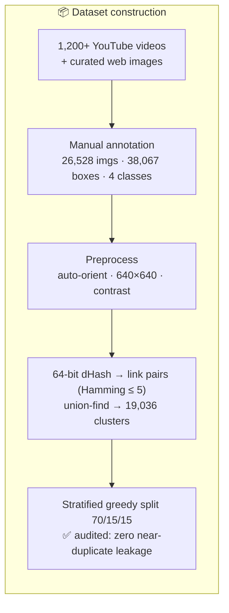
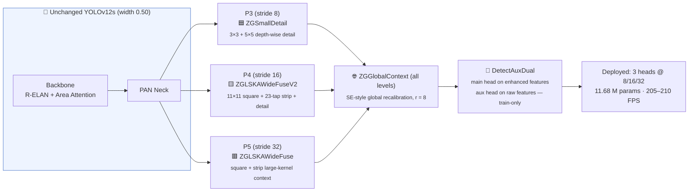

<h1 align="center">🔫 Real-Time Weapon Detection with Enhanced YOLOv12s & a Custom Dataset</h1>

<p align="center"><sub>Official repository for the paper <b>"Real-Time Weapon Detection Using Enhanced YOLOv12 Models and a Custom Dataset"</b><br>Constantin Catargiu & Iulian B. Ciocoiu — Gheorghe Asachi Technical University of Iasi, Romania</sub></p>

<p align="center">
  
  
  
</p>

<p align="center">
  <a href="https://universe.roboflow.com/gundetectiondataset/weapondataset-oi2g3/dataset/8">
    
  </a>
  <a href="https://universe.roboflow.com/gundetectiondataset/nogun/dataset/2">
    
  </a>
</p>

<p align="center">
  
  
  
  
  
  
</p>

---

## ⚡ TL;DR

> **What:** A customized **YOLOv12s** for detecting **small, occluded, low-contrast weapons** in surveillance video, trained on a new **26,528-image / 38,067-instance** public dataset with a **leakage-free** split.
>
> **How:** **(i)** a small-object-aware **loss** (curriculum weighting + adaptive clipping + retuned Task-Aligned assignment) and **(ii)** five **zero-gated, append-only modules** in the detection head — the backbone, neck, and P3/P4/P5 layout stay untouched, so every addition starts as an exact identity of the pretrained baseline.
>
> **Result:** **mAP@50 0.812 → 0.852 (+4.9%)**, Recall **+7.1%**, small-object mAP@50 **+10.6%**, `no_weapon` confounder class **+11.6%** — consistent across **3 seeds** (gains ≈ 10× the seed noise), at **205–210 FPS** on an RTX 4090. Outperforms **YOLO26s** trained under identical conditions, and transfers zero-shot to 3 external datasets (**mAP@50 0.776–0.805**).

---

## 📚 Table of Contents

| | | |
|---|---|---|
| [🏆 Research Highlights](#-research-highlights) | [📖 Overview & Contributions](#-overview--contributions) | [🔬 Method Pipeline](#-method-pipeline-at-a-glance) |
| [⚡ Dataset](#-dataset-summary) | [🧬 Leakage-Free Split](#-leakage-free-data-split-important) | [📊 Dataset Statistics](#-dataset-split--class-distribution-paper--table-1) |
| [📉 Part A: Custom Loss](#-proposed-model--part-a-small-object-aware-loss--assignment) | [🏗️ Part B: Head Modules](#%EF%B8%8F-proposed-model--part-b-zero-gated-head-enhancements) | [🧾 Config at a Glance](#-final-configuration-at-a-glance) |
| [📊 Per-Class Results](#-results--per-class-performance-paper--tables-4--5-test-set) | [🔬 Size Ablation](#-ablation-study--performance-by-object-size-paper--table-6-test-set) | [🧬 Architecture Search](#%EF%B8%8F-architecture-search-summary-40-variants--full-details-in-the-supplementary-material) |
| [🎲 Seed Reproducibility](#-seed-reproducibility-study-paper--table-8-3-independent-seeds-per-configuration) | [🔶 vs YOLO26](#-controlled-comparison-vs-yolo26-paper--table-7-averages-over-3-runs) | [🌍 External Validation](#-external-dataset-validation--state-of-the-art-context-paper--table-9) |
| [🔍 Visual Comparisons](#-detection-comparison--original-vs-custom-yolov12s) | [🚀 Getting Started](#-getting-started) | [📖 Citation](#-citation) |

---

<div align="center">

## 🏆 Research Highlights

</div>

The proposed model customizes **YOLOv12s** with **(i)** a **small-object-aware loss** (A1–A4) and **(ii)** five **lightweight, append-only, zero-gated enhancement modules** in the detection head (B1–B5). All headline gains are averaged over **3 independent seeds** and exceed seed-to-seed variation by an **order of magnitude**, while preserving **real-time operation**.

<table>
  <tr>
    <td align="center" width="50%">
      
      <br><sub>🏗️ Modified YOLOv12s architecture — five zero-gated head modules (B1–B5)</sub>
    </td>
    <td align="center" width="50%">
      
      <br><sub>📈 Training metrics — Baseline vs Custom Loss + Arch</sub>
    </td>
  </tr>
  <tr>
    <td align="center" width="50%">
      
      <br><sub>📊 Ablation: baseline (blue); + arch B1–B5 (orange); + loss A1–A4 (red); combined (green)</sub>
    </td>
    <td align="center" width="50%">
      
      <br><sub>🎯 Confusion matrices for the new model: a) small; b) medium; c) large; d) all objects</sub>
    </td>
  </tr>
</table>

<div align="center">

<table>
  <tr>
    <th align="center" colspan="4">📈 Test-Set Performance (mean over 3 seeds — <a href="#-seed-reproducibility-study-paper--table-8-3-independent-seeds-per-configuration">seed study</a>)</th>
  </tr>
  <tr>
    <th align="center">Metric</th>
    <th align="center">🔷 YOLOv12s<br><sub>Baseline → + Custom Loss (A1–A4)</sub></th>
    <th align="center">🏆 YOLOv12s<br><sub>Baseline → + Loss + Arch (Proposed)</sub></th>
    <th align="center">🔶 YOLO26s<br><sub>(same data, split & schedule)</sub></th>
  </tr>
  <tr>
    <td align="left"><b>mAP@50</b></td>
    <td align="center">0.812 → <b>0.839</b> <sub>(+3.3%)</sub></td>
    <td align="center">0.812 → <b>0.852</b> <sub>(+4.9%)</sub></td>
    <td align="center">0.807</td>
  </tr>
  <tr>
    <td align="left"><b>mAP@50-95</b></td>
    <td align="center">0.516 → <b>0.539</b> <sub>(+4.5%)</sub></td>
    <td align="center">0.516 → <b>0.553</b> <sub>(+7.2%)</sub></td>
    <td align="center">0.521</td>
  </tr>
  <tr>
    <td align="left"><b>Precision</b></td>
    <td align="center">0.833 → <b>0.852</b> <sub>(+2.3%)</sub></td>
    <td align="center">0.833 → <b>0.865</b> <sub>(+3.8%)</sub></td>
    <td align="center">0.845</td>
  </tr>
  <tr>
    <td align="left"><b>Recall</b></td>
    <td align="center">0.747 → <b>0.782</b> <sub>(+4.7%)</sub></td>
    <td align="center">0.747 → <b>0.800</b> <sub>(+7.1%)</sub></td>
    <td align="center">0.753</td>
  </tr>
  <tr>
    <td align="left"><b>F1-score</b></td>
    <td align="center">0.788 → <b>0.816</b> <sub>(+3.6%)</sub></td>
    <td align="center">0.788 → <b>0.831</b> <sub>(+5.5%)</sub></td>
    <td align="center">0.796</td>
  </tr>
  <tr>
    <td colspan="4" align="center"><b>🔍 Size-Specific mAP@50</b></td>
  </tr>
  <tr>
    <td align="left">🔍 <b>Small</b></td>
    <td align="center">0.640 → <b>0.681</b> <sub>(+6.4%)</sub></td>
    <td align="center">0.640 → <b>0.708</b> <sub>(+10.6%)</sub></td>
    <td align="center">0.615</td>
  </tr>
  <tr>
    <td align="left">📦 <b>Medium</b></td>
    <td align="center">0.781 → <b>0.818</b> <sub>(+4.7%)</sub></td>
    <td align="center">0.781 → <b>0.826</b> <sub>(+5.8%)</sub></td>
    <td align="center">0.780</td>
  </tr>
  <tr>
    <td align="left">🟫 <b>Large</b></td>
    <td align="center">0.848 → <b>0.866</b> <sub>(+2.1%)</sub></td>
    <td align="center">0.848 → <b>0.872</b> <sub>(+2.8%)</sub></td>
    <td align="center">0.843</td>
  </tr>
  <tr>
    <td colspan="4" align="center"><b>🔍 Size-Specific mAP@50-95</b></td>
  </tr>
  <tr>
    <td align="left">🔍 <b>Small</b></td>
    <td align="center">0.324 → <b>0.348</b> <sub>(+7.4%)</sub></td>
    <td align="center">0.324 → <b>0.354</b> <sub>(+9.3%)</sub></td>
    <td align="center">0.317</td>
  </tr>
  <tr>
    <td align="left">📦 <b>Medium</b></td>
    <td align="center">0.445 → <b>0.472</b> <sub>(+6.1%)</sub></td>
    <td align="center">0.445 → <b>0.480</b> <sub>(+7.9%)</sub></td>
    <td align="center">0.466</td>
  </tr>
  <tr>
    <td align="left">🟫 <b>Large</b></td>
    <td align="center">0.574 → <b>0.591</b> <sub>(+3.0%)</sub></td>
    <td align="center">0.574 → <b>0.595</b> <sub>(+3.7%)</sub></td>
    <td align="center">0.588</td>
  </tr>
</table>

<table>
  <tr>
    <th align="center">⚙️ Deployed Params</th>
    <th align="center">⚡ Throughput (RTX 4090)</th>
    <th align="center">🎯 Biggest Gains</th>
  </tr>
  <tr>
    <td align="center">9.10 M → <b>11.68 M</b> <sub>(+2.58 M; 0.82 M aux is training-only)</sub></td>
    <td align="center">~220 FPS → <b>205–210 FPS</b> <sub>(wide real-time margin)</sub></td>
    <td align="center"><b>Small objects</b> +10.6% mAP@50, +12.8% Recall<br><b>no_weapon</b> +11.6% mAP@50, +16.4% Recall</td>
  </tr>
</table>

<sub>🔍 The largest relative gains land exactly where the design aims — small objects and the confounder class — and the proposed YOLOv12s outperforms <b>YOLO26s</b> at every object size.</sub>

</div>

---

## 📖 Overview & Contributions

This repository accompanies our research paper on **real-time small-object weapon detection**. The main contributions:

1. 📦 **A large, realistic, public dataset** — **26,528 images / 38,067 manually annotated instances** across 4 classes (`knife`, `pistol`, `long_gun`, `no_weapon`), extracted from **1,200+ YouTube videos** (CCTV, action films, firearm tutorials, shooting-range & tactical-training footage) plus curated web images, spanning motion blur, varied lighting, occlusion, and dense crowds. Hosted as two companion Roboflow projects forming a single dataset.
2. 🧬 **A leakage-free evaluation protocol** — perceptual-hash clustering of near-duplicate video frames with whole-cluster split assignment and a cross-split audit, so reported metrics measure **generalization**, not memorization.
3. 📉 **A small-object-aware loss** (A1–A4) — dynamic curriculum weighting, auxiliary center loss (evaluated, then disabled), adaptive loss clipping, and a small-object-tuned Task-Aligned assigner.
4. 🏗️ **Five zero-gated, append-only head modules** (B1–B5) — every module starts as an exact identity of the pretrained baseline and opens only where it reduces the loss; the P3/P4/P5 layout, backbone, and neck are untouched (a P2/five-scale extension was tested and **rejected**).
5. 🔬 **An extensive, honest evaluation** — 40+ architectural variants, loss grid searches, per-size and per-class ablations, a **3-seed reproducibility study**, a **controlled comparison against YOLO26** under identical conditions, and **zero-shot external validation** on three public benchmarks.

### 💡 Applications

| Domain | Use Cases |
|--------|-----------|
| 📹 **Surveillance** | CCTV monitoring, real-time threat detection, smart-city integration |
| 🛡️ **Public Safety** | Transportation hubs, stadiums, schools, public gatherings |
| 🚪 **Access Control** | Entry point screening, secure facilities, building protection |
| 🚔 **Law Enforcement** | Real-time threat assessment, evidence analysis, situational awareness |
| 🤖 **Research & AI** | Benchmark dataset, small-object detection research, negative-class design |

---

## 🔬 Method Pipeline at a Glance





<sub>🔧 Every colored module is a <b>zero-gated residual</b> (learnable gate γ initialized to 0): at epoch 0 the network reproduces the pretrained baseline <i>exactly</i>; gates open only where the branch reduces training loss — so the worst realistic outcome is baseline performance.</sub>

---

## ⚡ Dataset Summary

<table>
  <tr>
    <th align="left" width="220">📋 Property</th>
    <th align="left">📊 Details</th>
  </tr>
  <tr>
    <td>🖼️ <b>Total Images</b></td>
    <td><code>26,528</code></td>
  </tr>
  <tr>
    <td>🔢 <b>Total Instances</b></td>
    <td><code>38,067</code> — annotated manually by the first author, verified by the second</td>
  </tr>
  <tr>
    <td>🏷️ <b>Classes</b></td>
    <td>
      
      
      
      
    </td>
  </tr>
  <tr>
    <td>🎬 <b>Sources</b></td>
    <td>1,200+ YouTube videos (CCTV, action films, firearm tutorials, shooting-range & tactical-training footage) + curated web images — deliberately mixing viewpoints, resolutions, lighting, and weapon-handling contexts</td>
  </tr>
  <tr>
    <td>🧰 <b>Format</b></td>
    <td><code>YOLO</code> — <code>class x_center y_center width height</code> (normalized), axis-aligned boxes; one label per weapon type; partially visible/truncated weapons keep their class</td>
  </tr>
  <tr>
    <td>🧬 <b>Split</b></td>
    <td>70 / 15 / 15 (train/val/test), <b>leakage-free</b> cluster-based split (<a href="#-leakage-free-data-split-important">details</a>)</td>
  </tr>
  <tr>
    <td>📜 <b>Usage</b></td>
    <td>All frames collected from publicly accessible sources — released <b>for research purposes only</b></td>
  </tr>
  <tr>
    <td>☁️ <b>Hosting</b></td>
    <td>
      Two companion Roboflow projects forming a single dataset:<br>
      <a href="https://universe.roboflow.com/gundetectiondataset/weapondataset-oi2g3/dataset/8"></a>
      <a href="https://universe.roboflow.com/gundetectiondataset/nogun/dataset/2"></a>
    </td>
  </tr>
  <tr>
    <td>📦 <b>Training Results</b></td>
    <td>
      <a href="https://drive.google.com/drive/folders/1TECu5MI4lv36sJH50WSmS4iBd8SuhYgF?usp=sharing"></a>
      <a href="https://drive.google.com/drive/folders/12aaS7CwZfGqb7__BK1UX54j1gQS_DoPi?usp=sharing"></a>
    </td>
  </tr>
</table>

<details>
<summary><b>🏷️ Class descriptions — and why <code>no_weapon</code> exists</b></summary>

<br>

- 🗡️ **`knife`** — bladed weapons including knives and similar sharp objects
- 🔫 **`pistol`** — handguns and short firearms
- 🎯 **`long_gun`** — rifles, shotguns, and other long-barreled firearms
- 🚫 **`no_weapon`** — a curated set of visually confusable items: phones, remote controls, selfie sticks, and similarly shaped hand-held tools

**Why an explicit negative class?** It **supervises the decision boundary directly** instead of leaving confounders as unlabeled background (following the *Not-Pistol* precedent of Bhatti et al., IEEE Access 2021), targeting the dominant failure mode of deployed weapon detectors — high false-positive rates on weapon-shaped everyday objects:

✅ Reduces false positives in production &nbsp;·&nbsp; ✅ Improves precision in crowded scenes &nbsp;·&nbsp; ✅ Forces the model to learn the weapon-vs-confounder boundary

</details>

<details>
<summary><b>🛠️ Preprocessing pipeline (uniform across all three splits)</b></summary>

<br>

| Step | Description | Purpose |
|:----:|-------------|---------|
| 🔄 **Auto-Orient** | Rotates the pixel matrix based on orientation metadata | Prevents learning misleading pose variations (sideways weapons, rotated people) |
| 📐 **Resize** | Uniform resizing to `640×640` px | YOLO training requirement; 640 px confirmed against 800/960 px alternatives (no improvement) |
| 🌗 **Auto-Adjust Contrast** | Adaptive histogram equalization across the full dynamic range | Emphasizes object boundaries in low-light/high-glare scenes — critical for small objects whose features get lost in shadows |

Applied identically to train/val/test, so training and evaluation share the same input distribution.

</details>

---

## 🧬 Leakage-Free Data Split (important!)

Most images originate from video footage, so **successive frames are nearly identical** — a naive per-frame split leaks near-duplicates between train and test and inflates accuracy. Our protocol prevents this:

| Step | What happens |
|:----:|--------------|
| 1️⃣ **Hash** | Every frame → **64-bit perceptual hash** (difference hash) |
| 2️⃣ **Link** | Image pairs within **Hamming distance ≤ 5** are linked (standard dHash near-duplicate threshold) |
| 3️⃣ **Cluster** | Connected components via **union-find** → **19,036 clusters** over 26,528 images |
| 4️⃣ **Assign** | Every **whole cluster** goes to a single split — stratified greedy procedure targeting **70/15/15** for total images *and* every class simultaneously |
| 5️⃣ **Audit** | Final cross-split check: **no image pair within the threshold crosses a split boundary** ✅ |

➡️ Reported metrics reflect **generalization**, not memorized near-duplicates.

---

## 📊 Dataset Split & Class Distribution <sub>(Paper — Table 1)</sub>

| Split | Images | Instances | 🗡️ knife | 🎯 long_gun | 🔫 pistol | 🚫 no_weapon |
|-------|-------:|----------:|---------:|------------:|----------:|-------------:|
| Train | 18,577 (70.0%) | 26,103 | 4,294 (16.5%) | 7,337 (28.1%) | 9,187 (35.2%) | 5,285 (20.2%) |
| Validation | 3,973 (15.0%) | 5,853 | 923 (15.8%) | 1,561 (26.7%) | 1,985 (33.9%) | 1,384 (23.6%) |
| Test | 3,978 (15.0%) | 6,111 | 941 (15.4%) | 1,643 (26.9%) | 2,060 (33.7%) | 1,467 (24.0%) |
| **Total** | **26,528** | **38,067** | **6,158 (16.2%)** | **10,541 (27.7%)** | **13,232 (34.8%)** | **8,136 (21.4%)** |

### 📐 Bounding-Box Size Distribution <sub>(Paper — Table 2; COCO convention on 640×640 images: small ≤ 32², medium ≤ 96², large > 96² px)</sub>

| Split | Total boxes | 🔍 Small | 📦 Medium | 🟫 Large |
|-------|------------:|---------:|----------:|---------:|
| Train | 26,103 | 2,198 (8.4%) | 5,312 (20.4%) | 18,593 (71.2%) |
| Validation | 5,853 | 475 (8.1%) | 1,087 (18.6%) | 4,291 (73.3%) |
| Test | 6,111 | 499 (8.2%) | 1,167 (19.1%) | 4,445 (72.7%) |
| **Total** | **38,067** | **3,172 (8.3%)** | **7,566 (19.9%)** | **27,329 (71.8%)** |

### 📐 Size Distribution per Class <sub>(Paper — Table 3)</sub>

| Class | Total boxes | 🔍 Small | 📦 Medium | 🟫 Large |
|-------|------------:|---------:|----------:|---------:|
| 🗡️ knife | 6,158 | 225 (3.7%) | 1,065 (17.3%) | 4,868 (79.1%) |
| 🎯 long_gun | 10,541 | 482 (4.6%) | 1,542 (14.6%) | 8,517 (80.8%) |
| 🔫 pistol | 13,232 | **2,023 (15.3%)** | 3,414 (25.8%) | 7,795 (58.9%) |
| 🚫 no_weapon | 8,136 | 442 (5.4%) | 1,545 (19.0%) | 6,149 (75.6%) |
| **Total** | **38,067** | **3,172 (8.3%)** | **7,566 (19.9%)** | **27,329 (71.8%)** |

> 📌 **Why this matters:** small instances are strongly class-dependent — `pistol` alone accounts for **63.8% of all small boxes** (handguns frequently appear small and distant in surveillance footage). This concentration of small, hard instances, together with the heterogeneous `no_weapon` class, is exactly what the loss and architecture design target — and exactly where the largest gains land.

---

## 📉 Proposed Model — Part A: Small-Object-Aware Loss & Assignment

Four modifications (A1–A4) to the standard YOLOv12 training objective. All hyperparameters were tuned by **grid search on the validation set**; the ranges and optima below are from the paper.

<details>
<summary><b>📉 A1 — Dynamic Curriculum Weighting ✅ enabled</b></summary>

<br>

**Problem:** after assignment, all positives are weighted roughly equally, so large boxes dominate — their IoU gradients are stronger and small objects get ignored in early optimization.

**Solution:** each positive receives a combined weight mixing a **normalized inverse-area term** (favoring small objects) with the **target score**, blended by a curriculum coefficient *α(t)* transitioning from **early area-dominant** to **later balanced** learning. Applied to both the IoU and DFL loss terms.

| Parameter | Search range | Optimal |
|-----------|:------------:|:-------:|
| α₁ | [0.1, 1.0] | **0.7** |
| α₂ | [0.1, 1.0] | **0.4** |
| Small-object threshold | — | area ≤ **32×32 px** |

</details>

<details>
<summary><b>🎯 A2 — Auxiliary Center Loss for Small Objects ❌ disabled in the final model</b></summary>

<br>

**Idea:** IoU collapses for tiny boxes even when centers are close, so add a lightweight **L1 penalty on box centers** (small targets only, decaying schedule) to fix "miss by a few pixels" errors.

**Honest result:** the tuned weight (α₃, α₄ searched in [0, 0.1]) brought **no measurable validation improvement** — and the ablation shows it slightly *hurts* small/medium objects (Table 6, column +A2). It is **switched off** (λ_center = 0) in the final model and documented for completeness.

</details>

<details>
<summary><b>✂️ A3 — Adaptive Loss Clipping ✅ enabled</b></summary>

<br>

**Problem:** mislabeled data or hard positives occasionally produce unstable loss spikes, destabilizing optimization in cluttered security footage.

**Solution:** per-batch clipping of the IoU and DFL losses with **epoch-dependent ceilings** — preventing gradient explosions in early training and yielding smoother loss curves.

| Parameter | Search range | Optimal |
|-----------|:------------:|:-------:|
| α₅ (IoU) | [10, 70], step 1 | **50** |
| α₆ (IoU) | [10, 70], step 1 | **30** |
| α₇ (DFL) | [10, 70], step 1 | **25** |
| α₈ (DFL) | [10, 70], step 1 | **15** |

</details>

<details>
<summary><b>🧲 A4 — Assignment Tuned Towards Small Objects (TAL) ✅ enabled</b></summary>

<br>

**Problem:** the default Task-Aligned Assigner uses a small candidate pool (*k* = 10) — for small objects, no anchor may overlap the target, producing false negatives.

| Parameter | YOLOv12 default | Ours | Search range |
|-----------|:---------------:|:----:|:------------:|
| Candidate pool `top-k` | 10 | **13** | [2, 25] |
| Score exponent | 0.5 | **0.7** | — |
| IoU exponent | 6.0 | **4.0** | — |

The retuned exponents better balance classification confidence vs localization quality during assignment; the larger pool improves recall in small-gun scenarios.

</details>

> 🏆 **Final loss: A1 + A3 + A4** (A2 evaluated, then disabled). λ_box, λ_DFL, λ_cls keep the original YOLOv12 values.

---

## 🏗️ Proposed Model — Part B: Zero-Gated Head Enhancements

> ⚠️ **Design decision worth knowing:** the "obvious" fix — a **stride-4 P2 head** — was implemented, tested, and **rejected**: it sharply increased compute and memory (160×160 feature maps) with **no consistent improvement** over the 3-scale design. The final model keeps the stock **YOLOv12s backbone + PAN neck (width 0.50)** and the **P3/P4/P5 layout**, and enhances **only the detection head**.

| # | Module | Level | One-line summary | Status |
|:-:|--------|:-----:|------------------|:------:|
| B1 | **Zero-gating principle** | all | Every module = residual branch × learnable gate γ (init 0) → exact identity at start, opens only if it reduces loss | design rule |
| B2 | 🟦 **ZGSmallDetail** | P3 | Parallel 3×3 + 5×5 depth-wise convs → sum → GroupNorm → gated residual; reinforces fine detail that large kernels wash out | ✅ |
| B2 | 🟨 **ZGLSKAWideFuseV2** | P4 | Expand-then-fuse: square 11×11 large-kernel attention ⊕ hybrid branch (23-tap strip attention + small-kernel detail) | ✅ |
| B2 | 🟥 **ZGLSKAWideFuse** | P5 | Square + strip large-kernel fusion — broad scene context for the coarsest scale | ✅ |
| B3 | 🌐 **ZGGlobalContext** | P3–P5 | SE-style global recalibration: GAP → 1×1 bottleneck (r=8) + SiLU → 1×1 expand → zero-gated additive broadcast | ✅ |
| B4 | 🎓 **DetectAuxDual** | head | Main head on enhanced features + auxiliary head on **raw** neck features (keeps backbone detail); **aux dropped at inference** | ✅ (train-only) |

<details>
<summary><b>🔧 B1 — Why zero-gating makes this low-risk</b></summary>

<br>

- At the start of training each module passes its input **unchanged** — the network reproduces the pretrained YOLOv12s baseline **exactly** (after a one-time remap of the detection-head index), so pretrained detection parameters transfer cleanly
- Gates open **only where the added branch reduces training loss**
- **Worst realistic outcome = baseline performance**
- Each block preserves channel width and spatial resolution → drops into the existing P3–P5 streams without altering the rest of the network
- Zero-init gates follow **ReZero / GCNet** practice

</details>

<details>
<summary><b>🔍 B2 — Scale-specific enhancement: what each level needs</b></summary>

<br>

| Level | Need | Module answer |
|-------|------|---------------|
| **P3** (stride 8) — where small objects live | Fine, high-frequency detail; every large-receptive-field variant tested here **degraded** small-object accuracy | Only small 3×3/5×5 depth-wise kernels — no large-kernel smoothing |
| **P4** (stride 16) | Both context *and* detail at the fusion source | Full-width expand-then-fuse: square 11×11 LKA branch ⊕ hybrid branch (23-tap strip attention for elongated objects + small-kernel detail path). Channel-split fusion was rejected — it starved both branches of capacity |
| **P5** (stride 32) — context dominates | Broad spatial context | Square + strip large-kernel attention fusion |

**Validated by sweeps:** square kernel k ∈ {7, 11, 15} → **k = 11** optimal with near-flat behavior around it (choice is not fragile); the **23-tap strip kernel** is motivated by the elongated geometry of knives and long guns and was validated as a standalone branch.

</details>

<details>
<summary><b>🌐 B3 — Global context for the confounder class</b></summary>

<br>

Per-location features lack whole-image context — exactly what the heterogeneous `no_weapon` class needs to be separated from genuine weapons (a phone in a hand vs a pistol in a hand is often a *context* question). At **near-zero cost**, ZGGlobalContext broadcasts an image-wide channel-context vector to every spatial location through a zero-initialized gate, improving appearance-vs-context discrimination without disturbing upstream detail. Result: **+11.6% mAP@50 and +16.4% Recall** on `no_weapon`.

</details>

<details>
<summary><b>🎓 B4 — Dual-head auxiliary supervision, free at inference</b></summary>

<br>

Training the head only through enhanced features lets the backbone drift toward coarse, context-dominated features. **DetectAuxDual** supervises a parallel auxiliary head on the **raw, pre-enhancement** P3/P4/P5 features — a short, direct gradient path that rewards the backbone for preserving high-resolution detail. The main path specializes in context; the auxiliary path targets detail. The aux head (0.82 M params) is **dropped at inference** → zero added latency.

</details>

### ⚖️ Parameter & Speed Budget

| | Baseline YOLOv12s | Proposed (deployed) |
|---|:---:|:---:|
| **Parameters (inference)** | 9.10 M | **11.68 M** (+2.58 M, +28% — dominated by the P5 fusion block) |
| **Training-only aux branch** | — | 0.82 M (removed at deployment) |
| **Throughput (RTX 4090)** | ~220 FPS | **205–210 FPS** |

All additions use **depth-wise and 1×1 operations only**, so the throughput cost is marginal and a wide real-time margin remains.

---

## 🧾 Final Configuration at a Glance

| Component | Enabled | Final values |
|-----------|:-------:|--------------|
| 📉 A1 — Curriculum weighting | ✅ | α₁ = 0.7, α₂ = 0.4, small ≤ 32×32 px |
| 🎯 A2 — Center loss | ❌ | λ_center = 0 (no validation gain; slightly hurts small objects) |
| ✂️ A3 — Adaptive clipping | ✅ | α₅ = 50, α₆ = 30, α₇ = 25, α₈ = 15 |
| 🧲 A4 — TAL assignment | ✅ | top-k = 13, score exp = 0.7, IoU exp = 4.0 |
| 🟦 B2 — ZGSmallDetail (P3) | ✅ | 3×3 + 5×5 depth-wise, GroupNorm, zero-gated |
| 🟨 B2 — ZGLSKAWideFuseV2 (P4) | ✅ | 11×11 square + 23-tap strip + detail path |
| 🟥 B2 — ZGLSKAWideFuse (P5) | ✅ | square + strip large-kernel fusion |
| 🌐 B3 — ZGGlobalContext | ✅ | all levels, reduction r = 8, SiLU |
| 🎓 B4 — DetectAuxDual | ✅ train-only | aux on raw features, dropped at inference |
| 🏛️ Backbone / neck / scales | unchanged | stock YOLOv12s, width 0.50, P3/P4/P5 (P2 rejected) |
| 🖼️ Input resolution | 640 px | confirmed vs 800/960 px (no improvement) |

---

## 📊 Results — Per-Class Performance <sub>(Paper — Tables 4 & 5, test set)</sub>

| Class | mAP@50<br><sub>Custom / Baseline</sub> | mAP@50-95<br><sub>Custom / Baseline</sub> | Precision<br><sub>Custom / Baseline</sub> | Recall<br><sub>Custom / Baseline</sub> | F1<br><sub>Custom / Baseline</sub> |
|-------|:---:|:---:|:---:|:---:|:---:|
| 🗡️ knife | **0.900** / 0.867 | **0.646** / 0.609 | **0.876** / 0.848 | **0.841** / 0.807 | **0.859** / 0.828 |
| 🔫 pistol | **0.916** / 0.882 | **0.609** / 0.569 | **0.897** / 0.862 | **0.879** / 0.840 | **0.888** / 0.851 |
| 🎯 long_gun | **0.903** / 0.881 | **0.575** / 0.554 | **0.880** / 0.859 | **0.883** / 0.848 | **0.882** / 0.853 |
| 🚫 no_weapon | **0.689** / 0.617 | **0.385** / 0.332 | **0.807** / 0.761 | **0.582** / 0.500 | **0.678** / 0.609 |
| **All** | **0.852** / 0.812 | **0.553** / 0.516 | **0.865** / 0.833 | **0.800** / 0.747 | **0.831** / 0.788 |

### 📈 Relative Improvements & Attribution <sub>(Paper — Table 5)</sub>

| Class | mAP@50 | Precision | Recall | F1 | What drives the gain |
|-------|:------:|:---------:|:------:|:--:|----------------------|
| 🗡️ knife | +3.8% | +3.3% | +4.2% | +3.7% | *ZGSmallDetail* (B2) + curriculum weighting (A1) preserve thin metallic edge features |
| 🔫 pistol | +3.9% | +4.0% | +4.6% | +4.3% | TAL tuning (A4) improves detection for the largest small-object class |
| 🎯 long_gun | +2.5% | +2.4% | +4.1% | +3.4% | Already strong at baseline; strip-kernel attention (B2) tightens elongated box fits |
| 🚫 no_weapon | **+11.6%** | +6.0% | **+16.4%** | **+11.3%** | *ZGGlobalContext* (B3) + *DetectAuxDual* (B4) separate confounders from real weapons |
| **All** | **+4.9%** | **+3.8%** | **+7.1%** | **+5.5%** | Complementary gains from the custom loss (A1, A3, A4) and head modules (B1–B4), each effective in isolation |

---

## 🔬 Ablation Study — Performance by Object Size <sub>(Paper — Table 6, test set)</sub>

<details>
<summary><b>🔍 Small Objects (area ≤ 32×32 px)</b> — click to expand</summary>

| Metric       | Baseline | +A1             | +A2             | +A3             | +A4             | Custom Loss<br>(A1–A4) | +Architecture<br>(B1–B5) | 🏆 New Model         |
|:-------------|---------:|:----------------|:-----------------|:-----------------|:-----------------|:------------------------------|:-----------------|:----------------------|
| **mAP@50**    | 0.640    | 0.669 (+4.53%)  | 0.631 (−1.41%)   | 0.665 (+3.91%)   | 0.674 (+5.31%)   | 0.681 (+6.41%)                | 0.664 (+3.75%)   | **0.708 (+10.63%)**   |
| **mAP@50–95** | 0.324    | 0.336 (+3.70%)  | 0.319 (−1.54%)   | 0.341 (+5.25%)   | 0.339 (+4.63%)   | 0.348 (+7.41%)                | 0.334 (+3.09%)   | **0.354 (+9.26%)**    |
| **Precision** | 0.758    | 0.770 (+1.58%)  | 0.762 (+0.53%)   | 0.766 (+1.06%)   | 0.778 (+2.64%)   | 0.783 (+3.30%)                | 0.769 (+1.45%)   | **0.790 (+4.22%)**    |
| **Recall**    | 0.585    | 0.622 (+6.32%)  | 0.572 (−2.22%)   | 0.628 (+7.35%)   | 0.625 (+6.84%)   | 0.648 (+10.77%)               | 0.611 (+4.44%)   | **0.660 (+12.82%)**   |
| **F1-score**  | 0.662    | 0.692 (+4.53%)  | 0.653 (−1.36%)   | 0.694 (+4.83%)   | 0.697 (+5.29%)   | 0.708 (+6.95%)                | 0.682 (+3.02%)   | **0.719 (+8.61%)**    |

</details>

<details>
<summary><b>📦 Medium Objects (32×32 &lt; area ≤ 96×96 px)</b> — click to expand</summary>

| Metric       | Baseline | +A1             | +A2             | +A3             | +A4             | Custom Loss<br>(A1–A4) | +Architecture<br>(B1–B5) | 🏆 New Model         |
|:-------------|---------:|:----------------|:-----------------|:-----------------|:-----------------|:------------------------------|:-----------------|:----------------------|
| **mAP@50**    | 0.781    | 0.811 (+3.84%)  | 0.773 (−1.02%)   | 0.807 (+3.33%)   | 0.814 (+4.23%)   | 0.818 (+4.74%)                | 0.797 (+2.05%)   | **0.826 (+5.76%)**    |
| **mAP@50–95** | 0.445    | 0.464 (+4.27%)  | 0.439 (−1.35%)   | 0.467 (+4.94%)   | 0.465 (+4.49%)   | 0.472 (+6.07%)                | 0.457 (+2.70%)   | **0.480 (+7.87%)**    |
| **Precision** | 0.816    | 0.838 (+2.70%)  | 0.820 (+0.49%)   | 0.833 (+2.08%)   | 0.845 (+3.55%)   | 0.851 (+4.29%)                | 0.832 (+1.96%)   | **0.860 (+5.39%)**    |
| **Recall**    | 0.723    | 0.751 (+3.87%)  | 0.714 (−1.24%)   | 0.754 (+4.29%)   | 0.752 (+4.01%)   | 0.763 (+5.53%)                | 0.741 (+2.49%)   | **0.775 (+7.19%)**    |
| **F1-score**  | 0.767    | 0.792 (+3.26%)  | 0.758 (−1.17%)   | 0.791 (+3.13%)   | 0.796 (+3.78%)   | 0.805 (+4.95%)                | 0.784 (+2.22%)   | **0.815 (+6.26%)**    |

</details>

<details>
<summary><b>🟫 Large Objects (area &gt; 96×96 px)</b> — click to expand</summary>

| Metric       | Baseline | +A1             | +A2             | +A3             | +A4             | Custom Loss<br>(A1–A4) | +Architecture<br>(B1–B5) | 🏆 New Model         |
|:-------------|---------:|:----------------|:-----------------|:-----------------|:-----------------|:------------------------------|:-----------------|:----------------------|
| **mAP@50**    | 0.848    | 0.858 (+1.18%)  | 0.853 (+0.59%)   | 0.854 (+0.71%)   | 0.862 (+1.65%)   | 0.866 (+2.12%)                | 0.856 (+0.94%)   | **0.872 (+2.83%)**    |
| **mAP@50–95** | 0.574    | 0.583 (+1.57%)  | 0.578 (+0.70%)   | 0.585 (+1.92%)   | 0.582 (+1.39%)   | 0.591 (+2.96%)                | 0.582 (+1.39%)   | **0.595 (+3.66%)**    |
| **Precision** | 0.844    | 0.867 (+2.73%)  | 0.851 (+0.83%)   | 0.862 (+2.13%)   | 0.873 (+3.44%)   | 0.880 (+4.27%)                | 0.861 (+2.01%)   | **0.893 (+5.81%)**    |
| **Recall**    | 0.808    | 0.822 (+1.73%)  | 0.815 (+0.87%)   | 0.825 (+2.10%)   | 0.823 (+1.86%)   | 0.831 (+2.85%)                | 0.818 (+1.24%)   | **0.838 (+3.71%)**    |
| **F1-score**  | 0.825    | 0.843 (+2.18%)  | 0.832 (+0.85%)   | 0.842 (+2.06%)   | 0.846 (+2.55%)   | 0.854 (+3.52%)                | 0.839 (+1.70%)   | **0.864 (+4.73%)**    |

</details>

> 📌 **How to read this:** every proposed component (A1, A3, A4, B1–B5) helps in isolation; **A2 slightly hurts small/medium objects** — which is exactly why it is disabled in the final model. The full combination is strongest on every metric at every object size, and gains scale inversely with object size (small +10.6% > medium +5.8% > large +2.8% mAP@50) — the intended behavior.

---

## 🧬 Architecture Search Summary <sub>(40+ variants — full details in the Supplementary Material)</sub>

<details>
<summary><b>What was explored — and what won</b></summary>

<br>

Over **40 distinct model variants** were tested before converging on B1–B5:

| Direction | Explored |
|-----------|----------|
| 🔍 **Attention** | Insertion point & kernel size of large-kernel attention; self-attention variants |
| 🔀 **Fusion** | Wide-receptive-field fusion; global & channel context; spatial pyramid pooling |
| 🧲 **Sampling** | Deformable and dynamic-sampling operators |
| 📏 **Capacity** | Capacity redistribution; P3 depth/path changes; head tower capacity |
| 🏔️ **Topology** | Neck topology changes; **P2/five-scale extension** (stride-4 head) |
| 🖼️ **Resolution** | 640 px vs 800 px vs 960 px input |
| 🎯 **Heads** | Auxiliary supervision, decoupled heads, alternative classifiers |

**Outcome:**

- 🏆 Best configuration **leaves the YOLOv12s backbone and PAN neck unchanged** (incl. the 0.50 width multiplier of the "s" scale) and enhances **only the detection head**
- ❌ The **P2/five-scale extension performed below the 3-scale design** while sharply increasing compute and memory
- ❌ Every large-receptive-field variant at P3 **degraded** small-object accuracy → P3 restricted to 3×3/5×5 depth-wise kernels
- ✅ Square-kernel dose–response sweep k ∈ {7, 11, 15} → **k = 11**, near-flat behavior around the optimum (robust choice)
- ✅ 640 px input confirmed against 800/960 px (no improvement)

</details>

---

## 🎲 Seed Reproducibility Study <sub>(Paper — Table 8; 3 independent seeds per configuration)</sub>

Neural-network training is stochastic — a single run risks mistaking a **lucky seed** for a real improvement, especially when configurations differ by a few points. Every configuration was trained **3×** with all other factors fixed (same dataset & split, 640 px, batch 64, deterministic execution):

| Configuration | n | mAP@50 | mAP@50-95 | Precision | Recall | mAP@50 (Small) | mAP@50 (Med.) | mAP@50 (Large) |
|---------------|:-:|:------:|:---------:|:---------:|:------:|:--------------:|:-------------:|:--------------:|
| Baseline | 3 | 0.812 (±0.0006) | 0.516 (±0.0011) | 0.833 (±0.0034) | 0.747 (±0.0019) | 0.640 (±0.0102) | 0.781 (±0.0025) | 0.848 (±0.0009) |
| + Custom Loss | 3 | 0.839 (±0.0007) | 0.539 (±0.0015) | 0.852 (±0.0025) | 0.782 (±0.0017) | 0.681 (±0.0155) | 0.818 (±0.0018) | 0.866 (±0.0001) |
| + Custom Arch | 3 | 0.845 (±0.0008) | **0.557** (±0.0014) | 0.853 (±0.0094) | 0.780 (±0.0044) | 0.664 (±0.0065) | 0.797 (±0.0022) | 0.856 (±0.0008) |
| **+ Loss + Arch (Proposed)** | **3** | **0.852 (±0.0002)** | 0.553 (±0.0021) | **0.865 (±0.0031)** | **0.800 (±0.0007)** | **0.708 (±0.0129)** | **0.826 (±0.0021)** | **0.872 (±0.0019)** |

**Key observations:**

- 🎯 **Signal ≫ noise:** mAP@50 varies by at most **±0.0008** across seeds (±0.0002 for the proposed model), while configuration gaps are **+2.7 / +3.3 / +4.0 points** — an order of magnitude larger. The gains cannot be ascribed to seed selection.
- ⚖️ **A deliberate trade-off:** at strict mAP@50-95 the architecture-only variant edges ahead (0.557 vs 0.553); the custom loss trades a sliver of strict-IoU localization for **much higher Recall (0.800 vs 0.780), Precision (0.865 vs 0.853), and small-object mAP@50 (0.708 vs 0.664)** — the operationally critical metrics for surveillance.
- 🔍 Only the small-object metric shows sizeable variance (std up to ~0.015 — expected, fewer instances), yet the proposed model's **6.8-point small-object gain still clears the spread**.

---

## 🔶 Controlled Comparison vs YOLO26 <sub>(Paper — Table 7; averages over 3 runs)</sub>

For a fair, reproducible comparison, **YOLO26 ("s" scale, official Ultralytics implementation)** was trained under **exactly the same conditions**: same dataset, same leakage-free split, 640 px input, identical schedule and hyperparameters.

| Metric | Object size | YOLOv12s | YOLOv12s + Custom Loss | 🏆 YOLOv12s + Loss + Arch | YOLO26 |
|--------|:-----------:|:--------:|:----------------------:|:---------------------------:|:------:|
| mAP@50 | Small | 0.640 | 0.681 | **0.708** | 0.615 |
| | Medium | 0.781 | 0.818 | **0.826** | 0.780 |
| | Large | 0.848 | 0.866 | **0.872** | 0.843 |
| | All | 0.812 | 0.839 | **0.852** | 0.807 |
| mAP@50-95 | Small | 0.324 | 0.348 | **0.354** | 0.317 |
| | Medium | 0.445 | 0.472 | **0.480** | 0.466 |
| | Large | 0.574 | 0.591 | **0.595** | 0.588 |
| | All | 0.516 | 0.539 | **0.553** | 0.521 |
| Precision | All | 0.833 | 0.852 | **0.865** | 0.845 |
| Recall | All | 0.747 | 0.782 | **0.800** | 0.753 |
| F1-score | All | 0.788 | 0.816 | **0.831** | 0.796 |

> 🔍 The modified YOLOv12s **outperforms YOLO26 at every object size** — the small-object gap (0.708 vs 0.615 mAP@50, **+15% relative**) is the largest.

---

## 🌍 External Dataset Validation & State-of-the-Art Context <sub>(Paper — Table 9)</sub>

The proposed model, trained **only on our custom dataset**, was evaluated **zero-shot (no retraining)** on three public weapon datasets:

| Model / Dataset | Precision | Recall | mAP@50 | Dataset |
|-----------------|:---------:|:------:|:------:|---------|
| **New YOLOv12s (ours) — own test set** | **0.865** | **0.800** | **0.852** | 26,528 images (knife, pistol, long_gun, no_weapon) |
| **↳ [Zenodo dataset](https://zenodo.org/records/16422779)** | 0.833 | 0.778 | 0.792 | 8,478 images (machete, knife, baseball bat, rifle, gun) |
| **↳ [YouTube-GDD](https://github.com/ucas-gyx/youtube-gdd)** | 0.854 | 0.781 | 0.805 | 5,000 images (gun) |
| **↳ [Sohas / OD-WeaponDetection](https://github.com/ari-dasci/OD-WeaponDetection)** | 0.828 | 0.760 | 0.776 | 5,859 images (pistol, smartphone, knife, coin purse, ticket, card) |

<details>
<summary><b>📚 Context: prior weapon-detection studies (⚠️ each row uses a different dataset — indicative, not directly comparable)</b></summary>

<br>

| Method | Precision | Recall | mAP@50 | Dataset |
|--------|:---------:|:------:|:------:|---------|
| YOLOv7 | 0.852 | 0.617 | 0.33 | 400 images (guns and knives) |
| YOLOv5l | 0.715 | 0.614 | 0.641 | 2,986 images (pistols) |
| YOLOv8m | 0.85 | 0.80 | 0.82 | 1,000 images (weapon, no_weapon) |
| VGG-SSD | 0.87 | 0.866 | 0.87 | 872 images (normal, knife, gun) |
| Faster R-CNN | — | — | 0.81 | 3,831 images (gun) |
| YOLOv10n | 0.938 | 0.863 | 0.91 | 9,464 images (pistol/handgun) |

Our model reaches mAP@50 = 0.852 on the **largest and most diverse dataset in the table** — which additionally includes a dedicated `no_weapon` confounder class that makes the task **deliberately harder**. The controlled comparison under identical data, split, and training conditions is the one against the YOLOv12s baseline and YOLO26 above. Retaining **mAP@50 = 0.776–0.805 zero-shot** on external data indicates the learned representations generalize well beyond the training distribution.

</details>

---

## 🔍 Detection Comparison — Original vs Custom YOLOv12s

Side-by-side predictions from the **baseline YOLOv12s** vs the **proposed model**: higher confidence scores, fewer weapon↔`no_weapon` confusions, and fewer missed detections — especially for small and partially occluded weapons. Figures 8–10 of the paper additionally isolate the **most safety-critical error mode** (actual weapons misclassified as `no_weapon`), which the proposed model reduces relative to the baseline.

<details>
<summary><b>🖼️ Click to view all detection examples</b></summary>

<br>

<table>
  <tr>
    <td align="center" colspan="2"><b>📌 Key Improvements</b></td>
  </tr>
  <tr>
    <td align="center">✅ Higher precision — fewer false positives</td>
    <td align="center">✅ Correct class assignment — reduced weapon↔no_weapon confusion</td>
  </tr>
  <tr>
    <td align="center">✅ Fewer missed detections on small objects</td>
    <td align="center">✅ Higher confidence scores across all classes</td>
  </tr>
</table>

<br>

<table>
  <tr><td align="center"></td></tr>
  <tr><td align="center"></td></tr>
  <tr><td align="center"></td></tr>
  <tr><td align="center"></td></tr>
  <tr><td align="center"></td></tr>
  <tr><td align="center"></td></tr>
  <tr><td align="center"></td></tr>
  <tr><td align="center"></td></tr>
  <tr><td align="center"></td></tr>
  <tr><td align="center"></td></tr>
  <tr><td align="center"></td></tr>
  <tr><td align="center"></td></tr>
  <tr><td align="center"></td></tr>
  <tr><td align="center"></td></tr>
  <tr><td align="center"></td></tr>
  <tr><td align="center"></td></tr>
  <tr><td align="center"></td></tr>
  <tr><td align="center"></td></tr>
  <tr><td align="center"></td></tr>
  <tr><td align="center"></td></tr>
</table>

<br>

### 🔎 Common Issues Fixed by the Custom Model

| Issue in Baseline | Fixed | Description |
|:-----------------:|:-----:|-------------|
| ❌ | ✅ | **Class confusion (pistol ↔ no_weapon):** handheld objects (phones, tools) misread as pistols and vice versa → *ZGGlobalContext* (B3) + *DetectAuxDual* (B4) separate confounders from real weapons |
| ❌ | ✅ | **Class confusion (long_gun ↔ no_weapon):** elongated objects mislabeled as long guns → 23-tap strip attention tightens elongated fits and class boundaries |
| ❌ | ✅ | **Missed small detections:** small/distant weapons missed → curriculum weighting (A1), TAL tuning (A4), and *ZGSmallDetail* (B2) recover them (+12.8% small-object Recall) |
| ❌ | ✅ | **Low confidence scores:** borderline detections → higher, more decisive scores |
| ❌ | ✅ | **Safety-critical misses:** actual weapons misclassified as `no_weapon` — reduced vs baseline (paper Fig. 10) |

</details>

---

## 🚀 Getting Started

<details>
<summary><b>⬇️ 1. Get the code, data, and weights</b></summary>

<br>

```bash
# Clone the repository
git clone https://github.com/CostiCatargiu/Yolov12_WeaponDetection
cd Yolov12_WeaponDetection

# Install dependencies
pip install -r requirements.txt
```

- 📦 **Dataset** — download both companion projects from Roboflow (YOLO format): [WeaponDataset v8](https://universe.roboflow.com/gundetectiondataset/weapondataset-oi2g3/dataset/8) + [NoGun Dataset](https://universe.roboflow.com/gundetectiondataset/nogun/dataset/2)
- ⬇️ **Pre-trained weights** — [Original model](https://drive.google.com/drive/folders/1TECu5MI4lv36sJH50WSmS4iBd8SuhYgF?usp=sharing) · [Custom model](https://drive.google.com/drive/folders/12aaS7CwZfGqb7__BK1UX54j1gQS_DoPi?usp=sharing)

</details>

<details>
<summary><b>🏋️ 2. Reproduce training (shared settings for baseline / custom / YOLO26)</b></summary>

<br>

Both the baseline and the custom model (and YOLO26) were trained under **identical settings** for a fair comparison:

<pre>
# ═══════════════════════════════════════════════════════════════
# ⚙️ Shared training settings
# ═══════════════════════════════════════════════════════════════
optimizer: SGD            # selected by the automatic optimizer policy
lr0: 0.01
weight_decay: 0.0005
momentum: 0.9
batch: 64
imgsz: 640
epochs: identical for all configurations
seeds: 3 independent runs per configuration, deterministic execution

# ═══════════════════════════════════════════════════════════════
# 🏆 Final custom-loss configuration (A1 + A3 + A4; A2 disabled)
# ═══════════════════════════════════════════════════════════════

# A1 — Dynamic curriculum weighting ✅        (search range [0.1, 1.0])
alpha_1: 0.7
alpha_2: 0.4
small_obj_px: 32          # small-object threshold (area ≤ 32×32)

# A2 — Auxiliary center loss ❌ DISABLED     (search range [0, 0.1];
lambda_center: 0.0        #  no measurable validation improvement)

# A3 — Adaptive loss clipping ✅             (search range [10, 70], step 1)
alpha_5: 50               # IoU clipping schedule
alpha_6: 30
alpha_7: 25               # DFL clipping schedule
alpha_8: 15

# A4 — Task-Aligned Assigner ✅              (top-k searched over [2, 25])
tal_topk: 13              # default: 10
tal_score_exp: 0.7        # default: 0.5
tal_iou_exp: 4.0          # default: 6.0

# Loss weights: lambda_box, lambda_DFL, lambda_cls — original YOLOv12 values
</pre>

> 📌 Detailed hyperparameter-tuning results, the full list of 40+ architecture variants, and the exact image-level split assignments are provided in the **Supplementary Material** and in this repository.

</details>

<details>
<summary><b>🖥️ 3. Hardware & software used in the paper</b></summary>

<br>

| Component | Specification |
|-----------|---------------|
| 💻 **Operating System** | Ubuntu 22.04.3 LTS |
| 🎮 **GPU** | NVIDIA RTX 4090 24GB (CUDA 12.1) |
| 🧠 **CPU** | Intel Core i9-13900KF (5.8 GHz) |
| 🗄️ **RAM** | DDR5 64GB (6000 MHz) |
| 🐍 **Python / 🔥 PyTorch** | 3.10.2 / 2.1.2 |

</details>

---

## 🔭 Future Work

- 🌡️ **Multimodal perception** — thermal and depth sensing for low-light or occluded conditions
- 🎞️ **Temporally aware detection** — motion consistency across video frames
- 🪶 **Lightweight compression, cross-dataset generalization & domain adaptation** — robustness for edge-device deployment
- 🏥 Extension toward other applications (e.g., medical imaging) — under investigation

---

## 📚 Resources

| Resource | Link |
|----------|------|
| 📦 Weapon dataset (Roboflow) | https://universe.roboflow.com/gundetectiondataset/weapondataset-oi2g3/dataset/8 |
| 🚫 No-weapon dataset (Roboflow) | https://universe.roboflow.com/gundetectiondataset/nogun/dataset/2 |
| 🌍 External eval — Zenodo dataset | https://zenodo.org/records/16422779 |
| 🌍 External eval — YouTube-GDD | https://github.com/ucas-gyx/youtube-gdd |
| 🌍 External eval — Sohas / OD-WeaponDetection | https://github.com/ari-dasci/OD-WeaponDetection |
| 🔶 YOLO26 (Ultralytics) | https://docs.ultralytics.com/models/yolo26/ |
| 📄 YOLOv12 paper | https://arxiv.org/abs/2502.12524 |
| ⬇️ Trained weights & results | Google Drive links in the [Dataset Summary](#-dataset-summary) |

---

## 📖 Citation

If you use this dataset or code, please cite the paper:

```bibtex
@article{catargiu2026weapon,
  title   = {Real-Time Weapon Detection Using Enhanced YOLOv12 Models and a Custom Dataset},
  author  = {Catargiu, Constantin and Ciocoiu, Iulian B.},
  journal = {IEEE Access},
  year    = {2026}
}
```

<p align="center"><sub>⚠️ Dataset released for <b>research purposes only</b>. All frames were collected from publicly accessible sources.<br>Questions or issues? Please open a GitHub issue.</sub></p>
